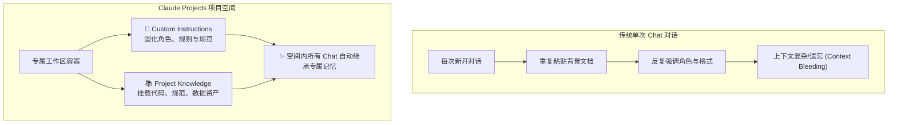
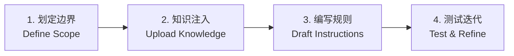

# Claude Academy: 《Intro to Projects》深度实战笔记

> **课程出处**：Anthropic 官方 Claude Academy 专题指南 (`tutorials/intro-to-projects`)  
> **学习定位**：掌握 Claude Projects（项目空间），构建专属业务上下文与高复用人机协同工作流  
> **学习时长**：约 7 分钟

---

## 目录
1. [心智模型：什么是 Claude Projects？](#1-心智模型什么是-claude-projects)
2. [核心支柱一：Custom Instructions (系统级定制指令)](#2-核心支柱一custom-instructions-系统级定制指令)
3. [核心支柱二：Project Knowledge (专属项目知识库)](#3-核心支柱二project-knowledge-专属项目知识库)
4. [从 0 到 1 创建高价值 Project 实战四步法](#4-从-0-到-1-创建高价值-project-实战四步法)
5. [高频业务场景模版库](#5-高频业务场景模版库)
6. [维护技巧与避坑指南 (Best Practices)](#6-维护技巧与避坑指南-best-practices)

---

## 1. 心智模型：什么是 Claude Projects？

- **心智定位**：不要将 Project 仅看作一个“文件归档文件夹”，而要将其视为**一位专属该业务线的全职智能专家**。
- **解决的核心痛点**：
  1. **告别冷启动**：再也不用在每次对话开头反复粘贴背景说明、编码规范或品牌指南。
  2. **杜绝上下文交叉污染 (Context Bleeding)**：不同业务线（如产品规划 vs 架构审查 vs 运营文案）物理隔离。
  3. **团队级标准对齐**：在 Team/Enterprise 计划中一键共享 Project，保证团队所有人调用统一的 AI 标准。

---

## 2. 核心支柱一：Custom Instructions (系统级定制指令)

Custom Instructions 决定了 Claude 在该项目中的**思考方式、专业角色与行为准则**。

### 黄金编写原则：
1. **明确角色与业务目标**：
   - ❌ 模糊设定：*“你是一个产品专家，请帮我写 PRD。”*
   - ✅ 精准设定：*“你是我司资深 B2B SaaS 产品总监。我们的目标客户是中大型零售企业的供应链主管，重点关注效率提升与 ROI。”*
2. **采用“触发-动作”范式 (Trigger-Action Rules)**：
   - *“当用户输入代码片段时，先检查是否存在安全漏洞与边界溢出，再提供重构方案。”*
   - *“当要求撰写邮件时，正文控制在 150 词内，且必须在开头提供 1 句话摘要。”*
3. **重视否定约束 (Negative Constraints / Never Rules)**：
   - LLM 对明确的负面限制往往极其敏感，例如：
     - *“严禁使用空洞的公文套话或营销说辞。”*
     - *“如知识库中没有明确依据，严禁编造数据，必须直接告知无法查得。”*
4. **指定排版与表达偏好**：
   - 如要求所有技术方案均使用 Markdown 标题 + Mermaid 架构图 + 风险对比表格。

---

## 3. 核心支柱二：Project Knowledge (专属项目知识库)

Project Knowledge 是 Claude 回答问题时检索引用的长期事实依据库。

### 知识库管理 4 大最佳实践：
1. **模块化分层文件**：
   - 避免将所有内容拼成一个超大文件。
   - 推荐拆分为：`architecture-spec.md`（架构规范）、`api-contracts.json`（接口契约）、`brand-tone.pdf`（品牌规范）。
2. **结构化与清晰标题 (Heading Hierarchy)**：
   - 知识库文档采用清晰的 `# 一级标题`、`## 二级标题`、加粗关键词与表格，极利于 Claude 内部语义检索与精准命中。
3. **持续迭代与“经验沉淀” (Living Knowledge Base)**：
   - 当在某次对话中总结出了新的设计准则或踩坑经验时，**立即更新到 Project Knowledge 文档中**，让未来所有会话自动汲取经验。
4. **精简去噪**：
   - 剔除无意义的免责声明、重复版本记录与废弃代码，保持知识库信噪比。

---

## 4. 从 0 到 1 创建高价值 Project 实战四步法

1. **第 1 步：划定单一职责边界 (Define Scope)**
   - 为独立项目命名（如 `支付网关重构`、`Q4 海外社媒营销`），避免范围过大。
2. **第 2 步：注入核心基准资产 (Upload Knowledge)**
   - 上传核心需求书、架构图、行业研报或代码仓库摘要。
3. **第 3 步：配置专属 Prompt (Draft Instructions)**
   - 设定角色立场、评审维度与输出风格。
4. **第 4 步：对话测试并增量调优 (Test & Refine)**
   - 开启一轮新 Chat 提问测试，如果 Claude 的回答有偏差，不要只在 Chat 里纠正，直接去更新 Project 的 Instructions 或 Knowledge。

---

## 5. 高频业务场景模版库

### 场景 A：软件架构与代码 Review 项目
* **Project Knowledge**：`tech-stack-guidelines.md`（技术栈约定）、`security-baseline.md`（安全基线）。
* **Custom Instructions 核心片段**：
  > “你是一名资深分布式系统架构师。评审所有提交的代码时，必须严格参照知识库中的技术规范。按以下四步输出：1. 潜在性能与安全风险；2. 边界条件覆盖；3. 重构建议（附带代码 diff）；4. 综合评分（1-10分）。”

### 场景 B：行业投研与竞品分析项目
* **Project Knowledge**：近 3 年竞品研报、财务报表 PDF、行业政策汇编。
* **Custom Instructions 核心片段**：
  > “你是一名科技行业顶级投资分析师。所有观点必须有知识库中的具体数据或报告章节支撑。任何推论必须区分‘客观事实’与‘主观预测’，并使用表格进行多维度竞品对比。”

---

## 6. 维护技巧与避坑指南 (Best Practices)

| 维护维度 | 推荐做法 | 常见误区 |
| :--- | :--- | :--- |
| **项目颗粒度** | 一个具体产品线/模块建一个 Project | 把整个公司所有业务塞进一个 Project |
| **知识更新** | 发生需求变更时，第一时间替换知识库文件 | 知识库很久不更新，仅靠在 Chat 里反复说“之前的文档过时了” |
| **指令调优** | 采用 Trigger-Action 具体条件句式 | 堆砌 5000 字无序的散文式要求 |
| **产物留存** | 空间内生成的关键方案保存为 **Artifacts** | 散落在对话历史中难以回溯 |
