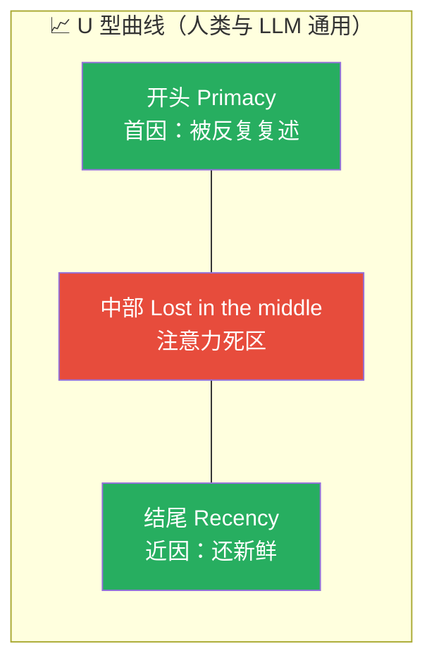
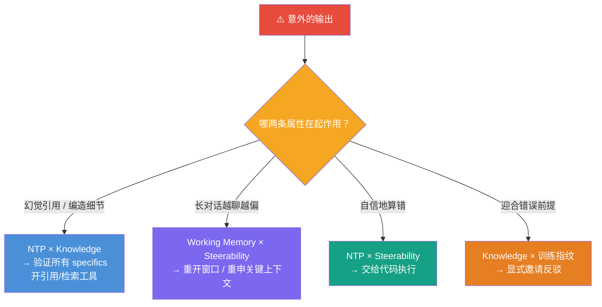

# AI Capabilities and Limitations: 全课程总结笔记

> **课程出处**：Anthropic 官方 Claude Academy (`academy.claude.com/courses/ai-capabilities-and-limitations`)  
> **课程定位**：《AI Fluency: Framework & Foundations》的**姊妹篇**——4D 框架教"你"（人的胜任力），这门课教"机器"（AI 的属性）：它为什么既流畅又自信地出错、你的任务落在能力区还是限制区  
> **核心主题**：四大属性光谱（Next Token Prediction / Knowledge / Working Memory / Steerability）、训练指纹、属性碰撞诊断、校准的信任  
> **课程体量**：13 课 · 约 3.5 小时 · 1 测验（🏆 9/10 通过）

---

## 目录
1. [课程总览：给机器建心智模型（L1-L2）](#1-课程总览给机器建心智模型l1-l2)
2. [性格从哪来：训练两阶段与四大指纹（L3）](#2-性格从哪来训练两阶段与四大指纹l3)
3. [属性一：Next Token Prediction（L4-L5）](#3-属性一next-token-predictionl4-l5)
4. [属性二：Knowledge（L6-L7）](#4-属性二knowledgel6-l7)
5. [属性三：Working Memory（L8-L9）](#5-属性三working-memoryl8-l9)
6. [属性四：Steerability（L10-L11）](#6-属性四steerabilityl10-l11)
7. [属性碰撞诊断学（L12）](#7-属性碰撞诊断学l12)
8. [收官：校准的信任（L13）](#8-收官校准的信任l13)
9. [测验错题解析：「校准的信任」](#9-测验错题解析校准的信任)
10. [全课 Cheatsheet](#10-全课-cheatsheet)

---

## 1. 课程总览：给机器建心智模型（L1-L2）

### 两门课是一个系统

> The 4D Framework teaches **YOU** how to collaborate with AI. This course teaches you **how AI is able to work with you**. Together they're one system: human competencies on one side and machine properties on the other.

- **4D（人的一半）**：Delegation / Description / Discernment / Diligence
- **四大属性（机器的一半）**：Next Token Prediction / Knowledge / Working Memory / Steerability——4D 胜任力正是对这四个属性的**回应**
- **材料是耐久的**：模型会更新、边界会移动，但**四属性本身不变**——这是它比 tips and tricks 长寿的原因

### 生成式 AI ≠ 你每天遇到的 AI

| 维度 | 分类/预测 AI（占绝大多数） | 生成式 AI（本课程对象） |
| :--- | :--- | :--- |
| 核心动作 | 排序、分类、过滤既有内容 | **逐 token 产出新内容** |
| 例子 | 垃圾邮件过滤、推荐系统、欺诈检测、照片打标 | Claude 等 transformer 文本模型 |
| 失败模式 | 分错类、推错内容 | **流畅但捏造**、遵循但走样 |

### 四属性框架总览（每条都是从能力到限制的光谱）

| 属性 | 核心问题 | 能力区（左端） | 限制区（右端） |
| :--- | :--- | :--- | :--- |
| **Next Token Prediction** | 答案从哪来？ | 熟路：总结、重排格式、解释常见概念 | 新颖领域、稀疏模式、"真 vs 听着真" |
| **Knowledge** | 它到底知道什么？ | 训练数据中频繁、一致的主流话题 | 罕见、截止后、小众、本地、有争议 |
| **Working Memory** | 它现在注意着什么？ | 材料装得下、会话进行中、你主动供上下文 | 超长文档/对话、期望跨会话记忆（悬崖） |
| **Steerability** | 你到底控制了多少？ | 短、具体、可验证的指令 | 长推理链、抽象要求、原生精度 |

> 💡 **光谱越靠右，你越该验证与补偿。** 每课开头的自评滑条（Trust it → Spot-check → Check details → Verify carefully → High risk）就是这个思想的具象化。

---

## 2. 性格从哪来：训练两阶段与四大指纹（L3）

### 两阶段训练


### 微调留下的四大行为指纹（fingerprints）

| 指纹 | 表现 | 高代价场景 |
| :--- | :--- | :--- |
| **Sycophancy（谄媚）** | 顺着你的预设说，不敢反驳 | 任何你**希望听到诚实反馈**的地方 |
| **Verbosity（冗长）** | 默认写多、写满 | 任何**时间压力下需要简洁**的地方 |
| **Over-caution（过度谨慎）** | 对灰色地带反射性拒答/过度对冲 | 合理请求被无谓设防 |
| **Loose confidence calibration（校准松散）** | 自信程度与实际可靠性**不挂钩** | 它越自信你越要警惕（全课程最反直觉的一条） |

> 实测法（课程练习）：同一任务跑三次——正常跑 / 预埋错误假设看它是否迎合（"I think this strategy is bulletproof"）/ 一句话问题看默认多啰嗦。

---

## 3. 属性一：Next Token Prediction（L4-L5）

### 核心机制

> 生成式 AI 更像**规模化的自动补全**，而不是搜索引擎。它逐词写下"按惯例接下来该是什么"——这一个机制同时给了你**流畅**和**幻觉**。

- **能力区**：与训练中见过无数次的模式相似的任务（总结、改格式、解释常见概念）——流畅、自信、大体准确
- **限制区**：新颖/稀疏地带；以及任何需要区分"**是真的**"和"**听起来是真的**"的任务
- **Fabrication concentrates in specificity（捏造集中在具体性上）**：人名、日期、统计数字、引用、URL、直接引语——**主张越精确，越值得验证**
- **产品层缓解**：citations（引用源）、uncertainty signaling（不确定性提示）、constrained generation（约束生成）、generator-verifier loops（生成-验证循环）

### L5 交互实验：Markov 链（100% 可解释的 next-token 生成器）

- 用 5 条短信构建**转移矩阵**（frequency table）→ 归一化得概率分布 → **sampling（采样）**选下一个词
- **Markov 链 vs LLM 的三步对照**：
  - 读上下文：Markov 只看**上一个词**；LLM 看**整个对话**
  - 算分布：Markov 查一行表；LLM 跑一次**前向传播**（attention / embeddings / feedforward…）
  - 采样：**完全相同**——输出都是下一个 token 的概率分布
- 历史彩蛋：Markov 1913 年发表思想（页面写 1906）；2010 年 n-gram 模型驱动手机输入法（SwiftKey/QuickType）；2015 年起神经网络（RNN→2017 Transformer）用**可学习的函数**替换查表——**牺牲了可解释性，换来海量上下文与能力**

> 🔗 **4D 连接**：NTP 是 **Discernment** 的地基——知道输出生成自"续写模式"，就知道该施加哪种审视。

---

## 4. 属性二：Knowledge（L6-L7）

### 知识的边界

> 模型只知道训练时读过的东西，仅此而已。默认无实时浏览、无亲身经历、在 **knowledge cutoff** 处硬截止。实际问题不是"它知不知道"，而是"**它读过的东西里，这个话题被代表得有多充分？**"

| 能力区 | 限制区 |
| :--- | :--- |
| 训练数据中**频繁**出现 | **罕见**话题 |
| 训练**内**较新 | **截止日期之后**的一切 |
| 多来源**一致** | 小众、本地化、**有争议** |

### 四大特征失败

| 失败 | 表现 |
| :--- | :--- |
| **Staleness（过时）** | 把旧信息当现状陈述，不提示截止 |
| **Uneven coverage（覆盖不均）** | 主流话题深、小众话题浅，但**语气一样自信** |
| **Inherited bias（继承偏差）** | 训练数据决定什么算"默认/正常"（外人视角的刻板假设） |
| **Source amnesia（来源失忆）** | 无法说明知识从哪来 |

**产品层修复**：web search、retrieval（RAG / MCP）、tool use——给模型接上它从未训练过的信息源。

### L7 交互实验：嵌入与语义检索（1024 维空间可视化）

- **字符串搜索的局限**：搜"car"找不到"automobile"——几十年靠同义词典、词干规则、点击模式**手工**搭桥
- **Embeddings 的革命**：**意义可以是一个"地点"**——文本→坐标，相近概念在空间中相邻；这个映射不是手工的，是训练中**涌现**的
- 2D 恐龙×过山车示例 → 3D 加生物学轴 → 真实嵌入模型约 **1024 维**；维度语义是黑盒（说不出"第 847 维是恐龙轴"）
- **Similarity search**：把问题也映射进同一空间，取最近的 k 个——不是关键词匹配，是**多维邻近度**
- 距离用 **cosine similarity**（余弦相似度）：看向量**指向**而非绝对距离，取值 -1（相反）~1（相同）

> 🔗 **4D 连接**：知识不均是 **Delegation** 的核心依据——知道模型哪里库存充足、哪里单薄，才知道何时交出去、何时自己供上下文、何时换工具。

---

## 5. 属性三：Working Memory（L8-L9）

### 硬边界的记忆

> 模型此刻注意的一切都活在一个**固定大小的容器**（context window）里。容器内它能注意，容器外**一切不存在**。

- 这是四属性中**唯一的悬崖（cliff）而非缓坡**：其他属性是逐渐退化，它是"**好用直到突然不好用**"
- **Silent truncation（静默截断）**是特征失败——内容悄悄掉出窗口，**不一定有警告**
- **模型不会从你的纠正中学习**：它只回应"当前在上下文里"的东西；纠正是本次会话的，不是习得的
- **产品层缓解**：memory 功能、compaction（压缩）、projects/workspaces、更大窗口、multi-agent 工作流

### L9 交互实验：Serial Position Effect（序列位置效应）



- 心理学百年结论：列表开头（首因）与结尾（近因）记得牢，**中部先消失**
- **LLM 同样如此**：Stanford 2023 研究把关键事实放在长上下文的不同位置——放在**最前或最后**准确率最高，**埋在中间准确率掉 30%+**；Transformer 的注意力天然更看重窗口**两端**
- **危险模式 vs 安全模式**：关键指令埋在 18 条消息中间 ❌；**关键指令放开头（system prompt）+ 结尾重复** ✅

### 上下文工程三策略

| 策略 | 做法 |
| :--- | :--- |
| **Front-loading（前置）** | 最重要的材料放最前 |
| **Chunking（分块）** | 长活拆段，别一口气塞满 |
| **Re-supplying（再补给）** | 关键约束在结尾重申 |

> **金句**：More context ≠ better results. 注意力是有限的。**Curate ruthlessly, place strategically, repeat what matters.**（无情精选、策略性放置、重复要害）——每加一段上下文，都在把别的内容往"中部死区"推。

> 🔗 **4D 连接**：Working Memory 是 **Description** 的作用对象——懂窗口原理才知道怎么组织上下文、何时前置、何时重开。

---

## 6. 属性四：Steerability（L10-L11）

### 指令是怎么被遵循的

> 模型遵循指令的方式和它做所有事的方式**一样：续写一个模式**。这让它出奇地可驾驭——也意味着**你的意图和它实际执行的之间永远有缝隙**，最有趣的失败都住在这道缝里。

| 能力区（控制紧） | 限制区（控制松） |
| :--- | :--- |
| **短**指令 | **长推理链** |
| **具体**（"用三列表格回复"） | **抽象**要求（"更有深度一点"） |
| **可验证**（"不超过 100 词"） | 要求**原生数值/逻辑精度** |

### 三大特征失败

| 失败 | 机制 | 对策 |
| :--- | :--- | :--- |
| **Reasoning drift（推理漂移）** | 多步依赖任务中，早期小错**滚雪球** | **中途插入 checkpoint**："做完第 2 步先停下给我看结果" |
| **Letter-over-spirit（字面压过意图）** | 指令被字面遵循但意图落空（"缩短"→砍掉了不该砍的） | **重述目标**，而不是把指令重复得更用力 |
| **Brittle arithmetic（脆弱算术）** | 逐 token 生成不适合精确计算 | **交给代码执行**（code execution） |

> **关键句**：When an instruction is followed literally but uselessly, **restate the goal**. Repeating the instruction with more force won't close the gap.

**产品层缓解**：system prompts、code execution、visible reasoning、structured output modes。

> 🔗 **4D 连接**：Steerability 既让 **Description** 有威力，也给它划了界——懂"词与意图的缝隙"才懂怎么写 prompt、在哪设 checkpoint。

---

## 7. 属性碰撞诊断学（L12）

> **真实世界的失败几乎从来不是单一属性作祟，而是两条属性相遇。** 能说出是哪两条，就直接知道该抓哪种修复。



**官方点名的诊断配对**：

- **Next Token Prediction + Knowledge** → 幻觉的具体细节（编造引用、人名、数字）
- **Working Memory + Steerability** → 长对话漂移（指令还在吗？上下文还全吗？）

**诊断四步**：说出是哪种"意外" → 定位各属性光谱上的大致位置 → **定向修复**（verify specifics / re-supply context / offload to code / invite pushback）→ 拒绝"再试一次"式盲目重试。

> 🔗 **4D 连接**：这一手诊断就是 **Discernment 的应用**——知道自己在看的是"哪一种错"，评估才有的放矢。

---

## 8. 收官：校准的信任（L13）

### 一体系统

- 心智模型收束为：**四条光谱 + 特征失败 = 属性交集**
- 本课程与 4D 框架是**一个系统的两面**：属性解释了 4D 胜任力在回应什么
- **模型会继续变，但属性的形状持续有效**——边界会移动，要持续"试边"

### Calibrated Trust 的官方定义（两处，互为完整版）

> **L2**：Calibrated trust means locating your task on the continuum, **not granting or withholding trust wholesale**.  
> **L13**：Calibrated trust means **locating your task on each continuum** and **matching your verification and context habits to where it sits**.

---

## 9. 测验错题解析：「校准的信任」

**题目**：在实践中，"校准的信任"（calibrated trust）意味着什么？

### ✅ 正解（拼合两处官方定义）

**先判断你的任务落在四条属性光谱（NTP / Knowledge / Working Memory / Steerability）的哪个位置，再让"信任程度 + 核查力度 + 上下文习惯"与这个位置相匹配——既不全盘信任，也不全盘不信任。**

### 展开为三个实操动作

1. **定位（locate）**：任务贴近能力区（熟路任务、主流知识、材料装得下、指令短而具体）还是滑向限制区（新颖领域、罕见/截止后知识、超长文档、抽象指令）？
2. **匹配（match）**：按验证光谱给力度——
   - 能力区 → **Trust it / Spot-check**（抽查即可）
   - 中间地带 → **Check details**（查关键细节，尤其 specifics：人名/日期/数字/引用）
   - 限制区 → **Verify carefully / High risk**（逐项验证 + 主动供上下文/开检索/交代码）
3. **重校准（recalibrate）**：模型升级后边界会移动，位置判断要随之更新——校准是**持续动作**，不是一次性设置。

### ❌ 典型干扰项为什么错

| 干扰项 | 错在哪 |
| :--- | :--- |
| "对 AI 输出一律保持怀疑" | 这是**全盘不信任**（wholesale withholding）——官方明确排除；能力区任务抽查即可，一律严查是浪费 |
| "信任 AI 直到它出错为止" | 这是**全盘信任**（wholesale granting）——恰好是被幻觉伤到的姿势 |
| "根据模型大小/知名度决定信任度" | 校准对象是**任务在光谱上的位置**，不是模型的牌子或参数量 |
| "设定一次信任级别后长期不变" | 忽略了"模型会变、边界会移"——校准必须随任务和模型**动态重定位** |

### 一句话记忆

> **信任的刻度跟着任务走，不跟着感觉走：任务落在光谱哪一格，核查力度就配到哪一档。**

---

## 10. 全课 Cheatsheet

```markdown
### 🧠 AI Capabilities and Limitations 速查

#### 1. 一体系统
4D = 人的胜任力（怎么协作）
四属性 = 机器的属性（它如何能与你工作）
模型会变，属性不变（材料耐久）

#### 2. 训练两阶段 → 四指纹
Pretraining（文档补全器）→ Fine-tuning（助手）
指纹：谄媚 / 冗长 / 过度谨慎 / 自信-可靠性脱钩

#### 3. 四属性光谱（能力区 → 限制区）
NTP：熟路 → 新颖；捏造集中在 specifics（人名/日期/数字/引用/URL）
Knowledge：频繁·训练内·一致 → 罕见·截止后·小众·争议
Working Memory：装得下·会话内 → 超长·跨会话（唯一"悬崖"，静默截断）
Steerability：短·具体·可验证 → 长链·抽象·原生精度

#### 4. 属性 × 缓解工具
NTP → 引用 / 不确定性提示 / 约束生成 / 生成-验证
Knowledge → 网搜 / RAG / 工具调用
Memory → memory / 压缩 / projects / 大窗口 / multi-agent
Steerability → system prompt / 代码执行 / 可见推理 / 结构化输出

#### 5. 上下文工程
关键信息放开头 + 结尾重申（U 型曲线，中部是死区）
Front-load / Chunk / Re-supply
More context ≠ better（无情精选、策略放置、重复要害）

#### 6. 失败诊断
幻觉细节 = NTP × Knowledge → 验证 specifics
长对话漂移 = Memory × Steerability → 重供上下文/重开窗口
自信算错 = NTP × Steerability → 代码执行
迎合作风 = Knowledge × 指纹 → 显式邀请反驳
（先命名属性对，再定向修复，拒绝盲目重试）

#### 7. Steerability 金句
指令被字面遵循但没用时：重述目标
（重复指令加力，关不上词与意图的缝隙）

#### 8. 校准的信任
定位任务在四光谱的位置
→ 匹配核查力度（Trust → Spot-check → Check → Verify → High risk）
→ 随模型演进重新校准
（不全盘信，不全盘疑，刻度跟任务走）

#### 9. 与你已学的连接
L8 context window = Claude Code L6 的工作记忆
L9 U 型曲线 = /compact /clear /Subagent 的理论根
L12 诊断 = Code review / Discernment 的通用化
L13 校准信任 = Choosing the Right Model 的"敢上线最便宜档"
```

### 课程衔接

> 🔗 **收官**：本课程与《AI Fluency: Framework & Foundations》互为姊妹篇（官方建议任一顺序，合起来是完整的人机协作图景）。至此你已集齐**理论双子星**：4D（人）+ 四属性（机器）。
