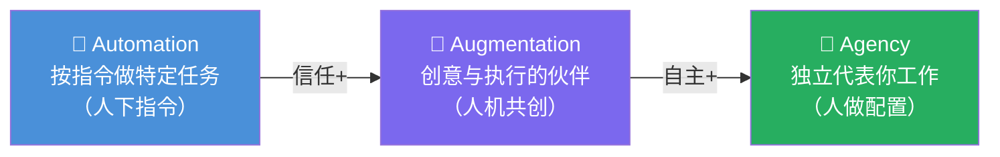

# AI Fluency: Framework & Foundations: 《Why do we need AI Fluency?》为什么需要 AI 流利度

> **课程出处**：Anthropic 官方 Claude Academy (`academy.claude.com/courses/ai-fluency-framework-foundations/why-do-we-need-ai-fluency`)  
> **课程定位**：回答"Fluent（流利）到底指什么、为什么此刻重要"——AI Fluency 不只是会用工具，而是**实用技能 + 知识 + 洞察 + 价值观**四位一体；并引出人机协作的三种层级（3A 模型）  
> **核心主题**：Fluency 的完整构成、Automation / Augmentation / Agency 三分法  
> **课程时长**：7 分钟（第 2/14 课）

***

## 目录

1. [Fluency 的完整构成](#1-fluency-的完整构成)
2. [3A：人机协作的三种方式](#2-3a人机协作的三种方式)
3. [三层的本质差异](#3-三层的本质差异)
4. [实战 Cheatsheet](#4-实战-cheatsheet)

***

## 1. Fluency 的完整构成

> Being "fluent" with AI involves developing **practical skills, knowledge, insights, and values** that help you interact with AI in ways that are effective, efficient, ethical, and safe.

| 构成                         | 一句话                 |
| :------------------------- | :------------------ |
| **Practical skills（实用技能）** | 会操作：提示、委派、审查        |
| **Knowledge（知识）**          | 懂原理：模型如何工作、边界在哪     |
| **Insights（洞察）**           | 有经验：知道什么场景 AI 表现如何  |
| **Values（价值观）**            | 有底线：什么该交、什么该审、什么不该碰 |

> 💡 四者缺一不可——只有技能没有价值观是危险的，只有价值观没有技能是空谈。L1 的"4E"（有效/高效/道德/安全）是这四者共同服务的目标。

***

## 2. 3A：人机协作的三种方式

> Three ways people engage with AI: **Automation, Augmentation, Agency**.

| 层级                   | 定义                                        | 人扮演的角色          | 你学过的对应                                        |
| :------------------- | :---------------------------------------- | :-------------- | :-------------------------------------------- |
| **Automation（自动化）**  | AI 按**你的指令**完成**特定任务**                    | 指挥者：下指令、验结果     | Cowork 单次任务、Claude Code 单条 Prompt             |
| **Augmentation（增强）** | 你和 AI 作为**创意与执行上的伙伴**协作                | 合作者：来回碰撞、共同打磨   | Task Loop 四阶段、explore→plan→code→commit        |
| **Agency（能动性）**      | 你**配置** AI **独立**替你工作——设定它的知识与行为模式，而非逐个派活 | 配置者：建环境、定边界、立规矩 | Scheduled Tasks、Skills、Plugins、Managed Agents |



***

## 3. 三层的本质差异

一条递进线：**指令粒度越来越粗，AI 自主性越来越高，人的角色越来越后撤**——但**责任不后撤**（L1 的 Diligence 预告在最高层最吃紧）：

* **Automation**：你告诉它**做什么、怎么做**（What & How）

* **Augmentation**：你告诉它**做什么**，**怎么做一起商量**（What，共创 How）

* **Agency**：你告诉它**成为什么**（设定知识与行为模式），具体做什么它自己判断

> 🎯 **Agency 层的关键句**：configuring AI to work independently **on your behalf**, establishing its **knowledge and behavior patterns** rather than just giving it **specific tasks**——这正是你已学过的 Global Instructions / Skills / Subagents / CLAUDE.md / Managed Agents 共同构成的"配置面"。

***

## 4. 实战 Cheatsheet

```markdown
### 🧠 为什么需要 AI Fluency 速查

#### 1. Fluency 四构成
实用技能 + 知识 + 洞察 + 价值观
→ 服务于 4E：有效 / 高效 / 道德 / 安全

#### 2. 3A 协作模型（递进）
Automation：AI 按指令做特定任务（人=指挥者）
Augmentation：人机共创伙伴（人=合作者）
Agency：AI 独立代表你工作（人=配置者）

#### 3. 递进本质
指令粒度 ↓ AI 自主性 ↑ 人的角色后撤
但责任不后撤（Diligence 在 Agency 层最吃紧）

#### 4. Agency 的配置面（你已会的）
Global Instructions / Skills / Plugins
/ CLAUDE.md / Subagents / Managed Agents
```

### 课程衔接

> 🔗 **下一课**：L3《The 4D Framework》——4D 胜任力全景图：Delegation / Description / Discernment / Diligence 正式逐一登场。

