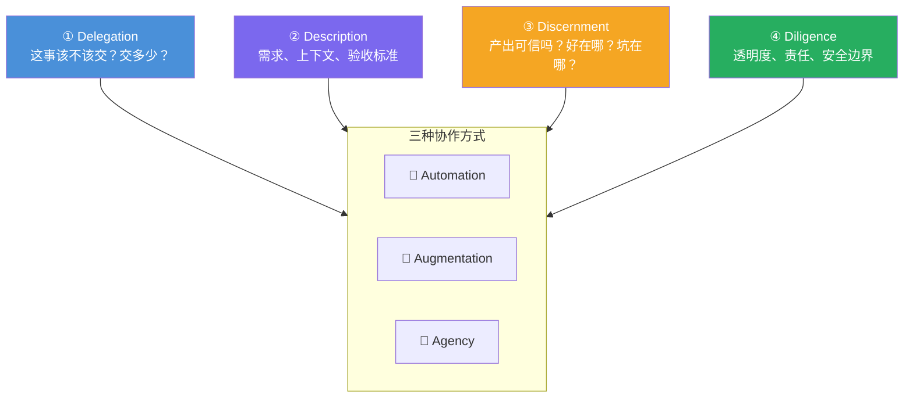

# AI Fluency: Framework & Foundations: 《The 4D Framework》4D 框架全景

> **课程出处**：Anthropic 官方 Claude Academy (`academy.claude.com/courses/ai-fluency-framework-foundations/the-4d-framework`)  
> **课程定位**：本课程的**骨架课**——正式定义 AI 流利度框架的四大核心胜任力（4Ds），并说明它们如何横跨三种协作方式（3A）发挥作用；后续 L4-L13 全部是 4D 的逐一深潜  
> **核心主题**：4D 各自定义、4D × 3A 的组合关系、三选一场景练习  
> **课程时长**：45 分钟（第 3/14 课，含练习）

---

## 目录
1. [4D 正式定义](#1-4d-正式定义)
2. [4D × 3A：胜任力如何横跨协作方式](#2-4d--3a胜任力如何横跨协作方式)
3. [三选一场景练习](#3-三选一场景练习)
4. [实战 Cheatsheet](#4-实战-cheatsheet)

---

## 1. 4D 正式定义

> The AI Fluency Framework consists of four core competencies (the **4Ds**).

| 4D | 官方定义 | 一句话理解 | 你已学的对应 |
| :--- | :--- | :--- | :--- |
| **Delegation（委派）** | Thoughtfully deciding **what work to do with AI vs. doing yourself** | 深思熟虑地划人机分工线 | Cowork L3（Task Loop）、L4（好委派 vs 糟糕委派） |
| **Description（描述）** | Communicating **clearly** with AI systems | 把需求说到位 | C-T-C-F 提示词法则（Context-Task-Criteria-Format） |
| **Discernment（辨别）** | Evaluating AI outputs and behavior with a **critical eye** | 带批判眼光验收产出 | Claude Code L7（Code review 三堆处置法） |
| **Diligence（尽责）** | Ensuring you interact with AI **responsibly** | 对全过程负责任 | Cowork L11（安全三道防线） |

**为什么值得学这套框架**：这些胜任力**横跨所有协作方式**（3A 全适用），且**为 AI 的下一步演进做好准备**——工具会换，4D 不会过时。

---

## 2. 4D × 3A：胜任力如何横跨协作方式

4D 不是四个孤立技能，而是**每次协作都在运转的四个维度**：



一次典型协作的时间序：**Delegation**（决定分工）→ **Description**（传达需求）→ AI 干活 → **Discernment**（批判验收）→ **Diligence**（贯穿全程的责任线）。

---

## 3. 三选一场景练习

课程给出三个场景，任选一个用 4D 逐项推演。以**研究项目**（AI 辅助分析大数据集写论文）为例：

| 4D | 练习问题 | 思路示例 |
| :--- | :--- | :--- |
| **Delegation** | 分析工作如何在人与 AI 之间划分？ | 代码执行/初筛交 AI；**研究问题、结论解释权**留自己 |
| **Description** | AI 需要哪些上下文才能干好它那份活？ | 研究问题、数据字典、统计方法偏好、异常值处理规则 |
| **Discernment** | 如何验证 AI 分析的准确性？ | 抽样手工复核、独立跑统计、检查它对方法的陈述 |
| **Diligence** | 发表 AI 辅助研究有哪些伦理考量？ | 如实披露 AI 参与、数据隐私、可复现性 |

另两个场景（营销邮件系列 / 小说角色共创）结构相同，核心差异在 Diligence 的重心：前者是**透明度与品牌责任**，后者是**如何致谢 AI 贡献**。

### 反思三问

1. 四个 D 里，你**最有信心**的是哪个？**最需加强**的是哪个？
2. 回想最近一次 AI 交互——如果当时有这套框架，会做得哪里不一样？
3. 哪项 4D 技能最能增强你当前的工作/项目？

---

## 4. 实战 Cheatsheet

```markdown
### 🏛️ 4D 框架速查

#### 1. 四大胜任力
Delegation 委派：深思人机分工线
Description 描述：清晰传达需求
Discernment 辨别：批判性验收
Diligence 尽责：负责任地交互

#### 2. 时间序
分工（D1）→ 传达（D2）→ 验收（D3）
→ Diligence 贯穿全程

#### 3. 框架特性
横跨 Automation / Augmentation / Agency 全部三种方式
为 AI 演进做准备——工具会换，4D 不换

#### 4. 与已学课程的映射
D1 ← Cowork L3/L4（Task Loop、好委派）
D2 ← C-T-C-F 提示词法则
D3 ← Claude Code L7（Code review）
D4 ← Cowork L11（安全三道防线）

#### 5. 场景练习法
任选一个真实项目，逐 D 写下四个答案
Diligence 重心随场景变：透明度/隐私/致谢
```

### 课程衔接

> 🔗 **下一课**：L4《Generative AI fundamentals》——两部分的**技术深潜第一课**：生成式 AI 的底层工作原理、与以往技术的本质区别、当前能力与局限；官方明说：这些知识将**强化你的 Delegation 胜任力**（懂边界才知道什么该交）。
