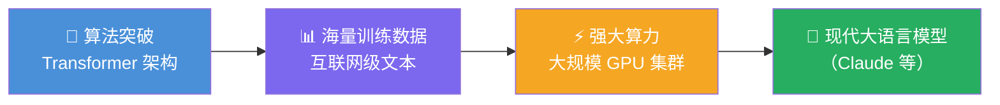

# AI Fluency: Framework & Foundations: 《Generative AI fundamentals》生成式 AI 基础

> **课程出处**：Anthropic 官方 Claude Academy (`academy.claude.com/courses/ai-fluency-framework-foundations/generative-ai-fundamentals`)  
> **课程定位**：技术深潜第一课（共两课）——回答"生成式 AI 到底是什么、和以前的 AI 有何不同、靠什么成为可能"；官方明说：这些知识直接**强化 Delegation 胜任力**（懂原理才懂边界，懂边界才会分工）  
> **核心主题**：生成式 vs 分析式、LLM 工作原理、三大技术支柱、预训练与微调、上下文窗口、涌现能力  
> **课程时长**：6 分钟（第 4/14 课）

---

## 目录
1. [生成式 AI 的定义：创造而非分析](#1-生成式-ai-的定义创造而非分析)
2. [LLM 如何工作](#2-llm-如何工作)
3. [三大技术支柱](#3-三大技术支柱)
4. [训练两阶段与关键概念](#4-训练两阶段与关键概念)
5. [实战 Cheatsheet](#5-实战-cheatsheet)

---

## 1. 生成式 AI 的定义：创造而非分析

> Generative AI 的关键区分：**create new content（创造新内容）** rather than just **analyzing what already exists（分析既有内容）**。

| 维度 | 传统 AI（分析式） | 生成式 AI |
| :--- | :--- | :--- |
| 核心动作 | 分类 / 预测 / 检测 | **生成**新文本、图像、代码 |
| 典型任务 | 垃圾邮件识别、销量预测 | 写邮件、画图、写程序 |
| 输出 | 标签、数值 | 前所未有的新内容 |

> 💡 你用 Claude 写笔记、生成代码、做摘要——全是"创造新内容"，这就是 Generative 的含义。

---

## 2. LLM 如何工作

大语言模型（LLM，如 Claude）的本质：

- **在海量文本上训练**，学习语言的统计规律与知识模式
- 工作时**逐 token 预测下一个词**——看似简单，规模到了一定程度就涌现出对话、推理、写代码等能力
- 它不是"检索数据库"，而是基于学到的模式**动态生成**

---

## 3. 三大技术支柱

> 从算法突破到海量数据再到强大算力——这条技术之旅让 LLM 成为可能：



| 支柱 | 说明 |
| :--- | :--- |
| **Transformer 架构** | 算法突破：注意力机制让模型理解长距离上下文关系 |
| **海量训练数据** | 互联网规模的文本语料 |
| **强大计算** | 大规模并行训练基础设施 |

三者缺一：没有算法，数据再多算不动；没有数据，架构再好学不到东西；没有算力，一切停留在论文里。

---

## 4. 训练两阶段与关键概念

### 训练两阶段

| 阶段 | 干什么 | 类比 |
| :--- | :--- | :--- |
| **Pre-training（预训练）** | 海量通用文本上学"语言 + 世界知识" | 读完全世界的书 |
| **Fine-tuning（微调）** | 针对性调整行为：更有用、更安全、更符合指令 | 岗前培训 |

### 关键概念

- **Context window（上下文窗口）**：模型一次能"看见"的内容上限——你的 Prompt、对话历史、工具结果都在里面（呼应 Claude Code L6：**工作记忆**，会用完、要管理）
- **Emergent capabilities（涌现能力）**：模型规模跨过阈值后**突然出现**的、训练时未明确教授的能力（推理、多步任务）——"量变引起质变"的实例

> 🎯 **与 Delegation 的关联**：懂了"逐 token 预测 + 涌现能力"，就明白为什么 LLM **擅长的和不擅长的都很极端**——这正是下一课（Capabilities & limitations）的主题，也是分工决策的依据。

---

## 5. 实战 Cheatsheet

```markdown
### 🧬 生成式 AI 基础速查

#### 1. 一句话定义
生成新内容（而非分析既有内容）的 AI
LLM = 逐 token 预测下一个词 + 规模涌现

#### 2. 三大技术支柱
Transformer 架构（算法）
+ 互联网级数据 + 大规模算力

#### 3. 训练两阶段
Pre-training：海量通用文本（读完全世界的书）
Fine-tuning：行为对齐（岗前培训）

#### 4. 两个关键概念
Context window：一次能看见的上限（= 工作记忆）
Emergent capabilities：规模跨阈值后突然出现的能力

#### 5. 与 4D 的关联
懂原理 → 懂边界 → Delegation 分工有依据
（下一课 Capabilities & limitations 直接展开）
```

### 课程衔接

> 🔗 **下一课**：L5《Capabilities & limitations》——技术深潜第二课：生成式 AI **当前能力与局限**的完整清单，Delegation 决策的直接依据。
