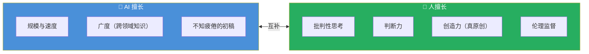

# AI Fluency: Framework & Foundations: 《Capabilities & limitations》能力与局限

> **课程出处**：Anthropic 官方 Claude Academy (`academy.claude.com/courses/ai-fluency-framework-foundations/capabilities-limitations`)  
> **课程定位**：技术深潜第二课（收官）——生成式 AI 当前**能做什么、不能做什么**的完整清单；学完这课，Delegation 的分工决策就有了事实依据，不再是拍脑袋  
> **核心主题**：四大能力、四大局限、人机互补的最优组合  
> **课程时长**：9 分钟（第 5/14 课）

***

## 目录

1. [四大能力](#1-四大能力)
2. [四大局限](#2-四大局限)
3. [人机互补：最优组合](#3-人机互补最优组合)
4. [实战 Cheatsheet](#4-实战-cheatsheet)

***

## 1. 四大能力

| 能力                                 | 说明                           | 实例                               |
| :--------------------------------- | :--------------------------- | :------------------------------- |
| **任务多面手**（Versatility）             | 语言任务上高度通用，**无需额外训练**即可切换不同任务 | 上一秒改邮件语气，下一秒写正则                  |
| **对话感知**（Conversational awareness） | 维持对话流：记住上文、理解指代、延续语境         | 多轮追问不用重复背景                       |
| **内容生成**（Create new content）       | 生成文本、图像、代码等新内容               | 草稿、总结、翻译、代码                      |
| **外部工具连接**（Connect with tools）     | 通过工具/API/MCP 触达实时数据与外部系统     | 你学过的 Tool Use、MCP、Built-in tools |

> 💡 第 4 项正是你在 Platform 课学的整套工具体系——能力清单与已学课程无缝衔接。

***

## 2. 四大局限

| 局限                                      | 说明                    | 缓解手段（已学对应）                                     |
| :-------------------------------------- | :-------------------- | :--------------------------------------------- |
| **知识截止日期**（Knowledge cutoff）            | 训练数据有时间边界，**之后的事不知道** | 网搜工具、MCP 实时数据源                                 |
| **幻觉**（Hallucinations）                  | 会生成**看似可信实则错误**的内容    | Discernment 批判验收、要求引用来源                        |
| **上下文窗口限制**（Context window constraints） | 一次能看的有限，超出就"忘"        | Claude Code L6：`/compact`、`/clear`、Subagent 隔离 |
| **复杂推理挑战**（Reasoning challenges）        | 多步推理、精确数学仍会翻车         | Thinking 模式、让 AI 展示推理步骤、人工复核                   |

> ⚠️ **幻觉是 Discernment 存在的第一理由**：错得最危险的输出往往是**语气最自信**的那批。

***

## 3. 人机互补：最优组合

> The most effective applications **combine human and AI strengths**.



官方论断：**人提供批判性思考、判断、创造力与伦理监督**——这四样正是 4D 框架对"人"这一侧的要求。

### 课后反思两问

1. 懂了训练数据 + 预训练/微调的原理后，你与这些系统协作的方式会怎么变？
2. 了解工作原理与当前局限后，浮现了哪些**伦理考量**？

***

## 4. 实战 Cheatsheet

```markdown
### ⚖️ 能力与局限速查

#### 1. 四大能力
任务多面手（零训练切换）
/ 对话感知 / 内容生成 / 外部工具连接

#### 2. 四大局限 + 缓解
知识截止 → 网搜 / MCP 实时源
幻觉 → 批判验收、要求出处
上下文限制 → compact / clear / Subagent
复杂推理 → thinking 模式 + 人工复核

#### 3. 最优组合
AI：规模、速度、广度、初稿
人：批判思考、判断、原创、伦理监督

#### 4. Delegation 决策依据
任务落在"能力清单"内 → 可交
任务踩中"局限清单" → 留给自己或人机协作
语气最自信的输出 ≠ 最可信的输出（Discernment 记牢）

#### 5. 领域演进快
清单是"当前时点"的快照——定期更新认知
```

### 课程衔接

> 🔗 **下一课**：L6《A closer look at Delegation》——技术深潜结束，进入 4D 逐一深潜：第一个 D（Delegation 委派）正式展开，如何基于目标与 AI 能力做人机分工的**战略性决策**。

