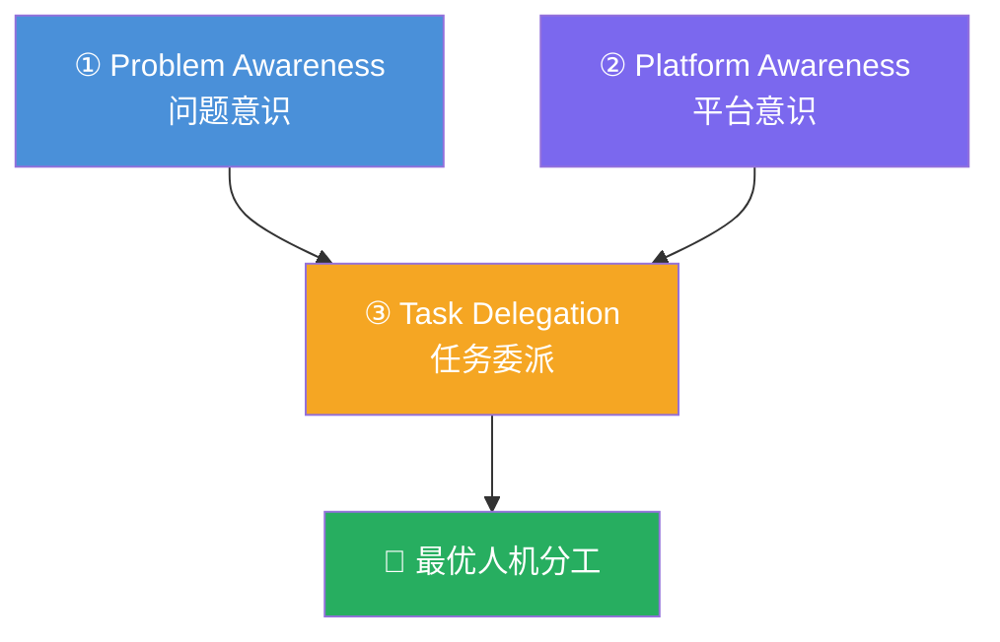

# AI Fluency: Framework & Foundations: 《A closer look at Delegation》委派深潜

> **课程出处**：Anthropic 官方 Claude Academy (`academy.claude.com/courses/ai-fluency-framework-foundations/a-closer-look-at-delegation`)  
> **课程定位**：4D 深潜第一站——Delegation（委派）正式展开：决定什么自己做、什么与 AI 协作、什么放手让 AI 独立干；**目标不是自动化一切，而是为每个任务构建最优人机组合**  
> **核心主题**：Delegation 三组件（Problem Awareness / Platform Awareness / Task Delegation）、领域专长 × AI 认知的双重要求  
> **课程时长**：20 分钟（第 6/14 课，含练习）

***

## 目录

1. [Delegation 三组件](#1-delegation-三组件)
2. [双重要求：领域专长 × AI 认知](#2-双重要求领域专长--ai-认知)
3. [核心心法：不是自动化一切](#3-核心心法不是自动化一切)
4. [课后练习：和 AI 一起做委派计划](#4-课后练习和-ai-一起做委派计划)
5. [实战 Cheatsheet](#5-实战-cheatsheet)

***

## 1. Delegation 三组件



| 组件                           | 含义                         | 关键问题               | 已学对应                                          |
| :--------------------------- | :------------------------- | :----------------- | :-------------------------------------------- |
| **Problem Awareness（问题意识）**  | 先弄清**自己的目标与工作实质**，再考虑 AI   | 这事到底要达成什么？好结果长什么样？ | C-T-C-F 的 C（Context/Criteria）                 |
| **Platform Awareness（平台意识）** | 了解**不同 AI 系统**各自能干什么、干不了什么 | 这个任务该用哪个工具？哪个模式？   | L5 能力/局限清单 + 五大产品线（ai/Cowork/Code/Platform）选型 |
| **Task Delegation（任务委派）**    | 综合 ①② 把工作**深思熟虑地分配**给人与 AI | 哪块我留？哪块共创？哪块全交？    | Cowork L4（好委派 vs 糟糕委派）                        |

***

## 2. 双重要求：领域专长 × AI 认知

> Effective delegation requires **both domain expertise and an understanding of AI capabilities**.

* **只有领域专长、不懂 AI** → 委派不足：该交的活自己吭哧（效率损失）

* **只懂 AI、没有领域专长** → 委派失准：分不出哪些环节需要人的判断（质量风险）

两者交集处，才是高质量的 Delegation 决策。

***

## 3. 核心心法：不是自动化一切

> The goal isn't to automate everything, but to **create the most effective human-AI partnership** for any given task or goal.

* 三种处置（对应 3A）：**自己做** / **人机共创** / **AI 独立完成**——每个子任务单独选择

* 判断依据回到三问：**需要人类专长/创造力/判断力的部分，永远留在人这边**

* 这与 Cowork 的黄金法则完全同源：**Claude can prepare; you ship**

***

## 4. 课后练习：和 AI 一起做委派计划

课程设计的练习本身就是一次 Augmentation 协作：

1. 挑一件**小任务**（起草邮件 / 列演示大纲 / 筹备会议）
2. 与 Claude 开聊：*"I'm preparing to \[任务] and want to discuss what a delegation plan may look like for figuring out which parts I should delegate to an AI like you vs. not."*
3. 一起探索四问：

   * 整体愿景是什么？**好结果长什么样**？

   * 到达那里需要**哪些具体工作块**？

   * 哪些块需要**人类专长、创造力或判断力**？

   * → 落成一张简单的**委派计划**
4. ⚠️ 官方特别强调：**要真对话，别只是列清单**——"you each may see something the other doesn't"（你们各自能看到对方看不到的东西）

### 反思两问

1. 回想最近一个与 AI 协作的项目——用这套 Delegation 框架，做法会有何不同？
2. 你的工作/学习中，哪类任务最能从 AI 协作中获益？

***

## 5. 实战 Cheatsheet

```markdown
### 🤝 Delegation 深潜速查

#### 1. 三组件
① Problem Awareness：先懂自己的目标与工作实质
② Platform Awareness：懂各 AI 系统的能力边界
③ Task Delegation：综合前两者做深思熟虑的分工

#### 2. 双重要求
领域专长 × AI 认知——缺一个就委派失准
（只有专长→委派不足；只有 AI 认知→分不清哪要人）

#### 3. 核心心法
目标不是自动化一切，是最优人机组合
三种处置逐块选：自己做 / 共创 / AI 独立
需要人类专长/创造力/判断的块永远留人

#### 4. 练习模板
找 Claude 聊："我想讨论这件事的委派计划"
四问：愿景？工作块？哪块要人？→ 落成计划
真对话，别列清单（各自能看到对方看不到的）

#### 5. 判断依据
问题不清 → 先 Problem Awareness
工具不明 → 回 L5 能力/局限清单
分工拿不准 → 问"这步错了谁兜得住"
```

### 课程衔接

> 🔗 **下一课**：L7《Project planning and Delegation》——把本课的 Delegation 方法**落地成一个贯穿课程余下部分的多步项目**：选题、定愿景、拆任务、做委派计划——这个项目将成为后续所有 4D 胜任力的实战画布。

