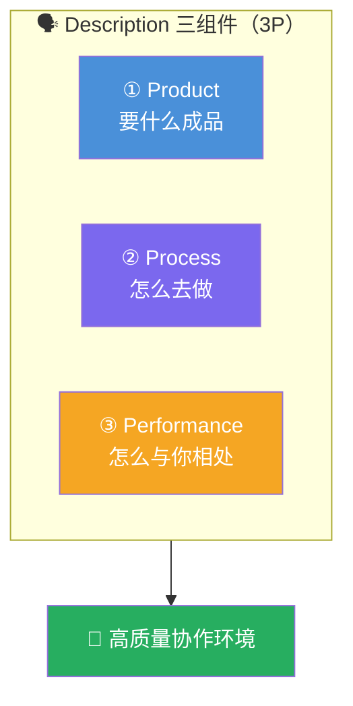

# AI Fluency: Framework & Foundations: 《A closer look at Description》描述深潜

> **课程出处**：Anthropic 官方 Claude Academy (`academy.claude.com/courses/ai-fluency-framework-foundations/a-closer-look-at-description`)  
> **课程定位**：4D 深潜第二站——Description（描述）：与 AI 有效沟通的艺术；不止是写 Prompt，而是**营造一个让你和 AI 都能高效工作的协作环境**  
> **核心主题**：3P 描述框架（Product / Process / Performance）、AI 不是自动售货机  
> **课程时长**：15 分钟（第 8/14 课，含练习）

---

## 目录
1. [3P 描述框架](#1-3p-描述框架)
2. [核心心法：AI 读不懂你的心](#2-核心心法ai-读不懂你的心)
3. [练习：Bad Prompt Makeover](#3-练习bad-prompt-makeover)
4. [实战 Cheatsheet](#4-实战-cheatsheet)

---

## 1. 3P 描述框架



| 组件 | 回答的问题 | 具体要素 |
| :--- | :--- | :--- |
| **Product Description（产品）** | 你要 AI **创造什么**？ | 输出内容、**格式**、受众、风格 |
| **Process Description（过程）** | AI **该怎么做**这件事？ | 方法路径、步骤顺序、约束——重要性不亚于终态目标 |
| **Performance Description（表现）** | 协作中 AI **该怎么表现**？ | 简洁还是详尽？挑战你还是支持你？（互动风格） |

> 🎯 对照你已学的 C-T-C-F 法则（Claude 101）：**C**ontext / **T**ask / **C**haracteristics / **F**ormat——3P 是它的理论化重构：Product ≈ Task+Characteristics+Format，Process ≈ Context 里的方法部分，Performance ≈ 角色与互动姿态。

---

## 2. 核心心法：AI 读不懂你的心

> AI can't read your mind. **AI systems are interactive partners, not databases or vending machines.**

- 结果质量的差距，往往就是**你把自己的需求、偏好的方法、期望的互动方式说得多清楚**
- **开头把话说清，省下的时间和返工远大于投入**（clear communication up front saves time and leads to better results）

---

## 3. 练习：Bad Prompt Makeover

与 Claude 互为考官的换位练习：

1. **让 Claude 出烂 Prompt**：请 Claude 挑战你，给出几个写得差的 Prompt
2. **用 3P 改写**每个烂 Prompt：
   - Product：到底要什么（内容/格式/受众/风格）
   - Process：希望它怎么着手
   - Performance：希望它协作时怎么表现
3. **前后对照复盘**：和 Claude 聊改写前后版本，请它反馈改进后的描述会怎样帮助它给出更好的回答
4. **5 分钟后互换角色**：你出烂 Prompt 让 Claude 修——**观察它倾向于补什么信息、怎么组织这些信息**（这是最值钱的环节：看高手怎么写）

### 反思两问

1. 3P 三个组件里，你当前与 AI 交互时**最容易忽略哪个**？
2. 回想一次没达预期的 AI 交互——更好的描述技能本可以怎样改善结果？

---

## 4. 实战 Cheatsheet

```markdown
### 🗣️ Description 深潜速查

#### 1. 3P 框架
Product：要什么（内容/格式/受众/风格）
Process：怎么做（方法/路径/约束）
Performance：怎么相处（简洁 or 详尽 / 挑战 or 支持）

#### 2. 心法
AI 读不懂你的心——它是对话伙伴
不是数据库、不是自动售货机
开头说清 = 省时间 + 好结果

#### 3. 检查清单（发 Prompt 前过一遍）
□ Product 说清了吗（要什么长什么样）？
□ Process 说了吗（怎么着手）？
□ Performance 说了吗（我要它什么姿态）？

#### 4. 练习法
Bad Prompt Makeover：与 Claude 互出烂题互改
重点观察 Claude 倾向补什么、怎么组织

#### 5. 与已学对应
3P ≈ C-T-C-F 的理论化重构
（Product=Task+Characteristics+Format）
（Process=方法性 Context，Performance=角色姿态）
```

### 课程衔接

> 🔗 **下一课**：L9《Effective prompting techniques》——Description 的技术工具箱：什么是 Prompt engineering、**六大基础提示技术**、以及回应不达标时的**排错与迭代**方法。
