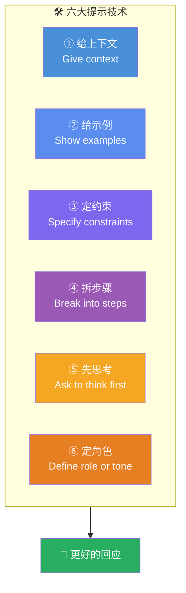

# AI Fluency: Framework & Foundations: 《Effective prompting techniques》高效提示技术

> **课程出处**：Anthropic 官方 Claude Academy (`academy.claude.com/courses/ai-fluency-framework-foundations/effective-prompting-techniques`)  
> **课程定位**：Description 的**技术工具箱**——Prompt engineering 是什么、六大基础提示技术、回应不达标时的排错迭代；本课与 L8 合起来构成 Description 的"道与术"  
> **核心主题**：Prompt engineering 定义、六大技术、秘密武器、迭代本质  
> **课程时长**：15 分钟（第 9/14 课，含练习）

---

## 目录
1. [Prompt Engineering 是什么](#1-prompt-engineering-是什么)
2. [六大基础提示技术](#2-六大基础提示技术)
3. [秘密武器与迭代本质](#3-秘密武器与迭代本质)
4. [实战 Cheatsheet](#4-实战-cheatsheet)

---

## 1. Prompt Engineering 是什么

> Prompt engineering is simply **the practice of designing effective instructions for AI systems**, combining **familiar human communication principles** with **AI-specific considerations**.

- 不要被"工程"二字吓到：一半是你本来就会的**好好说话**，一半是针对 AI 特性的调整
- 与 3P 框架的关系：L8 讲"说清什么"（Product/Process/Performance），本课讲"**怎么说**"（六个具体技法）

---

## 2. 六大基础提示技术



| # | 技术 | 要点 | 已学对应 |
| :--- | :--- | :--- | :--- |
| ① | **给上下文** | 说清**要什么、为什么要、相关背景** | C-T-C-F 的 Context；"模糊 Prompt 反而更贵"（Claude Code L6） |
| ② | **给示例** | 直接**演示**你要的输出风格或格式 | Few-shot；Platform L8 的 Skills（示例即知识） |
| ③ | **定约束** | 明确格式、长度等**硬性要求** | C-T-C-F 的 Characteristics |
| ④ | **拆步骤** | 把复杂任务拆成步骤，**引导多步推理** | 复杂任务进 Plan Mode（Claude Code L4） |
| ⑤ | **先思考** | **留出空间**让 AI 先走一遍过程再作答 | Thinking 模式（Platform L6） |
| ⑥ | **定角色** | 指定 AI 的**沟通角色或语气** | 3P 的 Performance；Subagent 的人设 |

---

## 3. 秘密武器与迭代本质

> The "secret weapon": **Ask the AI itself to help improve your prompt.**

- **让 AI 帮你改 Prompt**——它最清楚自己需要什么信息
- 成功的 Prompting 是**迭代的**（甚至与 AI **协作**的）：根据结果不断打磨，别指望一发命中
- **成功交互的共同模式**：清晰的任务概览 + 格式说明 + 明确约束 + 相关背景

### 反思三问

1. 六大技术中，哪个最能提升你当前的 AI 交互？
2. 回想一次不达预期的交互——哪些技术本可以改善结果？
3. 这些技术与 Description 胜任力是什么关系？（答案：这就是 Description 的具体操作层）

---

## 4. 实战 Cheatsheet

```markdown
### 🛠️ 高效提示技术速查

#### 1. 定义
Prompt engineering = 设计有效指令的实践
= 好好说话（人际原则）+ AI 特性（针对性调整）

#### 2. 六大技术
① 给上下文：要什么 + 为什么 + 背景
② 给示例：直接演示目标输出的样子
③ 定约束：格式 / 长度 / 硬性要求
④ 拆步骤：复杂任务引导多步走
⑤ 先思考：留空间让它先推演再作答
⑥ 定角色：指定角色与语气

#### 3. 秘密武器
让 AI 帮你改 Prompt——"请帮我改进这个提示，
指出缺什么信息"

#### 4. 迭代心态
成功 = 迭代出来的，不是一发命中
发之前过一遍六项，缺哪补哪

#### 5. 成功四要素
任务概览 + 格式说明 + 明确约束 + 相关背景
```

### 课程衔接

> 🔗 **下一课**：L10《A closer look at Discernment》——4D 第三站：L8/L9 讲的都是"怎么说"（Description），Discernment 解决**对话的另一半**——如何带着批判眼光**评估 AI 的产出**。
