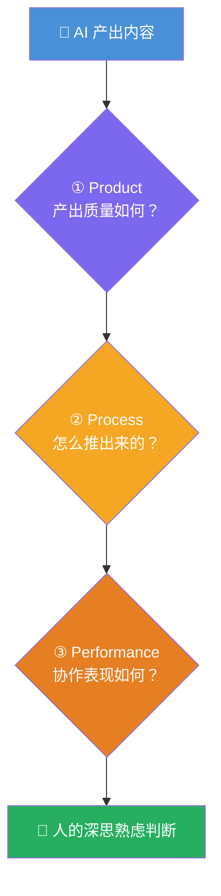

# AI Fluency: Framework & Foundations: 《A closer look at Discernment》辨别深潜

> **课程出处**：Anthropic 官方 Claude Academy (`academy.claude.com/courses/ai-fluency-framework-foundations/a-closer-look-at-discernment`)  
> **课程定位**：4D 深潜第三站——Discernment（辨别）：深思熟虑地评估 AI 的**产出、过程与行为**；官方点题：它是 Description 的**硬币另一面**——一个管"怎么说"，一个管"验收"  
> **核心主题**：3D 辨别框架（Product / Process / Performance）、描述-辨别反馈环  
> **课程时长**：20 分钟（第 10/14 课，含大练习）

---

## 目录
1. [3D 辨别框架](#1-3d-辨别框架)
2. [与 Description 的反馈环](#2-与-description-的反馈环)
3. [练习：领域专家辨别](#3-练习领域专家辨别)
4. [实战 Cheatsheet](#4-实战-cheatsheet)

---

## 1. 3D 辨别框架



| 维度 | 评估什么 | 关键检查点 |
| :--- | :--- | :--- |
| **Product Discernment（产出）** | 实际**输出的质量** | 准确性 / 恰当性 / 连贯性 / 相关性 |
| **Process Discernment（过程）** | AI **怎么得出**这个输出 | 逻辑错误 / 注意力缺口 / 不当推理 / 概念关联是否合理 |
| **Performance Discernment（表现）** | 协作过程中 AI **的表现** | 沟通风格是否有效、是否对你的问题与反馈保持响应 |

> 💡 结构上与 L8 的 3P 完全镜像：Description 说清 **Product/Process/Performance** 的期望，Discernment 就在这三个维度上**逐项验收**——期望与验收对齐，才是完整闭环。

---

## 2. 与 Description 的反馈环

> Discernment works hand-in-hand with Description in a **continuous feedback loop**.

- 验收发现偏差 → 修正 Description → 再验收——两 D 是**同一协作循环的两半**
- **再先进的 AI 也需要人的判断与监督**（呼应 L5：幻觉 + 自信语气 = 最危险的组合）

---

## 3. 练习：领域专家辨别

在你**有专长的领域**练辨别（呼应 L2 练习的"你热爱的主题"）：

1. **回到你的专长话题**（L2 练习讨论过的）
2. **要三份解释**：让 Claude 就同一具体问题生成**三个不同版本**的解释/分析
3. **用 3D 逐版评估**：
   - Product：哪版信息最准确？有事实错误吗？详细度合适吗？
   - Process：推理合逻辑吗？分析有缺口吗？概念关联合理吗？
   - Performance：是否专注回应你的问题？术语用对了吗？语气风格是否提升清晰度？
4. **反馈与改进**：告诉 Claude 最强版**为什么**有效 + 最弱版**哪里**有问题 → 一起改出更好版本
5. **反思**（与 Claude 讨论）：你靠什么**领域知识**识别出强弱？没有专长的人会卡在哪？——**领域知识与辨别力的关系**正是本练习的核心发现

> 🎯 官方彩蛋：最后一课 "Additional Activities" 里有 **Game Night**（游戏化辨别练习），想要更轻松的练法可以回头看。

### 反思三问

1. 3D 三个维度中，哪个对你**最难应用**？为什么？
2. Discernment 与 Description 如何互补、如何协同？
3. 什么样的**信号或模式**提示你"这个输出需要更仔细审查"？

---

## 4. 实战 Cheatsheet

```markdown
### 🔍 Discernment 深潜速查

#### 1. 3D 验收框架（镜像 3P）
Product：产出对不对（准确/恰当/连贯/相关）
Process：怎么推的（逻辑/缺口/推理/概念关联）
Performance：协作表现（响应性/术语/风格有效性）

#### 2. 反馈环
验收发现偏差 → 修正 Description → 再验收
两 D 是同一循环的两半，缺一即开环

#### 3. 危险信号（要更仔细审查）
语气最自信的内容（≠ 最可信）
涉及事实/数据/引用却无出处
推理跳步或概念关联牵强
对你的反馈答非所问

#### 4. 专家练习法
同题要三版解释 → 3D 逐版评
告诉 AI 强在哪弱在哪 → 一起改出第四版
反思：我的领域知识如何帮助我识别问题？

#### 5. 底线认知
再先进的 AI 也需要人的判断与监督
（你学过的 Code review / diff 审查就是 Process+Product 辨别）
```

### 课程衔接

> 🔗 **下一课**：L11《The Description-Discernment loop》——把两个 D **合环实战**：回到 L7 的课程项目，用 Description 沟通 + Discernment 验收，产出人机最佳组合的成果。
