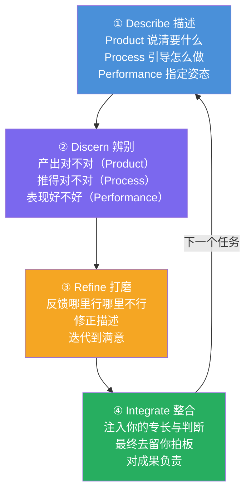

# AI Fluency: Framework & Foundations: 《The Description-Discernment loop》描述-辨别循环

> **课程出处**：Anthropic 官方 Claude Academy (`academy.claude.com/courses/ai-fluency-framework-foundations/the-description-discernment-loop`)  
> **课程定位**：两 D **合环实战课**——回到课程项目（L7 制定的计划），用 Description 沟通 + Discernment 验收，产出**人机协作超越任一方单独成果**的结果  
> **核心主题**：项目执行四步循环（Describe → Discern → Refine → Integrate）  
> **课程时长**：10 分钟（第 11/14 课，纯动手）

---

## 目录
1. [Step 1：回顾项目计划](#1-step-1回顾项目计划)
2. [Step 2：准备描述策略](#2-step-2准备描述策略)
3. [Step 3：四步循环执行](#3-step-3四步循环执行)
4. [实战 Cheatsheet](#4-实战-cheatsheet)

---

## 1. Step 1：回顾项目计划

- 翻出 L7 做的**项目计划与委派决策**（哪些任务留人 / 交 AI / 共创）
- 结合这几课学到的新东西，**放心修订**计划

---

## 2. Step 2：准备描述策略

开工前先和 Claude 对齐 3P 期望：

| 维度 | 开工前要谈清的 |
| :--- | :--- |
| **Product** | 每个任务需要什么**具体产出**？格式/风格/长度/详细度？ |
| **Process** | Claude 该**怎么着手**每个任务？有指定方法/框架/步骤吗？ |
| **Performance** | 协作中要它什么**姿态**？简洁还是详尽？挑战还是支持？ |

> 💡 这一步就是把 L8 的 3P 从"单次 Prompt 检查"升级为**项目级的协作章程**。

---

## 3. Step 3：四步循环执行



对项目里**每个任务**依次走完四步：

1. **Describe**——用 3P 清晰表达需求
2. **Discern**——用 3D 逐维验收
3. **Refine**——反馈有效/无效处，调整描述，迭代到达标
4. **Integrate**——注入你独有的视角、创造力、领域知识；**决定保留/修改/丢弃的最终决定权在你**；**对最终产出负责**

> 🎯 第 ④ 步是全循环的灵魂：官方明说目标是"exceed what either could achieve alone"（超越任一方单独成果）——而 Integrate 正是"人机最佳组合"落地的时刻。这与 Cowork 黄金法则 **Claude can prepare; you ship** 一脉相承。

### 反思三问

1. 什么样的描述模式带来了**最好的结果**？
2. Description 和 Discernment 哪个**花你更多力气**？为什么？
3. 实际执行与 L7 的初始计划相比如何？**中途做了什么调整**？

---

## 4. 实战 Cheatsheet

```markdown
### 🔄 描述-辨别循环速查

#### 1. 开工前（项目级 3P 章程）
Product：每任务要什么产出（格式/风格/长度）
Process：每任务怎么着手（方法/框架/步骤）
Performance：全程协作姿态（简洁 or 详尽/挑战 or 支持）

#### 2. 每任务四步
① Describe：3P 说清需求
② Discern：3D 逐维验收
③ Refine：反馈 + 修描述 + 迭代
④ Integrate：注入专长、拍板去留、承担责任

#### 3. 循环本质
不是线性流程，是每任务一圈的螺旋
目标：超越任一方单独能到的成果

#### 4. 人的角色（第④步灵魂）
最终决定权：保留/修改/丢弃
最终责任：产出是你的名字
（Claude can prepare; you ship）

#### 5. 已学对应
四步循环 = Agentic Loop 的人类版
（你验证 AI 的循环，AI 执行你的任务）
```

### 课程衔接

> 🔗 **下一课**：L12《A closer look at Diligence》——4D 最后一块拼图：Diligence（尽责）。前三个 D 主要管**有效与高效**，Diligence 管**道德与安全**——如何让 AI 协作负责任、透明、可问责。
