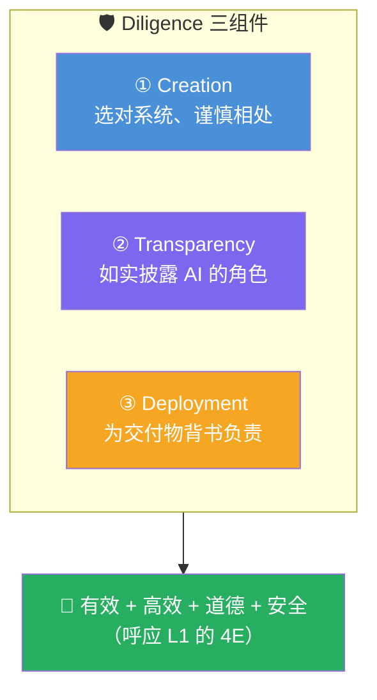

# AI Fluency: Framework & Foundations: 《A closer look at Diligence》尽责深潜

> **课程出处**：Anthropic 官方 Claude Academy (`academy.claude.com/courses/ai-fluency-framework-foundations/a-closer-look-at-diligence`)  
> **课程定位**：4D 深潜收官站——Diligence（尽责）：负责任、合乎道德的 AI 协作；前三个 D 主要管**有效与高效**，Diligence 管**道德与安全**——同样至关重要  
> **核心主题**：三重尽责（Creation / Transparency / Deployment）、Diligence 声明  
> **课程时长**：20 分钟（第 12/14 课，含大练习）

---

## 目录
1. [三重尽责框架](#1-三重尽责框架)
2. [Diligence 声明](#2-diligence-声明)
3. [练习：为自己的项目写声明](#3-练习为自己的项目写声明)
4. [实战 Cheatsheet](#4-实战-cheatsheet)

---

## 1. 三重尽责框架



| 组件 | 负什么 | 关键问题 |
| :--- | :--- | :--- |
| **Creation Diligence（创作）** | **选择与相处**：深思熟虑地选 AI 系统、决定怎么用 | 为什么选这个系统？共享了什么数据？有隐私/安全/伦理考量吗？ |
| **Transparency Diligence（透明）** | **如实披露**：向所有需要知道的人披露 AI 的角色 | 受众是谁？他们对 AI 披露有什么期望？AI 具体贡献了什么？ |
| **Deployment Diligence（部署）** | **交付背书**：对使用/分享的产出**验证并担保** | 怎么验证准确性与恰当性的？如何确保达标？你承担什么责任？ |

> 💡 **情境敏感性**：个人 / 学术 / 职业场景对披露与验证的**期望不同**——责任是理解并**满足所在情境的期望**。

---

## 2. Diligence 声明

> 官方连**本课程自己都附了一份 diligence statement**（PDF）——言行一致。

声明的标准结构（官方模板）：

```markdown
"在创作本 [文档/项目/内容] 时，我与 [AI 助手名] 协作完成 [具体任务：起草、
研究、编辑等]。我确认所有 AI 生成与共创的内容都经过了我的**彻底审查与评估**。
最终产出准确反映了我的理解、专长与本意。AI 协助在过程中至关重要，但我对
内容、其准确性及其呈现**承担全部责任**。本披露本着透明精神作出，以确认
AI 在创作过程中的角色。"
```

四要素：**用了什么 AI + AI 贡献了什么 + 评审过程是什么 + 责任我来担**。

---

## 3. 练习：为自己的项目写声明

四步（约 14 分钟）：

1. **理解声明**：读官方模板与本课程自己的声明
2. **反思自己的协作**：按三重尽责逐项过（选了什么系统共享了什么数据 / 受众期望什么 / 怎么验证的）
3. **与 Claude 共同起草**：分享反思（可选：分享历史对话），协作写出**项目专属**声明，覆盖四要素 + 情境考量（学术/职业）
4. **挂到成品上**：页脚 / 附录 / 元数据——**完成的标志是声明就位**

### 反思五问

1. 三重尽责中哪个对你**最难**？为什么？
2. 个人 / 学术 / 职业场景下你的 Diligence 做法**会怎么变**？
3. 承认 AI 的角色会如何影响**别人对你工作的看法**？
4. 项目过程中出现了哪些**没预料到的伦理考量**？
5. 你会为自己定什么**个人 AI 协作守则**？

---

## 4. 实战 Cheatsheet

```markdown
### 🛡️ Diligence 深潜速查

#### 1. 三重尽责
① Creation：选对系统、想清共享什么数据
② Transparency：对需要知道的人如实披露
③ Deployment：验证 + 为交付物背书（担责）

#### 2. 情境敏感
个人/学术/职业的披露与验证期望不同
责任 = 理解并满足所在情境的期望

#### 3. 声明四要素
用了什么 AI + AI 贡献了什么
+ 评审过程是什么 + 责任我来担

#### 4. 已学对应
Creation ← Cowork L11 权限与安全设置
Transparency ← 团队分享时的开放沟通
Deployment ← L11 循环的 Integrate 步
（"Claude can prepare; you ship" 就是
Deployment Diligence 的口号版）

#### 5. 个人守则问题清单
这数据能给它吗？（Creation）
谁需要知道 AI 参与了？（Transparency）
我敢为这产出签字吗？（Deployment）
```

### 课程衔接

> 🔗 **下一课**：L13《Conclusion》——收官课：回望整个 4D 框架如何协同工作，以及 AI 能力持续演进时你如何继续发展这些胜任力。
