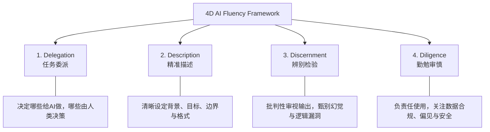

# Claude Academy: 《Claude 101》全景学习笔记

> **课程出处**：Anthropic 官方 Claude Academy (`academy.claude.com`)  
> **课程定位**：将 Claude 从“简单问答对话框”升级为“日常工作流与生产力中枢”的基础入门课  
> **学习时长**：约 2.5 小时（13 节课 + 1 个结课测试）

---

## 目录
1. [课程核心理念与定位](#1-课程核心理念与定位)
2. [核心思维模型：4D AI 流畅度框架 (4D Fluency Framework)](#2-核心思维模型4d-ai-流畅度框架-4d-fluency-framework)
3. [核心生产力组件：Projects, Artifacts & Skills](#3-核心生产力组件projects-artifacts--skills)
4. [三大工作模式：Chat, Cowork & Code](#4-三大工作模式chat-cowork--code)
5. [数据互联与外部知识：Connectors & Enterprise Search](#5-数据互联与外部知识connectors--enterprise-search)
6. [高效 Prompting 实战法则 (Cheatsheet)](#6-高效-prompting-实战法则-cheatsheet)
7. [常见误区与最佳实践](#7-常见误区与最佳实践)

---

## 1. 课程核心理念与定位

- **从“聊天机器人”到“智能协作者”**：不要仅将 Claude 视为搜索引擎或简单的回答工具，而应将其视为**拥有极高上下文理解能力的数字工作伙伴**。
- **掌握系统化工作流**：将分散的问答聚合为有结构、有持久记忆、有专属上下文的项目流。

---

## 2. 核心思维模型：4D AI 流畅度框架 (4D Fluency Framework)

Anthropic 在 AI Fluency 体系中提炼了人机协作的 **4D 核心能力模型**：



| 维度 | 核心含义 | 实践要点 |
| :--- | :--- | :--- |
| **Delegation**<br>(分工与委派) | 识别任务特性，决定人机边界 | 适合委派：草稿拟定、结构化摘要、数据转换、代码调试、多角度头脑风暴；<br>人类保留：价值判断、最终审核、关键战略决策。 |
| **Description**<br>(精准描述) | 消除歧义，提供充要条件 | 遵循 **C-T-C-F** 法则（Context 背景 + Task 任务 + Constraints 约束 + Format 格式）。 |
| **Discernment**<br>(批判审视) | 质量检验与事实查证 | 不盲从 AI 生成的内容；要求 Claude 给出推导逻辑与信息出处；进行交叉对比。 |
| **Diligence**<br>(合规与审慎) | 安全伦理与数据隐私 | 确保企业合规政策；脱敏敏感数据；防范潜在偏见与幻觉风险。 |

---

## 3. 核心生产力组件：Projects, Artifacts & Skills

### 3.1 Projects (项目空间)
* **作用**：为特定任务或工作域提供**专属的上下文容器**与**持久记忆**。
* **关键要素**：
  1. **Custom Instructions (自定义指令)**：针对该项目的通用规则（如语气、代码规范、目标受众）。
  2. **Project Knowledge (项目知识库)**：上传相关文档、参考规范、历史资料（支持 PDF、Markdown、代码文件等），后续对话自动共享这些背景。
  3. **对话隔离**：避免不同项目之间的上下文混杂。

### 3.2 Artifacts (独立工件)
* **作用**：将大段独立产出（代码、文档、Mermaid 图表、HTML/React UI 原型、SVG 等）从主聊天流中剥离，呈现在右侧独立侧边栏。
* **优势**：
  - **实时预览**：交互式前端、图表和文档可在侧边栏直接渲染。
  - **原地迭代**：支持在不污染主对话流的前提下，对工件进行版本切换与针对性修改。
  - **一键导出/复用**：方便下载或直接复制独立产出物。

### 3.3 Skills (技能/规范沉淀)
* **作用**：固化可重复使用的业务流与指令模版，让 Claude 快速套用特定分析模式或标准作业程序 (SOP)。

---

## 4. 三大工作模式：Chat, Cowork & Code

根据工作场景与复杂度选择合适的入口：

| 模式 | 适用场景 | 核心特点 |
| :--- | :--- | :--- |
| **Chat**<br>(日常对话) | 日常问答、简短分析、文案打磨、即时头脑风暴 | 轻量、迅速、开箱即用 |
| **Cowork**<br>(深度协同) | 复杂长文写作、多文档联合分析、长周期方案推演 | 深度交互、多文档交叉引用、协同编辑 |
| **Code**<br>(编程开发) | 软件工程、自动化脚本、终端集成、仓库级代码重构与调试 | 代码执行、工具调用、集成开发体验 (CLI / Claude Code) |

---

## 5. 数据互联与外部知识：Connectors & Enterprise Search

- **Research Tools / Web Search**：突破知识截止时间限制，实时检索互联网公开信息与学术/行业最新动态。
- **Enterprise Search (企业搜索)**：安全连接组织内部数据资产（如 Google Drive, Notion, Slack, GitHub, Linear, Microsoft 365 等）。
- **Model Context Protocol (MCP)**：Anthropic 推出的开放协议，为 Claude 挂载外部数据库、API 与专属工具链。

---

## 6. 高效 Prompting 实战法则 (Cheatsheet)

### 黄金结构：
```markdown
1. 【Role / Persona】你是资深的...（设定角色视角）
2. 【Context】背景信息：当前业务现状、业务目标是...
3. 【Task】具体任务：请根据上述背景输出...
4. 【Constraints】限制条件：字数限制在 X 内 / 采用专业且克制的语气 / 必须分点陈述
5. 【Format & Examples】输出格式及示例（如 Markdown 表格、JSON、步骤清单等）
```

### 提示词提效 5 大技巧：
1. **提供 Few-Shot 样本**：给 1-2 个高质量输入-输出范例，效果远优于纯文字描述。
2. **使用 XML 标签分隔模块**：使用 `<context>...</context>`、`<rules>...</rules>`、`<input>...</input>` 帮助 Claude 完美理解长文本结构。
3. **鼓励“逐步思考” (Chain of Thought)**：加入 `请在最终结论前，先列出分析推导步骤`，大幅提升复杂逻辑题的准确率。
4. **明确“允许承认不知道”**：加入 `如果参考资料中未提及某信息，请明确说明无法获取，切勿猜测`，有效抑制幻觉。
5. **指定输出格式**：要求以特定 JSON Schema、Markdown 标题或表格形式返回，便于下游自动化集成。

---

## 7. 常见误区与最佳实践

| 常见误区 | 最佳实践 (Anthropic 推荐) |
| :--- | :--- |
| ❌ 每次开新会话都重新粘贴所有背景文档 | ✅ 将公用文档放入 **Projects** 知识库统一管理 |
| ❌ 提示词过于宽泛（如“写一篇关于AI的文章”） | ✅ 指定受众、篇幅、核心观点、语气与落地案例 |
| ❌ 将所有代码/文案堆在单个聊天气泡中修改 | ✅ 利用 **Artifacts** 针对单块产出进行精准版本迭代 |
| ❌ 盲目采信所有生成的数字与引用 | ✅ 践行 **Discernment**，核对关键数据源与推导链条 |
