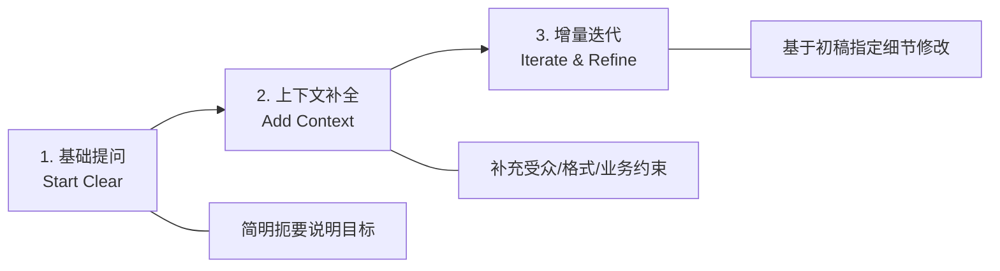

# Claude Academy: 《Getting Started with Claude.ai》实操学习笔记

> **课程出处**：Anthropic 官方 Claude Academy 快速入门指南 (`tutorials/getting-started-with-claude-ai`)  
> **学习定位**：Claude.ai 网页与桌面客户端操作指南与核心能力实操速查  
> **学习时长**：约 5 分钟短视频精讲

---

## 目录
1. [界面布局与导航机制](#1-界面布局与导航机制)
2. [高质量对话的 3 步法则 (Prompt 迭代)](#2-高质量对话的-3-步法则-prompt-迭代)
3. [多模态与文档分析能力 (Data & Document Handling)](#3-多模态与文档分析能力-data--document-handling)
4. [模型选型与高级特性 (Models & Features)](#4-模型选型与高级特性-models--features)
5. [高效操作 Cheatsheet & 避坑指南](#5-高效操作-cheatsheet--避坑指南)

---

## 1. 界面布局与导航机制

```
+-------------------------------------------------------------------------------+
| [Sidebar 侧边栏]           | [Main Workspace 主工作区]                        |
| - Start new chat (新对话)  |                                               |
| - Starred chats (收藏)     | 当前对话消息流 / Artifacts 分割视图              |
| - Projects (项目空间)       |                                               |
| - History (历史记录)       | --------------------------------------------- |
| - Settings & Academy       | 输入框 (Prompt Input) + 附件上传 + 模式开关     |
+-------------------------------------------------------------------------------+
```

* **左侧侧边栏**：
  - **Start new chat**：开启独立无污染的新对话（建议不同任务随时开新对话）。
  - **Projects**：跳转到特定工作区/项目空间。
  - **History 搜索**：通过关键词快速检索过往对话记录。
* **底部输入区**：
  - 支持直接粘贴多行文字、快捷键换行（`Shift + Enter`）与发送（`Enter`）。
  - 附件按钮（📎）支持直接拖拽/上传本地文件与图片。

---

## 2. 高质量对话的 3 步法则 (Prompt 迭代)



### 第一步：明确任务基线 (Clear Intent)
- 告诉 Claude 明确的目标，而不是模糊的愿望。
- *例*：“请帮我把这份会议纪要整理出 3 个行动项 (Action Items)。”

### 第二步：注入关键上下文与约束 (Context & Constraints)
- **受众定位**：写给高管汇报 vs 工程师技术讨论。
- **输出格式**：Markdown 表格、编号清单、JSON 代码块或两百字短摘要。
- **语言风格**：正式专业、轻松活泼或客观严谨。

### 第三步：多轮增量迭代 (Iterative Refinement)
- 避免一次不满意就推倒重来，直接针对 Claude 输出的具体段落提出调整：
  - *“第 2 点阐述过长，请精简为一句话。”*
  - *“增加一个关于性能瓶颈的风险分析列。”*

---

## 3. 多模态与文档分析能力 (Data & Document Handling)

Claude 拥有强大的长文本（200K+ 上下文）与多模态解析能力：

### 3.1 支持的文件格式
- **文档类**：PDF、Word (.docx)、Markdown (.md)、TXT、CSV 等。
- **代码与数据**：JSON、Python/JS/HTML 代码文件、SQL 导出。
- **图像与截屏**：PNG、JPEG、WebP（支持解析 UI 截图、架构草图、数据报表折线图等）。

### 3.2 典型应用操作
1. **长篇文档摘要与交叉比对**：
   - 上传两份不同季度的财报 / 规范方案，要求 `“对比这两份文件的核心差异点，并制作对比表格”`。
2. **非结构化数据转结构化**：
   - 粘贴混乱的聊天记录或上传扫描件，要求 `“提取所有提及的时间、责任人与待办，以 JSON 格式输出”`。
3. **根据草图生成代码**：
   - 截图一段网页或手绘线框图，要求 `“使用 Tailwind CSS + HTML 构建此界面的前端代码（在 Artifact 中展示）”`。

---

## 4. 模型选型与高级特性 (Models & Features)

### 4.1 Claude 家族核心模型定位
| 模型系列 | 特点与优势 | 适用场景 |
| :--- | :--- | :--- |
| **Claude Haiku** | 极速响应、极低成本、轻量精炼 | 简短数据清洗、快速日常问答、高频次自动化处理 |
| **Claude Sonnet** | 智能水平与处理速度的最佳平衡点（主力推荐） | 日常复杂分析、长文档写作、代码编写与重构、全能办公 |
| **Claude Opus** | 顶尖的深度推理，胜任极其复杂的逻辑推演 | 重大方案设计、多层嵌套数学与逻辑问题、学术级深度分析 |

### 4.2 核心高级特性
1. **Extended Thinking (扩展思考模式 / 深度思考)**：
   - 开启后，Claude 会在给出最终回答前进行深入的隐式/显式逻辑推导，极大减少复杂逻辑与算法设计中的错误。
2. **Search / Research Mode (联网与研究模式)**：
   - 允许实时检索最新网络公开数据与行业动态，弥补训练数据的时间限制。
3. **Artifacts 联动**：
   - 当输出涉及独立文档、代码片段、SVG 图表时自动激活右侧视窗，支持交互与快速下载。

---

## 5. 高效操作 Cheatsheet & 避坑指南

| 场景 | 推荐操作 | 避免做法 |
| :--- | :--- | :--- |
| **开启全新话题** | 点击左上角开新 Chat，保持上下文纯净 | 在同一个聊天中连续讨论 10 个互不相关的主题（导致上下文混乱且消耗 Token） |
| **分析超长文档** | 先让 Claude 输出全文大纲，再针对性深入某章节 | 一股脑让 Claude 逐字精读并输出上万字全文重写 |
| **代码与原型生成** | 要求在 **Artifact** 中以组件形式提供，便于独立调试 | 混杂在长对话文本中，难以完整复制和运行 |
| **复杂推理任务** | 开启 **Extended Thinking** 或在 Prompt 中要求分步思考 | 期望一步直接给出涉及多变量的复杂计算结果 |
