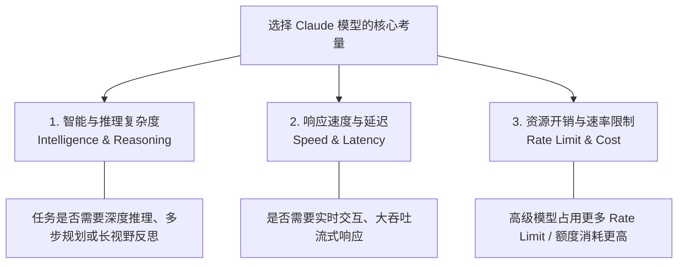
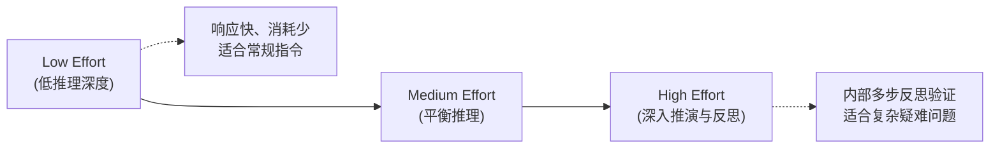
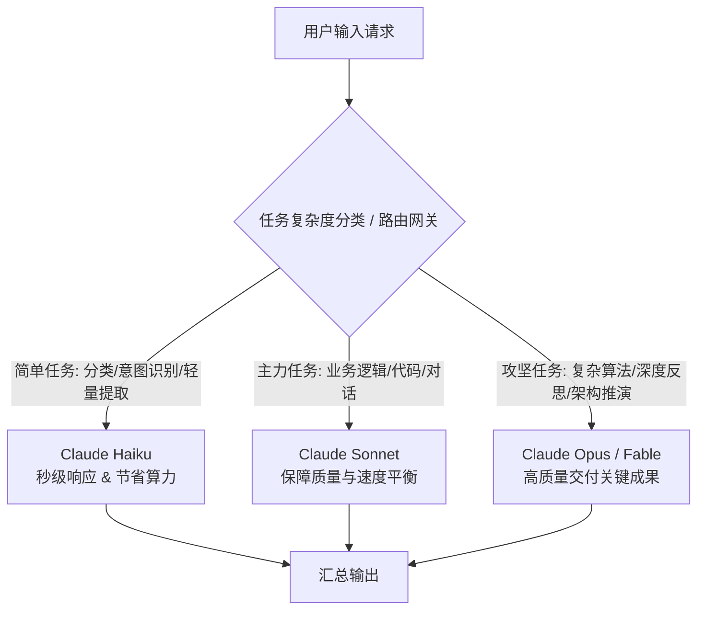
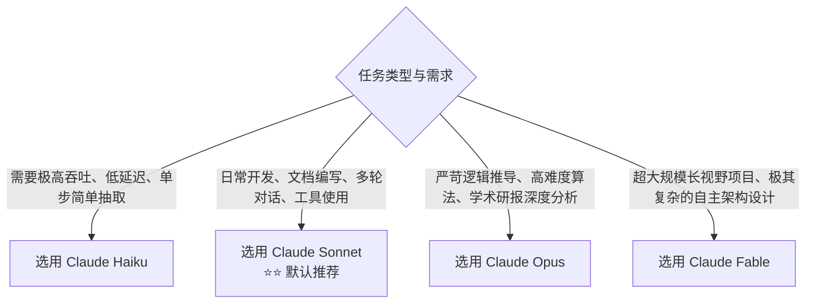

# Claude Academy: 《Choosing the Right Claude Model》学习笔记

> **课程出处**：Anthropic 官方 Claude Academy (`academy.claude.com/tutorials/choosing-the-right-claude-model`)  
> **课程定位**：掌握 Claude 模型家族的性能特点、速率限制与成本权衡，精准为任务匹配最优模型与思考强度  
> **核心主题**：模型家族分级（Haiku / Sonnet / Opus / Fable）、速率限制权衡、Effort 调节、分层路由架构

---

## 目录
1. [模型选型核心理念与权衡模型](#1-模型选型核心理念与权衡模型)
2. [Claude 模型家族能力矩阵与适用场景](#2-claude-模型家族能力矩阵与适用场景)
3. [Effort 思考深度调节机制](#3-effort-思考深度调节机制)
4. [企业级与工程实践：分层路由架构 (Tiered Routing)](#4-企业级与工程实践分层路由架构-tiered-routing)
5. [选型决策流与速查表 (Decision Flow & Cheatsheet)](#5-选型决策流与速查表-decision-flow--cheatsheet)

---

## 1. 模型选型核心理念与权衡模型

在 Claude 的实际使用与工程落地中，选择模型的核心并不是“盲目追求最强”，而是**在性能（能力）、速度（延迟）与消耗（Rate Limit / 成本）之间寻找最佳平衡点**。

### 核心认知法则
- **拒绝“杀鸡用牛刀”**：使用重型模型（如 Opus / Fable）处理简单摘要或分类任务，不仅会迅速耗尽你的账号速率限制（Rate Limits），还会增加不必要的等待时间。
- **默认主力原则 (Workhorse Default)**：在大多数通用业务场景下，优先以 **Sonnet** 作为默认主力模型，仅在遇到瓶颈或极端场景时向上或向下调整。

---

## 2. Claude 模型家族能力矩阵与适用场景

Anthropic 构建了由轻到重、定位分明的分级模型梯队：

| 模型分类 | 消耗与速率权重 (Weight) | 核心定位 | 最佳适用场景 (Best For) |
| :--- | :--- | :--- | :--- |
| **Claude Haiku** | **最轻 (Lightest)** | 极速响应、高吞吐、低成本 | • 快速简短问答与文本润色 • 大规模文档信息抽取与分类 • 结构化数据清洗、翻译与初步过滤 • 实时客服机器人的初步路由 |
| **Claude Sonnet** | **适中 (Moderate)** | 全能日常主力 (Daily Driver) | • 复杂代码编写、重构与 Bug 排查 • 多步骤复杂工作流、方案撰写 • 知识库检索与长文档分析 • 大多数 Agent 工具调用与日常交互 |
| **Claude Opus** | **较重 (Heavy)** | 深度研究与严密推理 | • 复杂数学、逻辑推理与严苛学术推导 • 跨学科/超长跨度文献综合深度分析 • 架构设计、高要求策略推演与代码审计 |
| **Claude Fable** | **最重 (Heaviest)** | 顶级攻坚与超大型复杂项目 | • 极度复杂的大型系统级架构与全自动决策 • 超长视野任务规划与自主代理编排 • 关键性关键资产/战略级代码工程 |

---

## 3. Effort 思考深度调节机制

除模型选择外，Anthropic 引入了 **Effort（思考程度/努力水平）** 调节参数，允许用户在同一种模型内灵活平衡“推理深度”与“速度/额度开销”：

* **灵活性优先**：在很多情况下，调整当前模型的 Effort 等级，比直接切换整个模型架构更加丝滑且符合成本效益。
* **按需释放算力**：简单修改采用 Low Effort，疑难逻辑开启 High Effort 确保准确率。

---

## 4. 企业级与工程实践：分层路由架构 (Tiered Routing)

在构建实际 LLM 应用或 Agent 系统时，推荐采用**分层路由（Tiered / Routed Stack）**架构：

### 最佳实践建议：
1. **意图分流**：前端先由 Haiku 快速判定意图与抽取参数。
2. **渐进升级 (Fallback / Upgrade)**：若 Sonnet 尝试 1~2 次未能解决深层疑难逻辑，自动升舱至 Opus/Fable。
3. **成本效益最大化**：90% 的日常请求由 Haiku 与 Sonnet 消化，将 Opus/Fable 留给核心 10% 的高价值攻坚场景。

---

## 5. 选型决策流与速查表 (Decision Flow & Cheatsheet)

### 💡 核心法则速记
- **默认选 Sonnet**：日常工作流 80%~90% 的首选。
- **批量/简单换 Haiku**：省额度、高并发、秒返回。
- **疑难硬核上 Opus / Fable**：用在刀刃上，不浪费宝贵的 Rate Limit。
- **结合 Effort 动态调优**：单模型内微调思考深度，获得最精确的性能收益。
