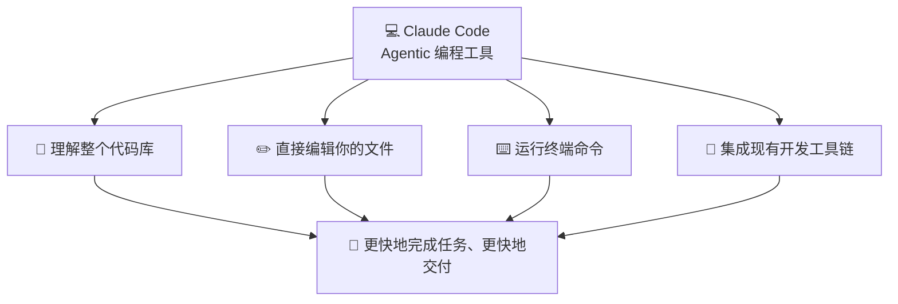
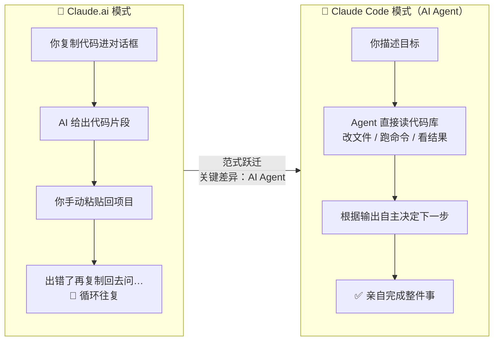
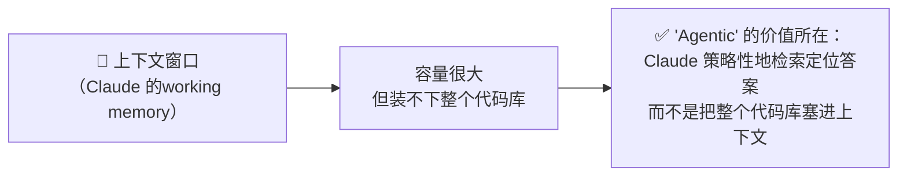

# Claude Code 101: 《What is Claude Code?》Agentic 编程工具入门

> **课程出处**：Anthropic 官方 Claude Academy (`academy.claude.com/courses/claude-code-101/what-is-claude-code`)  
> **课程定位**：Claude Code 板块第一课——理解 Claude Code 与 Claude.ai 的本质区别、AI Agent 的定义，以及高效使用 Claude Code 需要建立的三个核心认知  
> **核心主题**：Agentic 编程工具、AI Agent 定义、四大核心能力、上下文窗口、权限模式、保持人在环  
> **课程时长**：约 5 分钟（第 1/12 课）

---

## 目录
1. [Claude Code 是什么](#1-claude-code-是什么)
2. [与 Claude.ai 的本质区别：AI Agent](#2-与-claudeai-的本质区别ai-agent)
3. [四大核心能力](#3-四大核心能力)
4. [高效使用的三个核心认知](#4-高效使用的三个核心认知)
5. [实战 Cheatsheet](#5-实战-cheatsheet)

---

## 1. Claude Code 是什么

课程给出的定义：

> Claude Code is an **agentic coding tool** that understands your codebase, edits your files, runs commands, and integrates with your existing developer tools to help you get things done faster.



### 可用环境（5 个入口）

| 入口 | 说明 |
| :--- | :--- |
| **终端（Terminal）** | CLI 形态，最原生的工作方式 |
| **Visual Studio Code** | VS Code 扩展集成 |
| **JetBrains IDEs** | JetBrains 全家桶（IDEA / PyCharm 等） |
| **Claude Desktop 应用** | 桌面端 App |
| **Web** | 网页端 |

---

## 2. 与 Claude.ai 的本质区别：AI Agent

如果你用过 Claude.ai，可能会问：Claude Code 到底有什么不同？

> Unlike Claude.ai, Claude Code has **direct access** to your files, your terminal, and your entire codebase. Instead of copying and pasting code back and forth, **it goes in and does the work itself**.  
> （与 Claude.ai 不同，Claude Code 直接访问你的文件、终端和整个代码库。它不再是来回复制粘贴代码——而是亲自进去把活干了。）



### 什么是 AI Agent？

课程给出的定义：

> An AI Agent is software that can **interact with its environment** and **perform actions** to complete a **defined goal**. At its core, this works by having a large language model **operating in a loop in real time**.

拆解这个定义的四个要素：

| 要素 | 含义 |
| :--- | :--- |
| **与环境交互**（interact with environment） | 能读写文件、执行命令、访问外部世界 |
| **执行动作**（perform actions） | 不是"建议你做什么"，而是自己动手做 |
| **完成明确目标**（defined goal） | 围绕你定义的目标自主推进 |
| **实时循环运行**（LLM in a loop） | 核心机制：大模型在循环中实时运转——感知 → 行动 → 观察结果 → 再行动 |

此外，Agent 还可以调用**工具（tools）**、**外部服务（external services）**、甚至**其他 AI Agent** 来达成目标。

---

## 3. 四大核心能力

Claude Code 作为 Agent 在实际开发中能做什么：

| 能力 | 说明 | 典型用法 |
| :--- | :--- | :--- |
| **📖 读懂代码库** | 跨文件理解项目结构与逻辑 | "解释这个功能的实现" / "追踪这个 bug 在代码里的传播路径" |
| **✏️ 跨项目编辑文件** | 一次重构波及所有引用处 | 重构某个函数，并自动更新引用它的每一个文件 |
| **⌨️ 运行终端命令** | 执行并利用输出 | 跑构建脚本 / 跑测试 / 装依赖包，**根据输出决定下一步** |
| **🌐 搜索网络** | 按需获取外部知识 | 查文档、找最新 API 参考 |

> 💡 注意"根据输出决定下一步"这一句——这正是 Agent「循环运行」特质的体现：跑完测试 → 看到失败信息 → 定位问题 → 修改代码 → 再跑测试。

---

## 4. 高效使用的三个核心认知

课程强调，用好 Claude Code 需要铭记三件事：

### 4.1 上下文窗口（The context window）= Claude 的工作记忆



- 类比：**工作记忆**——能装很多，但不可能一次装下所有
- Agentic 能力的意义正在于此：Claude 会**策略性地**在代码库中定位答案（搜索、读文件、跟踪引用），而非暴力加载全部内容

### 4.2 权限由你掌控（You control its permissions）

| 权限模式 | 工作方式 | 适合人群 |
| :--- | :--- | :--- |
| **询问模式** | 运行命令、修改文件前**先问你** | 喜欢 hands-on 亲自把关 |
| **自动模式** | 后台安全检查逐项筛查每个动作后自动执行 | 喜欢 hands-off 放手让它干 |

> 无论哪种模式，**你始终掌控全局**（You're always in control）——与 Cowork 课程的"Human-in-the-Loop"哲学一致。

### 4.3 它会犯错（It can make mistakes）

Claude Code 并不完美，可能：
- **误解你的意图**（misunderstand intent）
- **引入 bug**（introduce a bug）
- **过度设计**（over-engineer a solution）

> **Staying in the loop helps you catch these early.**（保持人在环，帮你尽早发现这些问题。）——这是贯穿整个 Claude 生态课程的不变原则。

---

## 5. 实战 Cheatsheet

```markdown
### 💻 Claude Code 入门速查

#### 1. 一句话定位
Agentic coding tool：理解代码库 + 编辑文件 + 跑命令 + 集成工具链，
五个入口可用（终端 / VS Code / JetBrains / Desktop / Web）

#### 2. 与 Claude.ai 的核心区别
Claude.ai = 复制粘贴代码的对话
Claude Code = 直接访问文件/终端/代码库的 AI Agent（亲自干活）

#### 3. AI Agent 四要素
与环境交互 + 执行动作 + 明确目标 + LLM 实时循环
（可调用 tools / 外部服务 / 其他 Agent）

#### 4. 三大认知心法
① 上下文窗口 = 工作记忆：Claude 靠策略性检索，不靠全量加载
② 权限你掌控：询问模式（每步先问）vs 自动模式（后台安全检查）
③ 它会犯错：误解意图 / 引入 bug / 过度设计 → 保持人在环尽早纠偏

#### 5. 四大能力对应的高频指令
- 读懂："解释 X 功能" / "追踪这个 bug 的来源"
- 编辑："重构 X 函数并更新所有引用"
- 命令："跑测试，根据结果修复失败项"
- 搜索："查一下这个库的最新 API 文档"
```

### 课程衔接

> 🔗 **下一课预告**：L2《How Claude Code works》——深入 Claude Code 的工作机制：它是如何检索代码、执行操作、组织整个 Agent 循环的。
