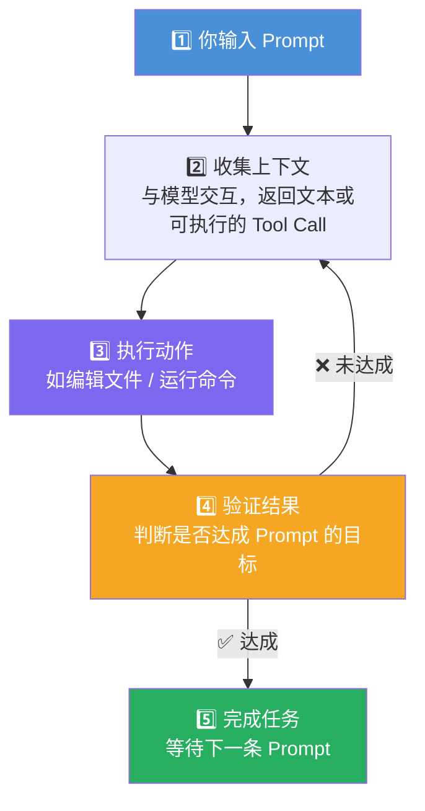
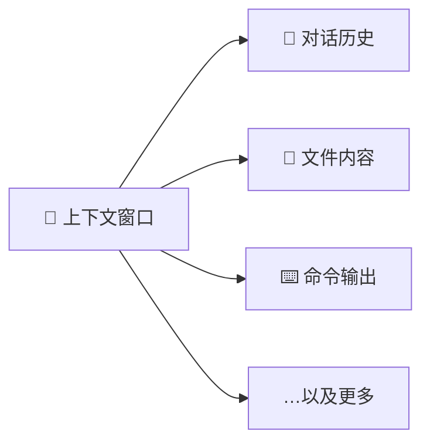
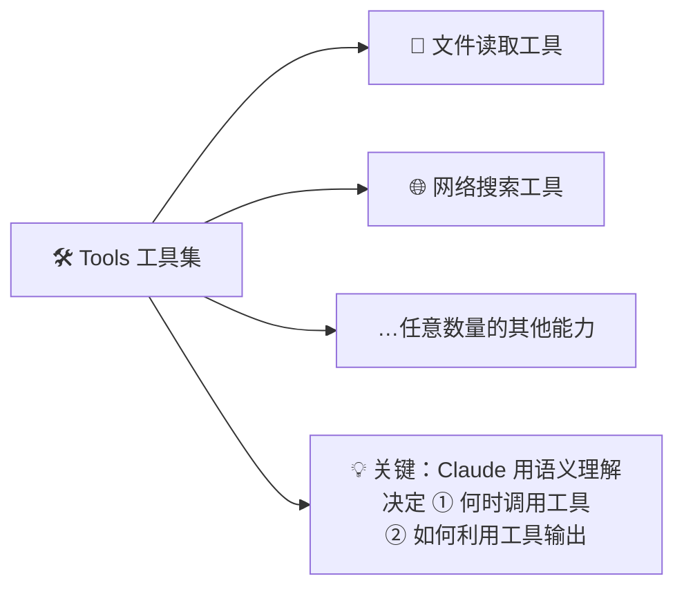
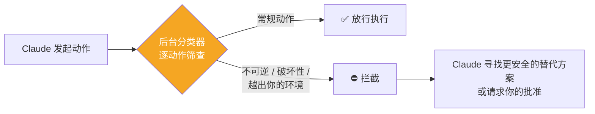

# Claude Code 101: 《How Claude Code works》Agentic 循环与底层机制深度解析

> **课程出处**：Anthropic 官方 Claude Academy (`academy.claude.com/courses/claude-code-101/how-claude-code-works`)  
> **课程定位**：揭开 Claude Code 的引擎盖——理解 Agentic Loop、上下文窗口管理、工具调用与四种权限模式，从"会用"进阶到"懂原理地用"  
> **核心主题**：Agentic Loop 五步循环、上下文压缩（Compaction）、工具（Tools）机制、四种权限模式  
> **课程时长**：约 5 分钟（第 2/12 课）

---

## 目录
1. [核心引擎：Agentic Loop 五步循环](#1-核心引擎agentic-loop-五步循环)
2. [上下文窗口与自动压缩](#2-上下文窗口与自动压缩)
3. [工具：Agent 的脊梁](#3-工具agent-的脊梁)
4. [四种权限模式](#4-四种权限模式)
5. [实战 Cheatsheet](#5-实战-cheatsheet)

---

## 1. 核心引擎：Agentic Loop 五步循环

Claude Code 与普通聊天应用的根本不同，在于它运行在一个 **Agentic Loop（代理循环）** 之上：



### 逐步拆解

| 步骤 | 发生什么 |
| :--- | :--- |
| **① 输入 Prompt** | 你描述目标 |
| **② 收集上下文** | Claude 与模型交互，模型返回**文本**或**工具调用（tool call）**供 Claude Code 执行 |
| **③ 执行动作** | 实际动手：编辑文件、运行命令等 |
| **④ 验证结果** | 自我检查：结果是否达成了 Prompt 设定的目标 |
| **⑤ 完成 / 循环** | 达成 → 结束待命；未达成 → **回到 ② 再来**，直到结果**完整且可验证**（complete and verifiable） |

### 人类在循环中的位置

> **Throughout this loop, you can add context, interrupt, or steer the model to help guide it toward your goal.**

循环全程你都可以：**补充上下文 / 打断 / 校正方向**——与 Cowork Task Loop 的 Steer 阶段完全同构。

---

## 2. 上下文窗口与自动压缩

### 上下文窗口装什么



- 上下文窗口决定了 Claude 能**存储和引用**多少信息：对话、文件内容、命令输出等
- 一旦逼近上限——

### Compaction（自动压缩）机制

> Claude Code **compacts** your conversation — automatically determining **what it can remove or summarize** to bring the context window back down to a usable size.

- 触发条件：上下文达到限额
- 动作：自动判断**哪些内容可以移除、哪些可以摘要化**
- 目标：把上下文窗口压回**可用大小**，循环得以继续

> 💡 这解释了长会话中 Claude Code 为什么能持续工作数小时——上下文不是被"装满即死"，而是被**滚动管理**的。

---

## 3. 工具：Agent 的脊梁

> **Tools are the backbone of how agents work.**

### 与普通 AI 助手的本质分野

| | 普通 AI 助手 | Claude Code（有工具） |
| :--- | :--- | :--- |
| **模式** | 文本进 → 文本出（text in, text out） | 文本进 → **行动出** |
| **能力** | 只能"说"该怎么做 | **决定何时执行代码**来逼近任务完成 |



两个关键点：
- 工具种类不限：读文件、搜网络，乃至任意扩展能力
- **语义理解驱动调度**：不是机械规则触发，而是 Claude 理解任务后自主判断何时该用什么工具、如何消化输出

---

## 4. 四种权限模式

| 模式 | 工作方式 | 要点 |
| :--- | :--- | :--- |
| **Manual（手动）** | 编辑文件、运行 shell 命令前**逐项请求明确许可** | 最细粒度掌控 |
| **Auto-accept（自动接受）** | **文件编辑不再询问**，但**命令仍需批准** | 折中：改动放行、执行把关 |
| **Plan mode（计划模式）** | 只用**只读工具**汇总出一份行动计划，**开始干活之前**先给方案 | 先谋后动，干预成本最低 |
| **Auto mode（全自动）** | 无许可弹窗持续工作，**后台分类器逐动作筛查**，专拦**不可逆、破坏性、越出你的环境**的操作 | 被拦截时 Claude 通常会改走更安全的路线，或请示你放行 |

### 自动模式的安全分类器



### 两条注意事项

1. **新会话的默认模式**取决于你的**套餐（plan）与设置（settings）**
2. > ⚠️ **Be cautious when skipping permissions** — 放开权限让 Claude Code 自由跑命令，意味着**错误更难在发生前被拦截**。所有权限都可在 settings 文件中配置。

---

## 5. 实战 Cheatsheet

```markdown
### ⚙️ Claude Code 工作机制速查

#### 1. Agentic Loop 五步
输入 Prompt → 收集上下文（文本/Tool Call）→ 执行动作
→ 验证结果 → 达成即完成 / 未达成回环重试
（目标：complete and verifiable 的结果）
全程可干预：补上下文 / 打断 / 转向

#### 2. 上下文管理
窗口装：对话历史 + 文件内容 + 命令输出 + …
到达上限 → 自动 Compaction（移除可移除的、摘要可摘要的）
→ 压回可用大小继续干活

#### 3. 工具 = Agent 的脊梁
普通助手：文本进文本出；Claude Code：语义理解驱动
自主决定 ①何时调用工具 ②如何用输出

#### 4. 权限模式四档
- Manual：文件+命令都逐项问
- Auto-accept：文件编辑放行，命令仍需批
- Plan mode：只读工具先出计划，批准后动手
- Auto mode：零弹窗 + 后台分类器拦"不可逆/破坏性/越界"动作

#### 5. 安全提醒
跳过权限 = 错误更难在发生前拦截
新会话默认模式由套餐与设置决定，可在 settings 文件配置
```

### 课程衔接

> 🔗 **下一课预告**：L3《Installing Claude Code》——环境搭建：安装步骤、入口选择与初始配置。
