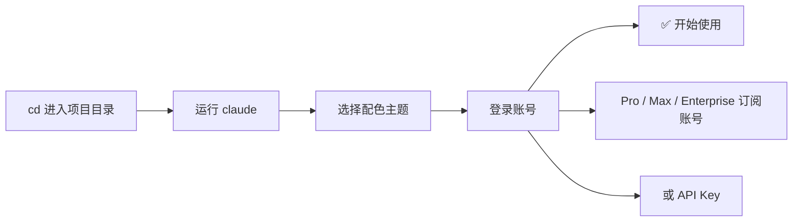
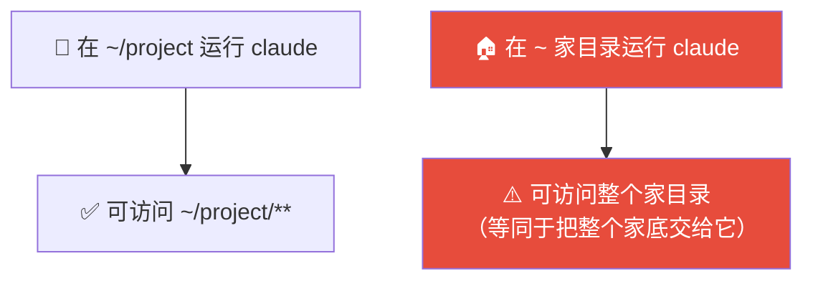
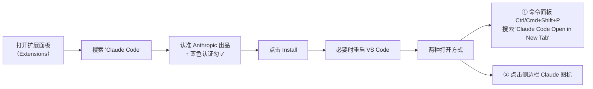
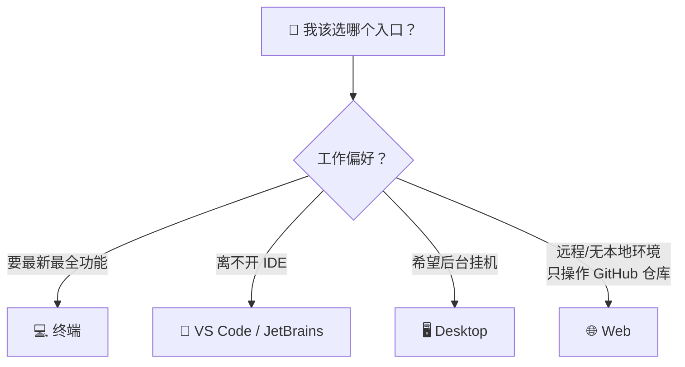

# Claude Code 101: 《Installing Claude Code》全平台安装指南

> **课程出处**：Anthropic 官方 Claude Academy (`academy.claude.com/courses/claude-code-101/installing-claude-code`)  
> **课程定位**：在终端、Web、IDE（VS Code / JetBrains）、桌面端五种环境中完成 Claude Code 安装配置，并按工作习惯选择最适合自己的入口  
> **核心主题**：各平台安装命令、首次启动设置、五种入口横评与选型建议  
> **课程时长**：约 6 分钟（第 3/12 课）

---

## 目录
1. [终端安装（macOS / Linux / WSL / Windows）](#1-终端安装macos--linux--wsl--windows)
2. [首次启动与初始化设置](#2-首次启动与初始化设置)
3. [VS Code 扩展安装](#3-vs-code-扩展安装)
4. [JetBrains 插件安装](#4-jetbrains-插件安装)
5. [桌面端与 Web 端](#5-桌面端与-web-端)
6. [五种入口横评与选型建议](#6-五种入口横评与选型建议)
7. [实战 Cheatsheet](#7-实战-cheatsheet)

---

## 1. 终端安装（macOS / Linux / WSL / Windows）

### 1.1 macOS / Linux / WSL

```bash
# 方式一：curl 一键安装（官方推荐，支持自动更新）
curl -fsSL https://claude.ai/install.sh | bash

# 方式二：Homebrew（⚠️ 不支持自动更新）
brew install claude-code
```

| 方式 | 自动更新 | 说明 |
| :--- | :--- | :--- |
| **curl 脚本** | ✅ 支持 | 官方首选，一步到位 |
| **Homebrew** | ❌ 不支持 | 适合习惯 brew 管理包的用户，需手动升级 |

### 1.2 Windows

| Shell | 命令 | 自动更新 |
| :--- | :--- | :--- |
| **PowerShell** | `Invoke-RestMethod` 命令 | ✅ |
| **CMD** | `curl` 命令 | ✅ |
| **winget** | `winget install` | ❌（同 Homebrew，需手动升级） |

---

## 2. 首次启动与初始化设置

### 验证安装

安装完成后应能直接运行：

```bash
claude
```

> 💡 如果命令找不到，**重启终端**（PATH 生效）。

### 初始化流程



- 登录方式二选一：**Claude 账号**（Pro / Max / Enterprise）或 **API Key**
- ⚠️ 组织有 Claude Enterprise 账号的用户，务必**选择 Enterprise 选项**

### ⚠️ 最重要的安全概念：目录即边界

> **Whatever directory you run `claude` in, it will have access to that directory and all of its subfolders.**

**你在哪个目录运行 `claude`，它就能访问该目录及所有子目录。**



> 💡 这与 Cowork L11「专用 Working Folder」的安全原则完全一致——**先 cd 到项目目录，再启动 claude**，而不是在家目录随手启动。

---

## 3. VS Code 扩展安装



- 扩展体验**与终端高度一致**
- 也可在设置中**关闭 UI、直接用内嵌终端体验**

---

## 4. JetBrains 插件安装

| 步骤 | 操作 |
| :--- | :--- |
| ① | 从 **JetBrains Marketplace** 安装 Claude Code 插件 |
| ② | **重启 IDE** |
| ③ | 重开后可见 Claude 图标 → 点击打开侧边面板 |
| ④ | 面板内是**终端体验**，与编辑器并排工作 |

---

## 5. 桌面端与 Web 端

### 5.1 Desktop（Claude 桌面应用）

- 安装并登录 Claude Desktop 后，顶部有 **"Code" 开关**
- 外观与 Chat 侧相似，但能力不同：

| 能力 | 说明 |
| :--- | :--- |
| 指定文件夹工作 | 与终端的"目录即边界"一致 |
| 调整权限 | 可切换权限模式 |
| **云端环境** | 可在 cloud environment 中运行 |

### 5.2 Web（网页端）

两种入口：
- 直接访问 `claude.ai/code`
- 或在聊天应用侧边栏点击 **"Code"** 标签

> ⚠️ **限制**：Web 端**只能操作 GitHub 仓库**（restricted to GitHub repositories）——体验与桌面端相似，但工作对象限定为远程仓库。

---

## 6. 五种入口横评与选型建议

| 入口 | 最佳用途 | 特点 |
| :--- | :--- | :--- |
| **终端** 🏆 | **追新首选** | **新功能最先上线**（features ship there first） |
| **VS Code / JetBrains** | 想让 Claude 与编辑器深度融合 | 体验与终端几乎一致 |
| **Desktop** | **挂后台干活**，人去忙别的 | 界面友好，支持云端环境 |
| **Web** | **远程操作 GitHub 仓库** | 无需本地环境，但仅限 GitHub |

> 💡 官方态度：**However you want to use Claude Code is up to you.**（怎么用随你——入口是同一套能力，选择只关乎工作习惯。）



---

## 7. 实战 Cheatsheet

```markdown
### 📦 Claude Code 安装速查

#### 1. 终端安装命令
# macOS / Linux / WSL（推荐，自动更新）
curl -fsSL https://claude.ai/install.sh | bash
# Homebrew（不自动更新）
brew install claude-code
# Windows: PowerShell(Invoke-RestMethod) / CMD(curl) / winget(不自动更新)

#### 2. 首次启动
cd 到项目目录 → claude → 选主题 → 登录
（订阅账号 Pro/Max/Enterprise 或 API Key；企业用户务必选 Enterprise）
命令找不到？→ 重启终端

#### 3. ⚠️ 核心安全守则
运行目录 = 权限边界（该目录 + 所有子目录）
永远先 cd 进项目目录，再启动 claude

#### 4. IDE 安装
- VS Code：扩展面板搜 "Claude Code"（认准 Anthropic + 蓝勾）
  → Cmd+Shift+P "Claude Code Open in New Tab" 或侧边栏图标
- JetBrains：Marketplace 装插件 → 重启 → 侧边 Claude 图标

#### 5. 入口选型口诀
追新 → 终端（功能首发地）
融合编辑器 → IDE 扩展
后台挂机 → Desktop（含云端环境）
远程 GitHub → Web（claude.ai/code，仅限 GitHub 仓库）
```

### 课程衔接

> 🔗 **下一课预告**：L4《Your first prompt》——发出你的第一条 Prompt：如何描述任务、观察 Agentic Loop 的实际运转。
