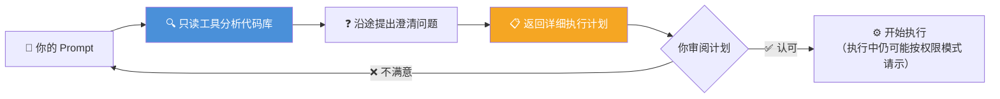
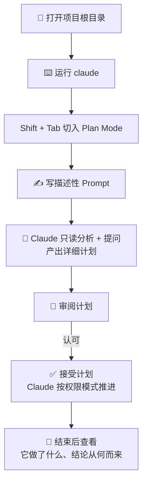

# Claude Code 101: 《Your first prompt》第一条 Prompt 与 Plan Mode 实战

> **课程出处**：Anthropic 官方 Claude Academy (`academy.claude.com/courses/claude-code-101/your-first-prompt`)  
> **课程定位**：发出你的第一条 Prompt——掌握 `Shift + Tab` 切换权限模式、用 Plan Mode 先谋后动，并通过"暗色模式开关"官方示例走完一次完整实战  
> **核心主题**：Prompt 描述性原则、权限模式切换、Plan Mode 工作流、暗色模式实战示例  
> **课程时长**：约 6 分钟（第 4/12 课）

---

## 目录
1. [写 Prompt 的基本心法](#1-写-prompt-的基本心法)
2. [权限模式切换：Shift + Tab](#2-权限模式切换shift--tab)
3. [Plan Mode：先谋后动](#3-plan-mode先谋后动)
4. [官方实战示例：暗色模式开关](#4-官方实战示例暗色模式开关)
5. [实战 Cheatsheet](#5-实战-cheatsheet)

---

## 1. 写 Prompt 的基本心法

> You talk to Claude Code like you would any AI assistant. When entering your prompt, here are some things to consider that can both **protect you and make things easier**.

与 Claude Code 对话就像和任何 AI 助手交流一样——但有一些技巧既能**保护你**，又能**让事情更顺畅**。

课程 Recap 中的核心原则：

> Try to be **as descriptive as possible** with your prompt.（Prompt 尽可能描述详尽。）

- **尽可能具体**：说清要什么、放在哪、基于什么现状——这与 Cowork 课的 C-T-C-F 提示词法则一脉相承
- **想留在环里就可以留在环里**（If you want to stay in the loop at every step, you can）——通过权限模式自己决定介入深度

---

## 2. 权限模式切换：Shift + Tab

> You can choose how much oversight to keep while Claude works. Press `Shift + Tab` to cycle between modes.

Claude 工作时保留多少监督权，由你决定——**按 `Shift + Tab` 循环切换**：

| 模式 | 行为 | 适合场景 |
| :--- | :--- | :--- |
| **Manual** | 每次编辑文件、运行命令都**先问你** | 全程把关，最放心 |
| **Auto-accept** | **文件编辑自动放行**，命令仍需批准 | 折中档：改动放行、执行把关 |
| **Auto** | **无弹窗持续工作**，后台安全分类器逐动作筛查；被拦截时 Claude 通常会改走更安全的路线，或请示你放行 | 放手让它干 |

> 💡 **There's no right or wrong answer — it's whatever you're comfortable with.**（没有标准答案——你用着舒服就行。）

---

## 3. Plan Mode：先谋后动

`Shift + Tab` 菜单里还藏着第四档——**Plan Mode（计划模式）**：



三个关键点：

- **只用只读工具**：分析阶段不动一行代码，天然安全
- **会反问澄清**：Plan 过程中会向你提 clarifying questions，把模糊需求问清楚
- **产出可执行计划**：审查通过后按计划干活，结束时你能看清 **Claude 做了什么、为什么这么做**

### 何时用 Plan Mode

> Plan mode is great for **planning complex changes** or doing a **safe code review**.（适合规划复杂变更，或做一次安全的代码审查。）

尤其是**多步实现一个 Feature** 的场景——正是 Plan Mode 的主场。

---

## 4. 官方实战示例：暗色模式开关

场景：给应用添加全局暗色模式。操作步骤：



官方示例 Prompt（值得逐句品味其描述性）：

> My app needs a dark mode implemented **across the entire app**. Can you create a **toggle switch on the header** that allows a user to toggle between light mode and dark mode? I need you to **find a good contrast color that works based on my existing light theme**.

这段 Prompt 的三个描述性要素：

| 要素 | 原文 | 作用 |
| :--- | :--- | :--- |
| **范围** | across the entire app | 全局生效，不是局部 |
| **位置与交互** | toggle switch on the header | 明确组件位置和形态 |
| **约束与依据** | find a good contrast color based on my existing light theme | 基于现有浅色主题找对比色——给了依据而非凭空发挥 |

> 💡 结束时，你能**确切看到 Claude 做了什么、以及它如何得出结论**（exactly what Claude did and how it reached its conclusions）——这就是 Agentic 过程的透明性。

---

## 5. 实战 Cheatsheet

```markdown
### ✍️ Claude Code 第一条 Prompt 速查

#### 1. Prompt 心法
- 尽可能描述详尽（descriptive as possible）
- 三要素：范围（全局/局部）+ 位置与交互 + 约束与依据
- 想每一步都留在环里？可以，由权限模式决定介入深度

#### 2. Shift + Tab 循环切换权限模式
- Manual：文件+命令逐项问（最稳）
- Auto-accept：文件编辑放行，命令仍批（折中）
- Auto：零弹窗 + 后台分类器筛查（放手）
- Plan Mode：先出计划再动手（先谋后动）
没有对错，舒服就好

#### 3. Plan Mode 使用时机
- 复杂变更：多步实现一个 Feature
- 安全代码审查
流程：Prompt → 只读分析代码库 → 提澄清问题
→ 返回详细计划 → 审阅认可 → 执行

#### 4. 实操记忆点
- 先 cd 到项目根目录再 claude（目录即边界）
- Plan Mode 结束后回看：它做了什么 + 结论怎么来的
```

### 课程衔接

> 🔗 **下一课预告**：L5《The explore → plan → code → commit workflow》——Claude Code 的核心工作流：探索 → 计划 → 编码 → 提交。
