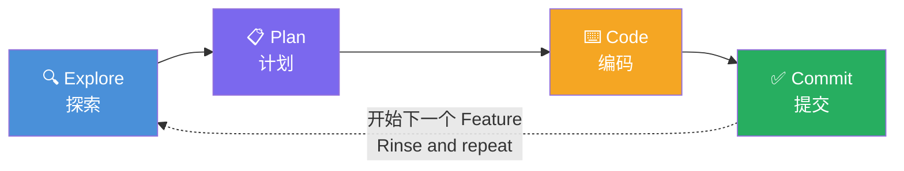
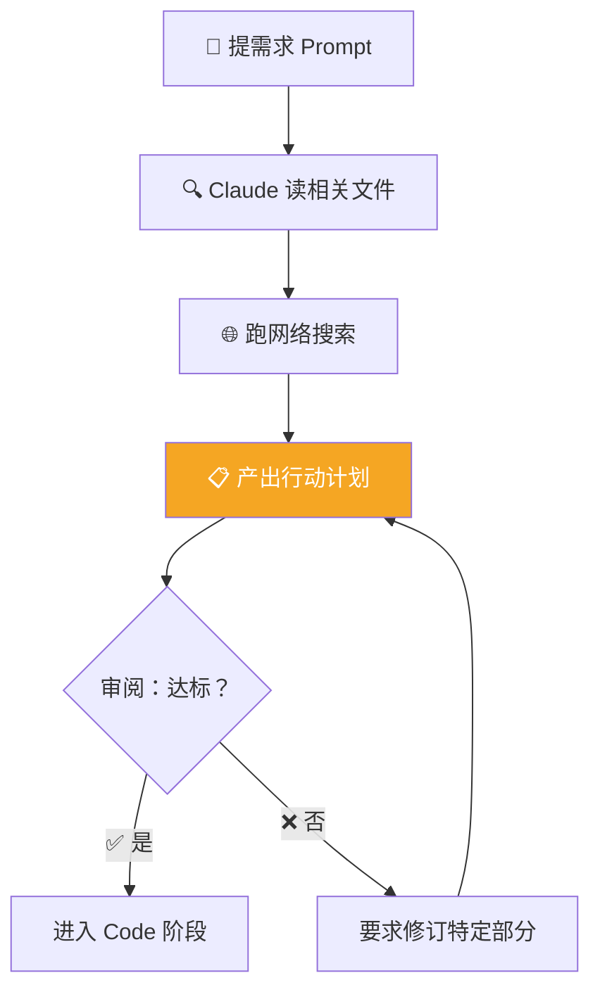
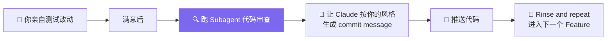

# Claude Code 101: 《The explore → plan → code → commit workflow》核心工作流四部曲

> **课程出处**：Anthropic 官方 Claude Academy (`academy.claude.com/courses/claude-code-101/the-explore-plan-code-commit-workflow`)  
> **课程定位**：全课程最核心的一课——Explore → Plan → Code → Commit 四步工作流；大多数人跳过前两步直接要代码，代价是后期更多返工纠偏  
> **核心主题**：Plan Mode 承接前两步、编码阶段三个提效技巧、CLAUDE.md 记忆沉淀、Subagent 代码审查  
> **课程时长**：约 8 分钟（第 5/12 课）

***

## 目录

1. [为什么这个工作流是全课最重要](#1-为什么这个工作流是全课最重要)
2. [Explore + Plan：Plan Mode 一肩挑](#2-explore--planplan-mode-一肩挑)
3. [Code：执行与三个提效技巧](#3-code执行与三个提效技巧)
4. [Commit：Subagent 审查 + 风格化提交](#4-commitsubagent-审查--风格化提交)
5. [四步全景回顾](#5-四步全景回顾)
6. [实战 Cheatsheet](#6-实战-cheatsheet)

***

## 1. 为什么这个工作流是全课最重要

> **If you take one thing away from this course, let it be this workflow: Explore, Plan, Code, and Commit.**  
> （如果这门课你只带走一样东西，那就是这个工作流。）



反面教材：

> Without it, most people **jump straight to asking Claude to write code** — which means **more course-correcting later on**.（大多数人直接让 Claude 写代码——意味着后期更多纠偏。）

这与 Cowork 课程「先 Plan 后 Do」的 Task Loop 哲学完全同构。

***

## 2. Explore + Plan：Plan Mode 一肩挑

前两步最快的完成方式就是 **Plan Mode**（`Shift + Tab` 切入）：

* Plan Mode 中 Claude **不能编辑文件**，只读取文件收集实现所需的信息

* 官方示例 Prompt（WebP 图片压缩管线）：

> I need to add WebP conversion to our image upload pipeline. **Figure out where in the pipeline it should happen, whether we need new dependencies, and how to approach it**.  
> （找出该插入管线的哪个位置、是否需要新依赖、如何实现。）

### Plan 阶段流程



两个关键认知：

* **纠偏的黄金位置在 Plan**：> This is the best place to course-correct because **it's before any code is written**.（改计划零成本，改代码有成本。）

* **Explore 可独立使用**：不开 Plan Mode 也能跑 explore subagent——只想要一份**代码库概览**、不打算改代码时用

***

## 3. Code：执行与三个提效技巧

计划认可后选 **Approve**，Claude 按你的权限模式推进（逐步问 / 文件放行 / Auto 全自动）。

> Claude will **do its best to troubleshoot before considering the plan "finished"** —— Claude 会在宣布"完成"前尽力排障，但你偶尔仍需介入。Plan Mode 的红利在这里兑现：**执行结束后你仍保有完整的推导上下文**，能更好地指导 Claude 下一步决策。

### 编码阶段三个提效技巧

| 技巧           | 说明                  | 原理                                                                          |
| :----------- | :------------------ | :-------------------------------------------------------------------------- |
| **① 定义成功标准** | 在计划里**明确写出什么叫"对"**  | Claude 对结果有信心，前提是清楚"正确"长什么样                                                 |
| **② 添加工具**   | 给 Claude 配上能直接验证的工具 | 例：做 Web UI 就装 **Claude in Chrome** 扩展，让 Claude Code 直接操纵浏览器标签页测试 UI——省去大量来回 |
| **③ 纳入测试套件** | 给 Claude 一套可持续验证的测试 | Claude 甚至能帮你写测试；但**先确认测试本身是可靠的事实源**，避免假阳性误导                                 |

### 💡 CLAUDE.md 沉淀法

> **Quick tip:** If you find Claude keeps running into the same issues, ask it to **save the solution to its CLAUDE.md file**.

Claude 反复踩同一个坑？让它把解决方案**写进 CLAUDE.md**——这就是 Claude Code 的"项目记忆"（与 Cowork 的 Global Instructions / Skills 同一思想的代码版）。

***

## 4. Commit：Subagent 审查 + 风格化提交



**Subagent 代码审查**的价值：

> A subagent gets a **fresh pair of eyes** on the codebase — it **doesn't carry the bias the main agent might have from the session**.

* 主 Agent 在会话中积累了自己的假设与偏好（bias），审查自己的代码容易"当局者迷"

* Subagent 是**全新视角**，不带会话偏见——相当于请了一位没参与开发的独立 Reviewer

***

## 5. 四步全景回顾

课程 Recap 官方定义：

| 步骤          | 官方定义                                                                              | 一句话本质              |
| :---------- | :-------------------------------------------------------------------------------- | :----------------- |
| **Explore** | gives Claude the relevant context it needs for your project                       | 给 Claude 装上项目上下文   |
| **Plan**    | creates a plan of action that Claude uses to **measure success**                  | 产出度量成功的行动计划        |
| **Code**    | is the back and forth between you and Claude before settling on the final outcome | 与 Claude 的来回打磨直到定稿 |
| **Commit**  | helps you review and push your code so you can start on your next feature         | 审查推送，开启下一循环        |

***

## 6. 实战 Cheatsheet

```markdown
### 🔄 Explore → Plan → Code → Commit 速查

#### 0. 核心心法
全课只带走一样东西，就带走这个工作流
直接跳去写代码 = 后期更多 course-correcting

#### 1. Explore + Plan（用 Plan Mode）
Shift + Tab 切入 → 提"找位置/查依赖/怎么干"式 Prompt
→ Claude 只读文件 + 网搜 → 产出计划 → 审阅/要求修订
纠偏黄金位：代码写出来之前
只想要代码库概览？不开 Plan Mode 跑 explore subagent 即可

#### 2. Code（三个提效技巧）
① 定义成功标准：计划里写明什么叫"对"
② 添加工具：Web UI → 装 Claude in Chrome 扩展直接测
③ 纳入测试套件：可连续验证；先确认测试可靠，防假阳性
反复踩坑 → 让 Claude 把解法写进 CLAUDE.md

#### 3. Commit
自己测满意 → 跑 subagent code reviewer（无会话偏见的新鲜视角）
→ Claude 按你的风格生成 commit message → 推送 → 下一个 Feature
```

### 课程衔接

> 🔗 **下一课预告**：L6《Context management》——上下文管理：/clear、/compact 等命令与长会话维护。

