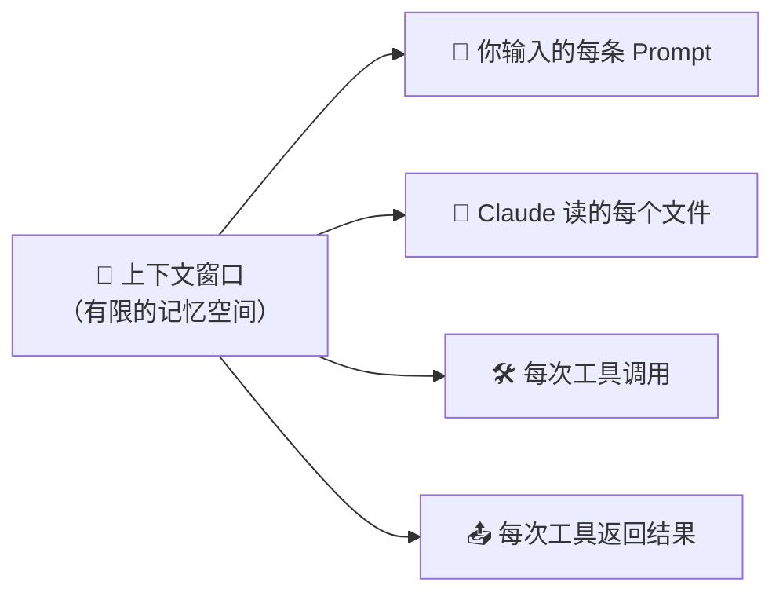
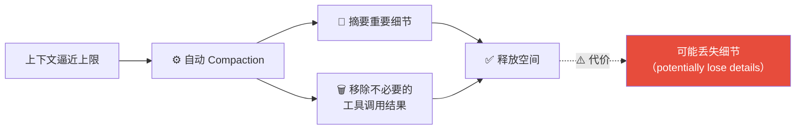
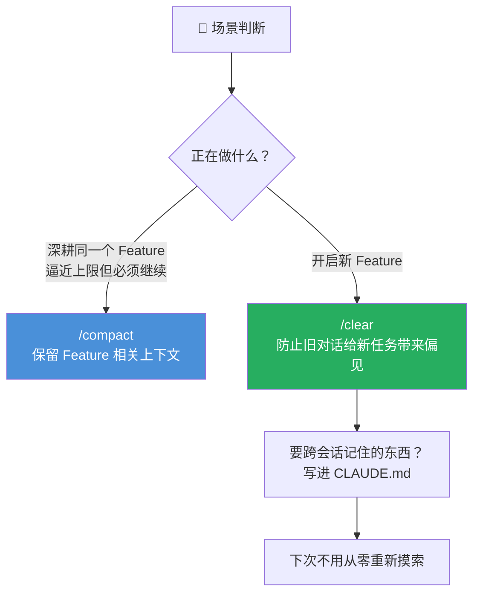
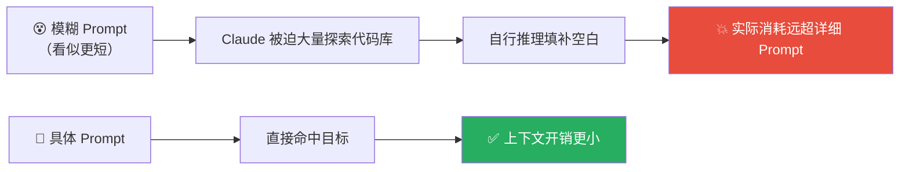

# Claude Code 101: 《Context management》上下文窗口管理实战

> **课程出处**：Anthropic 官方 Claude Academy (`academy.claude.com/courses/claude-code-101/context-management`)  
> **课程定位**：上下文是 Claude 的工作记忆——掌握 /compact、/clear、/context 三个命令的分工，以及四个节省上下文的实战技巧  
> **核心主题**：上下文窗口机制、自动压缩与细节丢失、三大命令、省上下文四技巧（具体化 / 管 MCP / Subagent / CLAUDE.md）  
> **课程时长**：约 7 分钟（第 6/12 课）

---

## 目录
1. [上下文窗口：Claude 的工作记忆](#1-上下文窗口claude-的工作记忆)
2. [装满之后：自动 Compaction 及代价](#2-装满之后自动-compaction-及代价)
3. [三大命令：/compact、/clear、/context](#3-三大命令compactclearcontext)
4. [省上下文四技巧](#4-省上下文四技巧)
5. [实战 Cheatsheet](#5-实战-cheatsheet)

---

## 1. 上下文窗口：Claude 的工作记忆

> **Context is Claude's working memory.** Every file it reads, every command it runs, every message you send — it all takes up space in the context window.

一切都会挤占上下文窗口：



空间是**有限的**（finite）——所以**如何优化使用**就成了关键课题。

---

## 2. 装满之后：自动 Compaction 及代价



- 自动压缩做的事：**摘要重要细节 + 移除不必要的工具调用结果**来腾空间
- ⚠️ **注意**：这个过程**可能丢失细节**——这就是 L2 课埋下的伏笔的完整版

---

## 3. 三大命令：/compact、/clear、/context

| 命令 | 作用 | 记忆残留 |
| :--- | :--- | :--- |
| **`/compact`** | **手动压缩**：把截至当前的一切打包摘要 | ✅ 保留压缩前工作的记忆 |
| **`/clear`** | **彻底清空**：完全从零开始 | ❌ 不保留任何先前会话记忆 |
| **`/context`** | **体检**：查看上下文总大小、占用最多的类别、可视化分解图 | ——（只读诊断） |

### 何时用哪个：经验法则



> 💡 **跨会话记忆的归属地是 CLAUDE.md**——想让 Claude 记住的约定、偏好、解法，写进去，就不用每次重新发现（与本仓库用 project memory 记格式规范是同一个思想）。

---

## 4. 省上下文四技巧

### ① Prompt 要具体（Be specific）

> A vague prompt might seem smaller, but it actually **costs more context in the long run**.



反直觉但重要：**模糊 Prompt 更费上下文**——省下的几个字，换来的是 Claude 更多的探索和推理开销。

### ② 管理 MCP 服务器（Manage your MCP servers）

- MCP 服务器**默认把全部可用工具加载进上下文**——不管你用不用
- 与当前项目无关的 MCP 服务器 → **关掉**
- 替代方案：**Skills**——工作方式类似 MCP，但**不预先全量加载**进上下文（按需触发）

### ③ 用 Subagent（Use subagents）

> Subagents run in parallel with your main agent but have a **completely separate context window**.


- Subagent 与主 Agent 并行运行，但拥有**完全独立的上下文窗口**
- 适用：**只需要答案、不需要过程**的任务（如"认证端点在哪个文件？"）——重活在 Subagent 里干，只把结论带回主上下文，保持主上下文干净

### ④ 沉淀 CLAUDE.md（承接上节）

跨会话记忆写进 CLAUDE.md，避免 Claude 每次从零重新发现项目事实。

---

## 5. 实战 Cheatsheet

```markdown
### 🧠 上下文管理速查

#### 1. 认知基线
上下文 = Claude 的工作记忆（Prompt + 读文件 + 工具调用与结果全占空间）
空间有限 → 优化使用是必修课

#### 2. 装满的后果
自动 Compaction：摘要细节 + 移除不必要工具结果 → 释放空间
⚠️ 代价：可能丢失细节

#### 3. 三命令分工
- /compact：手动压缩，保留工作记忆 → 同一 Feature 干到一半腾空间
- /clear：彻底清零 → 开新 Feature，防旧对话偏见
- /context：体检 → 看总量 / 占用大头 / 可视化分解

#### 4. 省上下文四技巧
① Prompt 具体化：模糊 Prompt 迫使 Claude 多探索多推理，反而更贵
② 管 MCP：无关服务器关掉；用 Skills 替代（按需加载不全量进上下文）
③ Subagent：只需答案的任务委派出去，独立上下文，只回传摘要
④ CLAUDE.md：跨会话记忆的归属地，别让 Claude 重复摸索

#### 5. 决策口诀
同 Feature 逼近上限 → /compact
开新 Feature → /clear
想跨会话记住 → CLAUDE.md
```

### 课程衔接

> 🔗 **下一课预告**：L7《Code review》——代码审查：让 Claude 审查你的代码，以及审查 Claude 写的代码。
