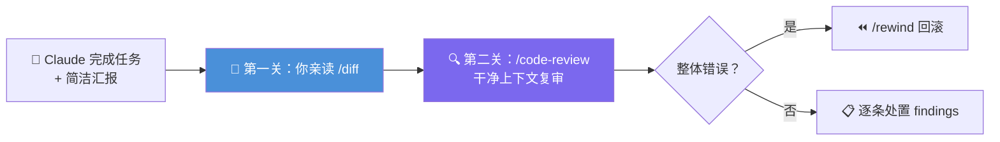
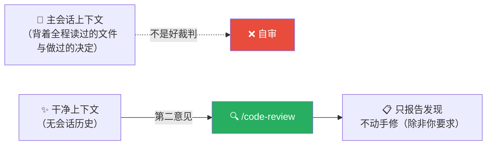
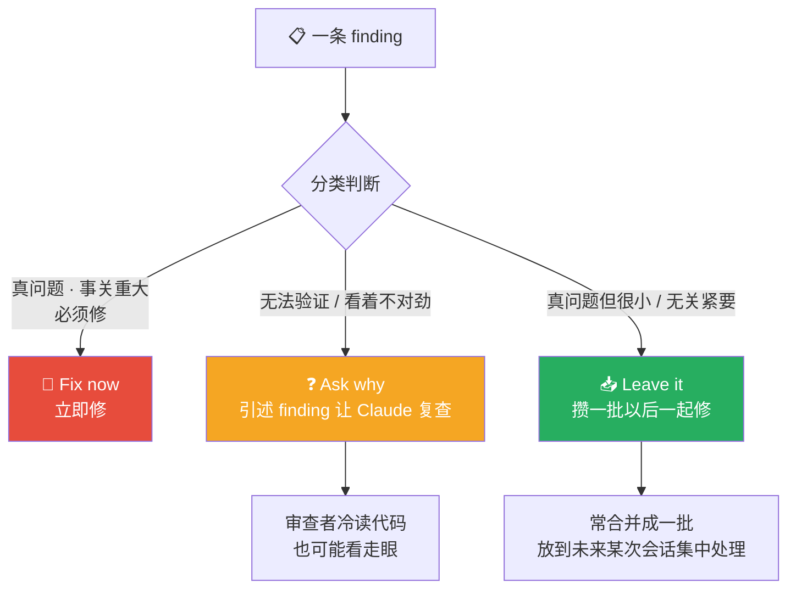

# Claude Code 101: 《Code review》代码审查：/diff 与 /code-review 双重把关

> **课程出处**：Anthropic 官方 Claude Academy (`academy.claude.com/courses/claude-code-101/code-review`)  
> **课程定位**：Claude 完成任务后的质量把关课——先亲读 /diff 核对真实改动，再用 /code-review 获得无会话偏见的第二意见，最后用三堆法处置每条 finding  
> **核心主题**：/diff 交互式差异查看、三类必查改动、/rewind 回滚、/code-review 干净上下文审查、三堆处置法、审查时机  
> **课程时长**：约 10 分钟（第 7/12 课）

---

## 目录
1. [为什么必须审查：会话自评不可信](#1-为什么必须审查会话自评不可信)
2. [/diff：亲读真实改动](#2diff亲读真实改动)
3. [/rewind：整体回滚](#3rewind整体回滚)
4. [/code-review：干净上下文的第二意见](#4code-review干净上下文的第二意见)
5. [三堆处置法：Fix now / Ask why / Leave it](#5-三堆处置法fix-now--ask-why--leave-it)
6. [官方实战：注册表单八文件案例](#6-官方实战注册表单八文件案例)
7. [审查时机与产品辨析](#7-审查时机与产品辨析)
8. [实战 Cheatsheet](#8-实战-cheatsheet)

---

## 1. 为什么必须审查：会话自评不可信

> The session that **wrote the code changes themselves (and explained them) is not the highest-quality judge of those changes**.

- Claude 汇报往往**简洁得体**，但简洁的描述之下可能是**大小不一的多文件改动**
- **写代码的会话不是自己改动最好的裁判**——当局者迷
- 良好实践：**每个改动保留前亲眼看一遍**，再让 Claude 从干净上下文复审一遍



---

## 2. /diff：亲读真实改动

### 命令用法

```
/diff
```

- **Diff = 改动的前后对照**：逐文件展示删了哪些行、加了哪些行
- `/diff` 打开**未提交改动**的交互式查看器，还能展示 **Claude 每一轮各改了什么**
- 操作：**上下箭头**在文件间移动，**Enter** 打开一个文件

> ⚠️ **前提：项目必须在 git 仓库中**——`/diff` 和 `/code-review` 都读取 git 的改动记录。项目还没上 git？让 Claude 帮你初始化并做首次提交。其他版本控制系统下这两个命令看不到改动，但 /rewind 仍有效（Claude 自己跟踪编辑）。

### 三类每次必查的改动

| 必查项 | 特征示例 |
| :--- | :--- |
| **① 你没要求的改动** | Claude 顺手改了同文件里的配置值；重写了一个你没提的辅助方法 |
| **② 被削弱的测试** | 测试被 skip、被删除、或被放宽到"刚好能过" |
| **③ 新增依赖与硬编码值** | 为一个函数引入整个包；URL / 密钥直接写死在代码里 |

---

## 3. /rewind：整体回滚

整个改动都不对时：

| 操作方式 | 说明 |
| :--- | :--- |
| 运行 `/rewind` 或**空提示符下连按两次 `Esc`** | 选出生成该改动的 Prompt |
| 选择 **Restore code and conversation** | 恢复代码**和**对话到之前状态 |

> ⚠️ **已知限制**：Claude 通过 shell 命令产生的文件改动（如包安装）**不会被回滚**。

---

## 4. /code-review：干净上下文的第二意见

> `/code-review` is that second reviewer: it reviews the change in a **clean context**, with **none of your session's history**, and reports what it finds. It **edits nothing unless you ask it to**.



使用要点：

- 审查**后台运行**，秒级到几分钟不等；**计入用量**——留给值得复审的改动
- 结果完成后送回对话；也可用自然语言要求（"Review the changes you just made. Report problems; don't fix anything yet."）——若 Claude 内联回答而没启动审查，**自己跑命令**
- **审查力度可调**：
  - `/code-review low`：只报最有把握的发现（更少误报）
  - `/code-review high`：撒更大的网，可能包含不太确定的发现
  - 选定的力度会被**记住**，直到你换档

---

## 5. 三堆处置法：Fix now / Ask why / Leave it

每条 finding 归入三堆之一：



### Ask why 的正确姿势

把 finding 原文引回去，让 Claude 再查一遍：

> You reported that isValidEmail doesn't trim spaces, **but line 4 calls trim(). Check again and tell me whether the finding stands**.

### 修 fix 时必须索要证据

> Fix the first finding: don't skip the empty-email test and restore the original assertion. **Then run the tests and show me the output**.

> 💡 若修复本身长成了一个大改动——**对它再跑一次审查**（审查是递归的）。

---

## 6. 官方实战：注册表单八文件案例

场景：给注册表单加输入校验（邮箱格式 + 8 位密码 + 行内报错）。Claude 汇报"一切属实、测试全过"，但 8 个文件的 diff 里藏着问题。

### /code-review 返回的 4 条 findings 与标准答案

| # | 位置 | 类型 | 发现 | 归类 | 理由 |
| :--- | :--- | :--- | :--- | :--- | :--- |
| 1 | `SignupForm.test.tsx:18` | correctness | 测试被 `it.skip` 跳过、断言从精确参数弱化为 `toHaveBeenCalled()` | **Fix now** | 测试放水，空值表单也能通过——正是"被削弱的测试" |
| 2 | `validate.ts:4` | correctness | `isValidEmail` 不 trim 首尾空格 | **Ask why** | 拿不准——第 4 行明明调用了 `trim()`，finding 可能站不住 |
| 3 | `config.ts:1` | correctness | `API_URL` 被硬编码为 `localhost:3000` | **Fix now** | 生产构建会把注册请求发到开发地址——硬编码值 |
| 4 | `form.css:1` | style | 错误提示用了 hex 色值而非项目的 `--color-danger` 变量 | **Leave it** | 真问题但很小——攒一批以后修 |

> 💡 这个案例完美演示了三类必查项：#1 是被削弱的测试、#3 是硬编码值，且都是 Claude 汇报里**只字未提**的。

---

## 7. 审查时机与产品辨析

### 什么时候值得细审

> 一行小改动：diff 瞥一眼即可。以下三种情况，人工审查 + Claude 审查双管齐下：

- 改动**大到脑子装不下**（bigger than you could hold in your head）
- 触碰**敏感**内容或执行**破坏性**操作
- 即将**交接给队友**之前

### 与 Claude Code Review 产品的区别

| | 本课的 `/code-review` 命令 | Claude Code Review（产品） |
| :--- | :--- | :--- |
| 形态 | Claude Code 内置命令 | 独立团队产品 |
| 触发 | 你在会话里手动跑 | 管理员为 GitHub 仓库开启 |
| 产出 | findings 回到对话 | 自动在 **Pull Request** 上发评论 |

---

## 8. 实战 Cheatsheet

```markdown
### 🔍 代码审查速查

#### 1. 审查铁律
写代码的会话不是自己改动的好裁判
每个改动保留前：① 你亲读 diff ② 干净上下文复审

#### 2. /diff（第一关：亲读）
看未提交改动的前后对照 + Claude 每轮各改了什么
（↑↓ 移动文件，Enter 打开）
前提：项目在 git 仓库中
三类必查：没要求的改动 / 被削弱的测试 / 新依赖与硬编码值

#### 3. /rewind（整体回滚）
/rewind 或空提示符下按两次 Esc
→ 选 Prompt → Restore code and conversation
⚠️ shell 命令产生的改动（如装包）不回滚

#### 4. /code-review（第二关：复审）
干净上下文、无会话偏见、只报告不动手
后台运行计入用量 → 留给值得的改动
力度：low（只报高置信）/ high（撒大网含不确定）
力度选择会被记住，直到换档

#### 5. 三堆处置法
- Fix now：真问题 + 事关重大 → 修，且索要证据
  （"run the tests and show me the output"）
- Ask why：拿不准 → 引述 finding 让 Claude 复查
- Leave it：真问题但很小 → 攒一批集中修
修复长成大改动 → 对它再跑一次审查

#### 6. 审查时机
大改动 / 敏感或破坏性 / 交接队友前 → 人工 + Claude 双审
同一问题被反复 flag → 写成规则进 CLAUDE.md（下一课）
```

### 课程衔接

> 🔗 **下一课预告**：L8《The CLAUDE.md file》——把项目约定写成 Claude 每次会话开场必读的规则文件。
