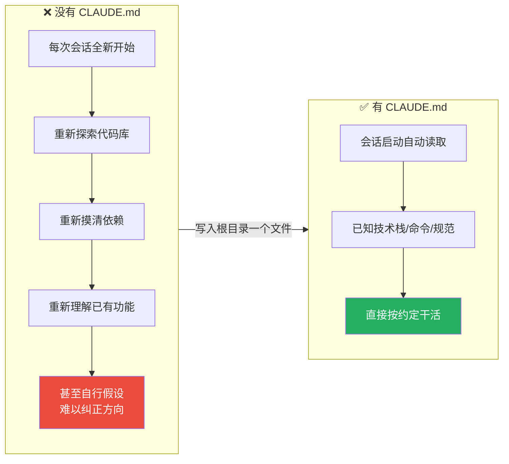
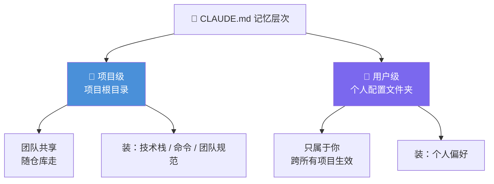

# Claude Code 101: 《The CLAUDE.md file》项目级持久记忆文件

> **课程出处**：Anthropic 官方 Claude Academy (`academy.claude.com/courses/claude-code-101/the-claude-md-file`)  
> **课程定位**：Claude Code 最实用的功能之一——用项目根目录的 CLAUDE.md 给 Claude 持久的项目记忆，省去每次会话从零摸索  
> **核心主题**：CLAUDE.md 解决的问题、标准写法示例、两级记忆层次（项目级/用户级）、/init 与三条使用技巧  
> **课程时长**：约 10 分钟（第 8/12 课）

---

## 目录
1. [它解决什么问题](#1-它解决什么问题)
2. [标准示例：一个典型的 CLAUDE.md](#2-标准示例一个典型的-claudemd)
3. [CLAUDE.md 是为团队准备的](#3-claudemd-是为团队准备的)
4. [三条使用技巧](#4-三条使用技巧)
5. [实战 Cheatsheet](#5-实战-cheatsheet)

---

## 1. 它解决什么问题

没有 CLAUDE.md 时，每次打开 Claude Code 都是**从零开始**：



### 定义

- 一个放在**项目根目录**的 Markdown 文件
- Claude Code **每次启动会话时自动读取**
- 官方类比：**Think of it as an onboarding script for your codebase**（代码库的新人入职引导脚本）
- 机制：**CLAUDE.md 的内容会被附加到你的 Prompt 中**（appended to your prompt）

> 💡 呼应 L6 课：跨会话记忆的归属地——"要跨会话记住的东西，写进 CLAUDE.md"。

---

## 2. 标准示例：一个典型的 CLAUDE.md

官方示例（Next.js 项目）：

```markdown
# Project
This is a Next.js 15 app using the App Router, Tailwind, and Drizzle ORM.

# Commands
- Dev server: `pnpm dev`
- Run tests: `pnpm test`
- Lint: `pnpm lint`

# Code Style
- Use 2-space indentation
- Prefer named exports
- All API routes go in app/api/
- Use server actions instead of API routes where possible
```

结构拆解——三大板块：

| 板块 | 内容 | 价值 |
| :--- | :--- | :--- |
| **# Project** | 技术栈声明（框架 / 路由方案 / 样式方案 / ORM） | Claude 不再猜测项目形态 |
| **# Commands** | 开发 / 测试 / Lint 命令 | Claude 直接用对命令，不用试错 |
| **# Code Style** | 缩进 / 导出风格 / 目录约定 / 技术偏好 | 产出代码符合团队规范 |

> 效果示例：有了这份文件，你让 Claude"创建一个 React 组件"，它**已经知道**该用 Tailwind 写样式、遵循你的代码约定。

---

## 3. CLAUDE.md 是为团队准备的

> You can (and should) **commit your CLAUDE.md to version control** so your team benefits from it.

**应该提交进版本控制**，让全团队受益。记忆文件有**两级层次**：



| 层级 | 位置 | 共享范围 | 放什么 |
| :--- | :--- | :--- | :--- |
| **项目级** | 项目根目录 | 全团队（随 git 走） | 技术栈、命令、团队代码规范 |
| **用户级** | 个人配置文件夹 | 仅自己，**跨所有项目** | 个人偏好 |

> 💡 与 Cowork 课的「Global Instructions（个人全局）vs Projects（项目空间）」完全同构——同一套记忆分层哲学。

---

## 4. 三条使用技巧

### ① 把纠正存进记忆（Save corrections to memory）

> If you find yourself **correcting Claude repeatedly** — like telling it to always use server actions instead of API routes — explicitly ask Claude to **save that rule to memory**.

反复纠正同一件事？**明确让 Claude 把这条规则写进记忆**。下次打开项目，它就知道了。

（这正是 L5 课 Quick tip 的展开：反复踩同一个坑 → 让它把解法写进 CLAUDE.md。）

### ② 引用项目文档（Reference project docs）

用 `@` 符号 + 文件路径，让 Claude 按需读取指定文档：

```markdown
## README.md
Please read if you need more info: @README.md
```

### ③ 先空着开始（Start without one）

> We recommend **starting a project without a CLAUDE.md file** so you can **see where you constantly have to course-correct** the model.

- **推荐做法**：新项目先不建 CLAUDE.md——**观察你在哪些地方反复纠偏**，这些才是值得写进去的内容
- 好处：保持 CLAUDE.md **紧凑、只装必要信息**
- 准备好了就运行 **`/init`**：让 Claude **自动生成**一份 CLAUDE.md

---

## 5. 实战 Cheatsheet

```markdown
### 📁 CLAUDE.md 速查

#### 1. 是什么
项目根目录的 Markdown 文件 = Claude Code 的持久项目记忆
每次会话自动读取，内容附加进 Prompt
类比：代码库的新人入职引导脚本（onboarding script）

#### 2. 三大板块模板
# Project   → 技术栈（框架/路由/样式/ORM）
# Commands  → dev / test / lint 命令
# Code Style → 缩进 / 导出风格 / 目录约定 / 技术偏好

#### 3. 两级记忆层次
- 项目级（根目录）：团队共享，随 git 提交，装团队规范
- 用户级（配置文件夹）：只属于你，跨项目生效，装个人偏好

#### 4. 三技巧
① 反复纠正的事 → 明确让 Claude 存进记忆
② 挂文档引用：@README.md（按需读取）
③ 新项目先空着开始，观察哪里反复纠偏再写
   保持紧凑；就绪后 /init 让 Claude 自动生成

#### 4. 心法
令人沮丧的会话 vs 高效的会话，差距就在上下文
CLAUDE.md 就是你提供上下文的方式
从技术栈 / 偏好 / 命令开始，边用边长
```

### 课程衔接

> 🔗 **下一课预告**：L9《Subagents》——子代理：独立上下文的专职帮手，并行干活保持主上下文干净。
