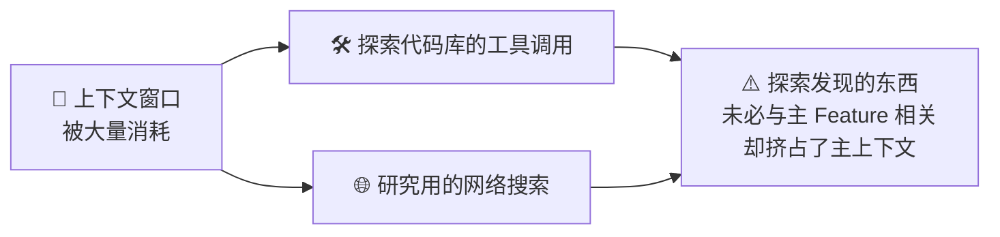
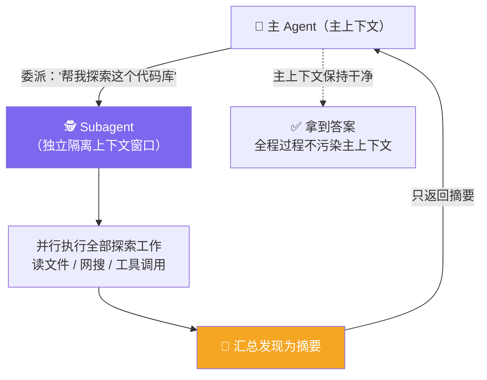

# Claude Code 101: 《Subagents》子代理：并行委派与上下文隔离

> **课程出处**：Anthropic 官方 Claude Academy (`academy.claude.com/courses/claude-code-101/subagents`)  
> **课程定位**：深入 Claude 的委派机制——把探索类重活交给独立上下文窗口的 Subagent 并行处理，主上下文只接收结论摘要  
> **核心主题**：Subagent 工作原理、/agents 创建向导、持久记忆与预载 Skills 两项进阶定制  
> **课程时长**：约 6 分钟（第 9/12 课）

---

## 目录
1. [工作原理：探索过程的上下文隔离](#1-工作原理探索过程的上下文隔离)
2. [创建自己的 Subagent：/agents](#2-创建自己的-subagentagents)
3. [进阶定制：持久记忆与预载 Skills](#3-进阶定制持久记忆与预载-skills)
4. [实战 Cheatsheet](#4-实战-cheatsheet)

---

## 1. 工作原理：探索过程的上下文隔离

### 问题背景

上下文管理中大量空间被**过程性内容**吃掉：



> What Claude discovers during that exploration **isn't always relevant** to the main feature you're developing.

### Subagent 的解法

> Claude spawns a subagent to handle a task like "explore this codebase for me." The subagent runs in parallel with **its own context window**, does all the exploration work, and once finished, **summarizes its findings and returns that summary back** to Claude.



一句话总结官方效果：

> You get **the answer** you were looking for, **without the entire journey** it took to get there **cluttering your main context**.（拿到答案，而不必让获取答案的整个旅程塞满你的主上下文。）

> 💡 与 L6「省上下文四技巧」之③、L5「Commit 前独立审查」一脉相承——Subagent 是贯穿多课的核心机制，本课系统展开。

---

## 2. 创建自己的 Subagent：/agents

### Subagent 的定义形态

Subagent 由 **Markdown 文件 + YAML frontmatter** 定义。

### 最简单的创建方式：让 Claude 生成

```
/agents
```

选择 **"Create new agent"**，向导会带你走完：

| 步骤 | 内容 |
| :--- | :--- |
| ① | 选择 Agent 的**作用域**（scope） |
| ② | 定义它的**用途**（purpose） |
| ③ | 选择它可访问的**工具**（tools） |
| ④ | 甚至给它**挑个颜色** 🎨 |

Claude 会生成三件套：**name（名字）、description（描述）、prompt（提示词）**——其中 description 尤其重要：**它告诉 Claude 什么时机该调用这个 Subagent**（基于你后续给的 Prompt 自动匹配触发）。

---

## 3. 进阶定制：持久记忆与预载 Skills

| 定制项 | 说明 | 适用场景 |
| :--- | :--- | :--- |
| **Persistent memory（持久记忆）** | 让 Subagent **跨对话保留记忆** | 长期在**同一批项目**上反复使用同一 Subagent 时价值最大 |
| **Preload skills（预载技能）** | 在定义里加 `skills` 键、按名列出技能 | ⚠️ 与主会话的 Skills 不同：**整个 Skill 会全量加载进 Subagent 的上下文**（主会话是按需加载） |

```yaml
# Subagent 定义示例（Markdown + YAML frontmatter）
---
name: codebase-explorer
description: 探索代码库并返回结构摘要，当用户需要了解项目概况时调用
skills:
  - codebase-analysis
---
你是一个代码库探索专员……
```

---

## 4. 实战 Cheatsheet

```markdown
### 🕵️ Subagents 速查

#### 1. 核心价值
保持上下文窗口干净 = Claude Code 高产的关键之一
Subagent = 后台并行干重活 + 只把答案带回主上下文
（答案留下，旅程不留）

#### 2. 工作原理
主 Agent 委派任务 → Subagent 在独立隔离上下文窗口并行工作
→ 全部探索过程（工具调用/网搜）都在自己窗口里发生
→ 完成后汇总摘要 → 只回传摘要给主 Agent

#### 3. 创建方式
/agents → Create new agent
向导四步：作用域 → 用途 → 可用工具 → 颜色
Claude 生成 name / description / prompt
（description 决定何时自动触发调用）

#### 4. 进阶定制
- Persistent memory：跨对话保留记忆 → 长期同项目复用
- Preload skills：skills 键按名预载
  ⚠️ Subagent 里是全量加载（主会话是按需）

#### 5. 深入学习
官方专门课程：Introduction to subagents
```

### 课程衔接

> 🔗 **下一课预告**：L10《Skills》——Claude Code 里的 Skills：按需加载的可复用指令包（与 Cowork 课的 Skills 同名同思想，机制细节不同）。
