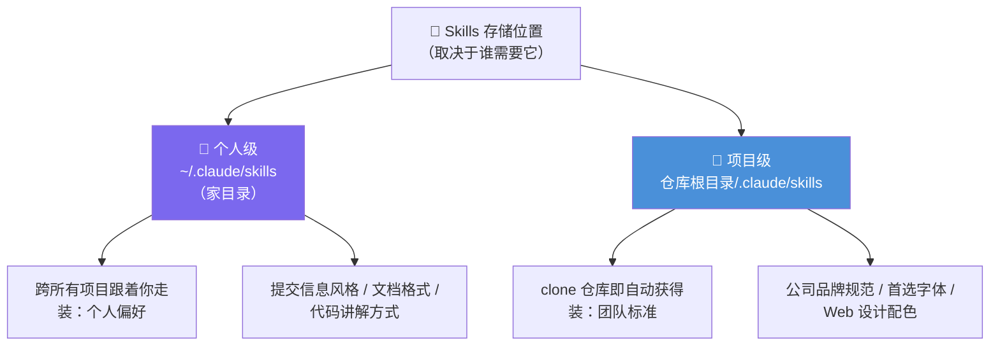

# Claude Code 101: 《Skills》按需加载的可复用技能包

> **课程出处**：Anthropic 官方 Claude Academy (`academy.claude.com/courses/claude-code-101/skills`)  
> **课程定位**：解决"每次都要向 Claude 重复解释同一套规范"的问题——把团队编码标准、PR 审查格式、提交信息偏好写成 SKILL.md，Claude 在匹配场景时自动激活  
> **核心主题**：Skill 定义与自动匹配机制、个人级/项目级存储位置、与 CLAUDE.md / Slash 命令的三方对比  
> **课程时长**：约 3 分钟（第 10/12 课）

---

## 目录
1. [它解决什么问题](#1-它解决什么问题)
2. [Skill 是什么与自动匹配机制](#2-skill-是什么与自动匹配机制)
3. [存储位置：个人级与项目级](#3-存储位置个人级与项目级)
4. [三方对比：Skills vs CLAUDE.md vs Slash 命令](#4-三方对比skills-vs-claudemd-vs-slash-命令)
5. [实战 Cheatsheet](#5-实战-cheatsheet)

---

## 1. 它解决什么问题

开场三个"每次都在重复"的场景：

- 每次 PR review，都要**重新描述**你想要的反馈结构
- 每条 commit message，都要**重新提醒**你的格式偏好
- 每次都要向 Claude 解释团队的编码标准

> **Skills fix this.**

**Skill = 教 Claude 做某事的 Markdown 文件——教一次，Claude 在相关场景自动应用。**

---

## 2. Skill 是什么与自动匹配机制

> Claude skills are **folders of instructions, scripts, and resources** that agents can **discover and use** to do things more accurately and efficiently.

Skill 是由**指令、脚本、资源**组成的文件夹；Claude Code 中的核心文件是 **SKILL.md**。

### 自动匹配：description 是决策依据


> The **description** is how Claude decides whether to use the skill.（description 决定 Claude 用不用这个 Skill。）

流程：Claude 读你的请求 → 与**所有可用 Skill 的描述**比对 → **激活匹配项**。

> 💡 与 Cowork 课的 Skills 机制一致（自动触发 vs 显式调用），与 Subagent 的 description 触发逻辑同构——**描述写得好，触发才准**。

---

## 3. 存储位置：个人级与项目级



| 层级 | 位置 | 生效范围 | 典型内容 |
| :--- | :--- | :--- | :--- |
| **个人级** | 家目录 `~/.claude/skills` | 跨所有项目跟着你 | 个人偏好：commit 风格、文档格式、代码讲解方式 |
| **项目级** | 仓库根 `.claude/skills` | **clone 即得**，随仓库走 | 团队标准：品牌规范、首选字体、设计配色 |

> 💡 又见两级层次——与 CLAUDE.md（用户级/项目级）、Cowork（Global Instructions/Projects）一脉相承。

---

## 4. 三方对比：Skills vs CLAUDE.md vs Slash 命令

Claude Code 有多种定制行为的方式，Skills 的独特性在于 **automatic + task-specific（自动 + 任务特定）**：

| 维度 | **Skills** | **CLAUDE.md** | **Slash 命令** |
| :--- | :--- | :--- | :--- |
| **加载时机** | **按需加载**——匹配请求才激活 | **每场对话都加载** | **你手动输入才触发** |
| **上下文开销** | 平时**只加载 name + description**，几乎不占上下文 | 常驻上下文 | —— |
| **触发方式** | Claude 识别场景**自动应用** | 无需触发，始终在场 | 必须记得敲命令 |
| **适合装** | 特定任务的专业知识 | 全局恒定的约定 | 手动意图明确的操作 |

### 分工口诀（官方例子）

- **"总是用 TypeScript strict 模式"** → CLAUDE.md（每场对话都该知道）
- **"PR 审查清单"** → Skill（调试时不需要它在上下文里，**真正要 review 时才加载**）
- **只加载 name + description** → 平时零负担，命中才全量进上下文

### 判断一个 Skill 该不该写的标准

> **If you find yourself explaining the same thing to Claude repeatedly, well, that's a skill waiting to be written.**  
> （如果你发现自己在反复向 Claude 解释同一件事——那就是一个等着被写出来的 Skill。）

最佳适用：团队代码审查标准、你偏好的 commit 格式、组织品牌规范。

---

## 5. 实战 Cheatsheet

```markdown
### 🎯 Claude Code Skills 速查

#### 1. 是什么
SKILL.md = 教 Claude 做某事的 Markdown 文件（教一次，终身自动应用）
Skill = 指令 + 脚本 + 资源组成的文件夹，agent 可发现、可使用

#### 2. 自动匹配机制
description 是决策核心：请求 ↔ 所有 Skill 描述比对 → 命中即激活
（描述写得好，触发才准——Subagent 的 description 同理）

#### 3. 两级存储
- ~/.claude/skills：个人级，跨项目跟人走（个人偏好）
- 仓库根/.claude/skills：项目级，clone 即得（团队标准）

#### 4. 三方分工
- Skills：自动 + 任务特定 + 按需加载（平时只有 name+description 在场）
- CLAUDE.md：全局恒定约定，每场对话都加载
  （TypeScript strict → CLAUDE.md；PR 审查清单 → Skill）
- Slash 命令：手动触发，无需匹配

#### 5. 该不该写成 Skill？
反复向 Claude 解释同一件事 = 一个等着被写的 Skill
```

### 课程衔接

> 🔗 **下一课预告**：L11《MCP》——Model Context Protocol：让 Claude Code 接入外部工具与数据源。
