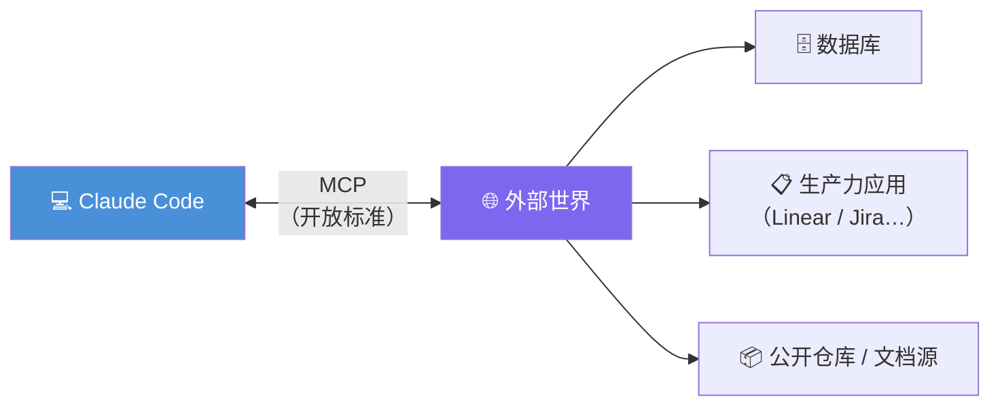
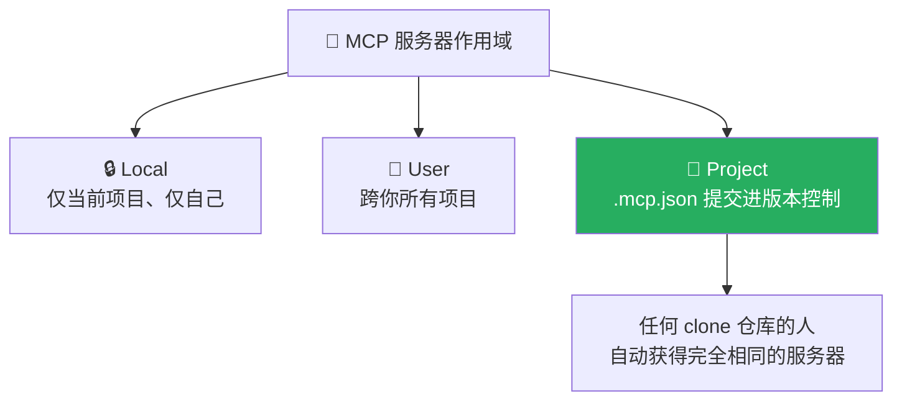
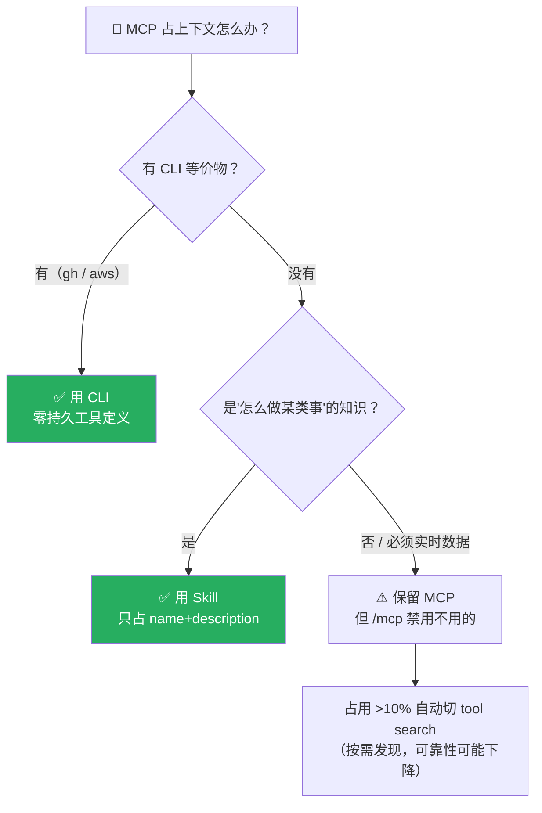

# Claude Code 101: 《MCP》Model Context Protocol 外部工具接入

> **课程出处**：Anthropic 官方 Claude Academy (`academy.claude.com/courses/claude-code-101/mcp`)  
> **课程定位**：让 Claude Code 连接外部工具与数据源的开放标准——大量上下文活在代码库之外（数据库、生产力应用、公开仓库），MCP 补上这座桥  
> **核心主题**：MCP 与 tools 概念、HTTP/Stdio 两类服务器、三种作用域、上下文成本与三种替代方案  
> **课程时长**：约 6 分钟（第 11/12 课）

***

## 目录

1. [MCP 是什么](#1-mcp-是什么)
2. [能干什么：tools 概念与官方示例](#2-能干什么tools-概念与官方示例)
3. [添加与管理 MCP 服务器](#3-添加与管理-mcp-服务器)
4. [三种作用域](#4-三种作用域)
5. [上下文成本与替代方案](#5-上下文成本与替代方案)
6. [实战 Cheatsheet](#6-实战-cheatsheet)

***

## 1. MCP 是什么

> **Model Context Protocol (MCP)** is an **open standard** that lets Claude Code connect to **external tools and data sources**. When you ask a question, Claude automatically understands when it should use those tools to better handle your query.

* **开放标准**（open standard）——不绑定 Claude 一家

* 连接对象：**外部工具 + 外部数据源**

* 智能调度：你提问时，Claude **自动判断**何时该用这些工具

### 为什么需要它

> A lot of your context lives **outside your codebase** — in databases, productivity apps, or public repositories. **MCP bridges that gap.**



***

## 2. 能干什么：tools 概念与官方示例

### tools 的定位（呼应 L2「工具是 Agent 的脊梁」）

> Tools give agents like Claude Code the ability to **perform actions** that help them complete tasks more effectively. This is different from typical AI, where you just get a **text response** back.

普通 AI：文本进文本出；有 tools 的 Agent：**能执行动作**。

### 官方两个示例

| 场景                 | 接入                              | 效果                        |
| :----------------- | :------------------------------ | :------------------------ |
| 团队用 **Linear** 管项目 | Linear MCP server               | Claude 直接拉取你们具体 issue 的详情 |
| 需要**最新依赖文档**       | docs MCP server（如 **Context7**） | 给 Claude Code 提供实时文档      |

***

## 3. 添加与管理 MCP 服务器

### 添加命令

```bash
claude mcp add <server>
```

### 两类服务器

| 类型            | 面向       | 特点             |
| :------------ | :------- | :------------- |
| **HTTP 服务器**  | **远程服务** | 由服务提供方托管，走网络连接 |
| **Stdio 服务器** | **本地进程** | 跑在你自己机器上       |

### 会话内管理：/mcp

```
/mcp
```

查看已连接的服务器、检查状态、**禁用不需要的服务器**。

***

## 4. 三种作用域



| 作用域         | 范围        | 机制                                   |
| :---------- | :-------- | :----------------------------------- |
| **Local**   | 当前项目 + 仅你 | 本地配置                                 |
| **User**    | 你的所有项目    | 用户级配置                                |
| **Project** | 全团队       | **`.mcp.json`** **提交进版本控制**，clone 即得 |

> 💡 又见「个人 / 团队」两级分层——与 CLAUDE.md（用户级/项目级）、Skills（\~/.claude/skills / 仓库 .claude/skills）完全同构。

***

## 5. 上下文成本与替代方案

### 成本真相（呼应 L6「管理你的 MCP 服务器」）

> MCP servers add tool definitions to your context window — **even when you're not actively using them**.

* 每个服务器都会把**工具定义**塞进上下文——**不用也在占**

* 服务器配多了，可用上下文被蚕食

* **兜底机制**：MCP 工具占用**超过上下文窗口 10%** 时，Claude Code 自动切到 **tool search 模式**——按需发现工具，但可靠性可能下降

### 三种省上下文的选择

| 方案               | 原理                                                | 例子                      |
| :--------------- | :------------------------------------------------ | :---------------------- |
| **① 用 CLI 替代**   | 有 CLI 等价物时，CLI **不产生持久工具定义**，更省上下文                | `gh`（GitHub）、`aws`（AWS） |
| **② 用 Skill 替代** | 平时**只有 name + description 在上下文**，Claude 判定需要才全量加载 | （承接 L10）                |
| **③ 勤用 /mcp 管理** | 查看连接状态，**禁用当前不用的服务器**                             | <br />                  |



***

## 6. 实战 Cheatsheet

```markdown
### 🔌 MCP 速查

#### 1. 是什么
Model Context Protocol = 开放标准
让 Claude Code 连接外部工具与数据源，提问时自动判断何时调用
（大量上下文活在代码库之外——MCP 补这座桥）

#### 2. 典型用例
- Linear MCP → 拉取团队 issue 详情
- Context7（docs MCP）→ 实时依赖文档

#### 3. 添加与管理
- 添加：claude mcp add <server>
- 两类：HTTP（远程托管）/ Stdio（本地进程）
- 会话内：/mcp → 看连接 / 查状态 / 禁用不用的

#### 4. 三种作用域
- Local：当前项目 + 仅自己
- User：跨你所有项目
- Project：.mcp.json 提交进 git → clone 即得（团队标配）

#### 5. 上下文成本（重点）
MCP 工具定义不用也占上下文
三选一省上下文：
① 有 CLI 等价物 → 用 CLI（gh/aws），零持久定义
② 知识型任务 → 用 Skill（平时只占 name+description）
③ 必须实时数据 → 保留 MCP 但勤禁用
兜底：占用 >10% 自动切 tool search（按需发现，可靠性可能降）

#### 6. 决策口诀
实时外部数据 → MCP
本地可 CLI → CLI
"教一次就会"的知识 → Skill
```

### 课程衔接

> 🔗 **下一课预告**：L12《Hooks》——收官课：在 Claude 工作流的特定节点自动触发自定义命令。

