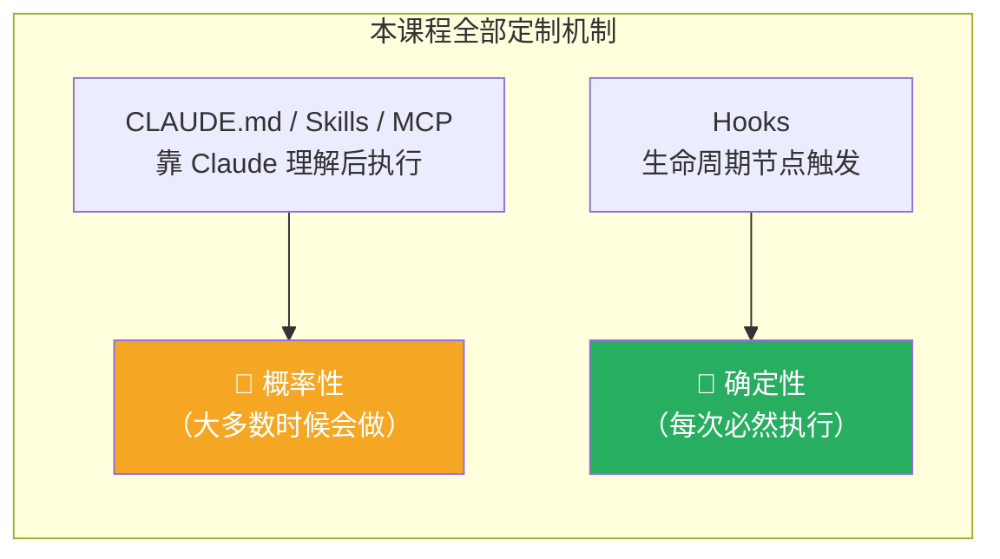
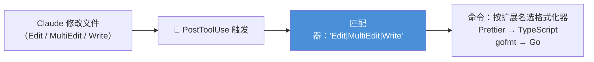

# Claude Code 101: 《Hooks》确定性控制：生命周期钩子

> **课程出处**：Anthropic 官方 Claude Academy (`academy.claude.com/courses/claude-code-101/hooks`)  
> **课程定位**：收官课——Hooks 是全课程唯一**确定性**机制：在 Claude Code 生命周期特定节点必然执行的命令，把"建议 Claude 做"升级为"保证会发生"  
> **核心主题**：确定性 vs 概率性、五类常用事件、PostToolUse 自动格式化实战、PreToolUse 拦截与退出码协议、团队共享  
> **课程时长**：约 6 分钟（第 12/12 课）

---

## 目录
1. [核心概念：唯一确定性的机制](#1-核心概念唯一确定性的机制)
2. [为什么需要：CLAUDE.md 的概率性缺口](#2-为什么需要claudemd-的概率性缺口)
3. [工作原理：事件 + 匹配器 + 命令](#3-工作原理事件--匹配器--命令)
4. [实战示例：PostToolUse 自动格式化](#4-实战示例posttooluse-自动格式化)
5. [拦截利器：PreToolUse 与退出码协议](#5-拦截利器pretooluse-与退出码协议)
6. [团队共享](#6-团队共享)
7. [实战 Cheatsheet](#7-实战-cheatsheet)

---

## 1. 核心概念：唯一确定性的机制

> The key difference between hooks and everything else covered in this course is that hooks are **deterministic** — they **always run**.



**Hooks 与本课程其他所有机制的分野：确定性。** 它不是"提醒 Claude 该做什么"，而是**程序化保证**。

---

## 2. 为什么需要：CLAUDE.md 的概率性缺口

典型场景对比：

> You can tell Claude in your CLAUDE.md to run Prettier after every file edit. **Most of the time it will. But sometimes it won't.** A hook makes it happen **every single time, no exceptions**.

- 在 CLAUDE.md 写"每次编辑后跑 Prettier" → **大多数时候**会做，但偶尔不会
- 配置成 Hook → **每一次都执行，无例外**

### 四大常见用例

| 用例 | 价值 |
| :--- | :--- |
| **编辑后自动格式化** | 代码风格永久一致 |
| **记录所有已执行命令** | 合规审计（compliance） |
| **拦截危险操作** | 禁止改生产环境文件 |
| **任务完成时通知自己** | 挂机干别的，完成即提醒 |

---

## 3. 工作原理：事件 + 匹配器 + 命令

配置位置：`settings.json`（或会话内用 `/hooks` 命令配置）。

三要素：**选一个事件 →（可选）设匹配器限定作用的工具 → 提供要跑的命令**。

### 五类最常用事件

| 事件 | 触发时机 |
| :--- | :--- |
| **PreToolUse** | 工具调用**之前**（可拦截） |
| **PostToolUse** | 工具调用完成**之后** |
| **UserPromptSubmit** | 你提交 Prompt 时（Claude 处理**之前**） |
| **Stop** | Claude 完成响应时 |
| **Notification** | Claude 发送通知时 |

> 💡 还有更多事件——完整列表见官方 [hooks reference](https://code.claude.com/docs/en/hooks)。

---

## 4. 实战示例：PostToolUse 自动格式化

最经典的 Hook 用法：



- 事件：**PostToolUse**
- 匹配器：`"Edit|MultiEdit|Write"`（正则——只要 Claude 改了文件就命中）
- 命令：检查文件扩展名 → 跑对应格式化器

---

## 5. 拦截利器：PreToolUse 与退出码协议

PreToolUse Hook 可以在工具执行**前拦截**，是**强制硬规则**的手段：

- Hook 通过 **stdin 收到 JSON**（工具名 + 输入参数）
- **退出码决定行为**：

| 退出码 | 行为 | 说明 |
| :--- | :--- | :--- |
| **0** | ✅ 正常放行 | 检查通过 |
| **2** | ⛔ **拦截该动作** | **stderr 信息回传给 Claude** 作反馈——它知道为什么被拦、能自行调整 |
| 其他 | ⚠️ 非阻塞错误 | 展示给你，但不停止任何操作 |

### 典型硬规则（官方例子）

- 拦截对**生产配置目录**的写入
- 拦截包含 **`rm -rf`** 的 bash 命令
- 拦截**对 main 分支的 commit**

> 关键措辞：**Whatever your team needs to be *guaranteed*, not suggested.**（凡是团队需要被**保证**而非被**建议**的——用 Hook。）

> 💡 呼应 Cowork L11 安全课与 L1「它会犯错」——Hooks 是把"人在环审批"固化为"代码化护栏"的最后一块拼图。

---

## 6. 团队共享

- 配置在 **`.claude/settings.json`** 的 Hooks 是**项目级**，可提交进仓库
- 全团队 **clone 即得**同一套 Hooks
- 命令中用 **`CLAUDE_PROJECT_DIR` 环境变量**引用项目内脚本——**无论 Claude 当前工作目录在哪**都能正确找到

> 💡 至此四大团队共享机制集齐：`.mcp.json`（MCP）、`.claude/skills/`（Skills）、项目级 CLAUDE.md、`.claude/settings.json`（Hooks）——全部"随 git 走"。

---

## 7. 实战 Cheatsheet

```markdown
### 🪝 Hooks 速查

#### 1. 核心定位
全课程唯一确定性机制：生命周期节点 → 必然执行
CLAUDE.md 是"建议"（大多数时候会做），Hook 是"保证"（无例外）
口诀：需要每次必然发生的事，别写进 Prompt，写进 Hook

#### 2. 四大用例
自动格式化 / 命令日志（合规）/ 拦截危险操作 / 完成通知

#### 3. 配置三要素
事件 →（可选）匹配器（限定工具）→ 命令
位置：settings.json 或会话内 /hooks

#### 4. 五类常用事件
- PreToolUse：工具调用前（可拦截）
- PostToolUse：工具调用后（格式化/日志）
- UserPromptSubmit：提交 Prompt 时（处理前）
- Stop：Claude 完成响应
- Notification：Claude 发通知

#### 5. PreToolUse 退出码协议
stdin 收 JSON（工具名+输入）
- 0 → 放行
- 2 → 拦截；stderr 回传 Claude 作反馈（知为何被拦，可调整）
- 其他 → 非阻塞错误（展示但不停止）
硬规则示例：禁写生产目录 / 禁 rm -rf / 禁 commit main

#### 6. 团队共享
.claude/settings.json 随 git 提交 → 全队 clone 即得
脚本路径用 CLAUDE_PROJECT_DIR 环境变量引用

#### 7. 全课程定制机制对照
CLAUDE.md（全局约定·每会话加载）
Skills（任务特定·按需加载）
Subagents（独立上下文·委派）
MCP（外部工具/数据·实时连接）
Hooks（确定性护栏·必然执行）
```

### 课程衔接

> 🔗 **下一课预告**：Course quiz——Claude Code 101 结课测验。
