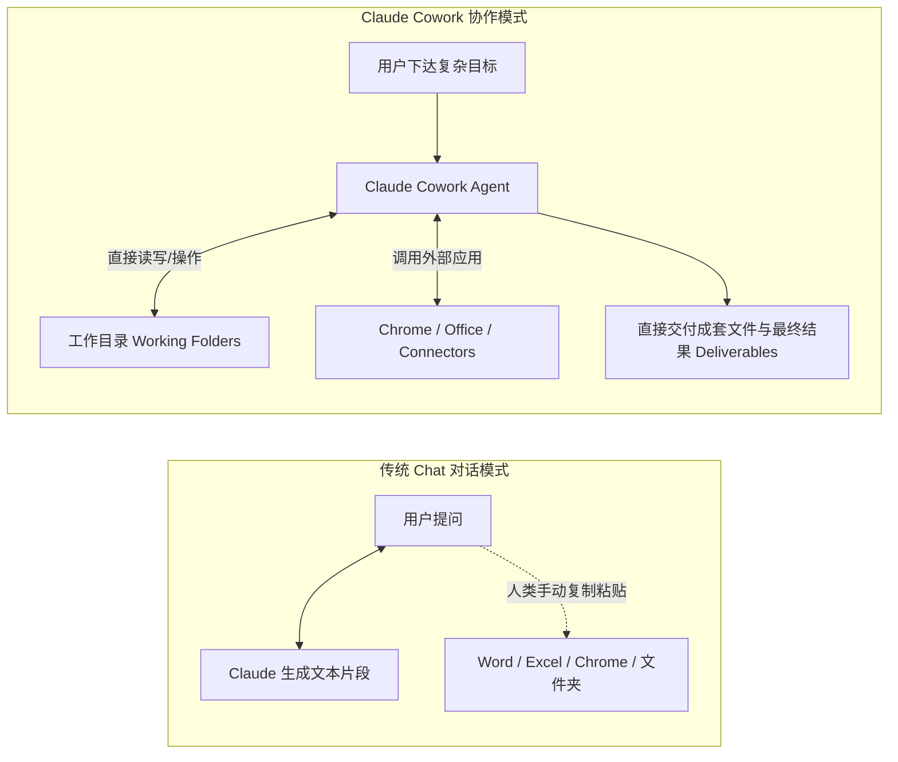
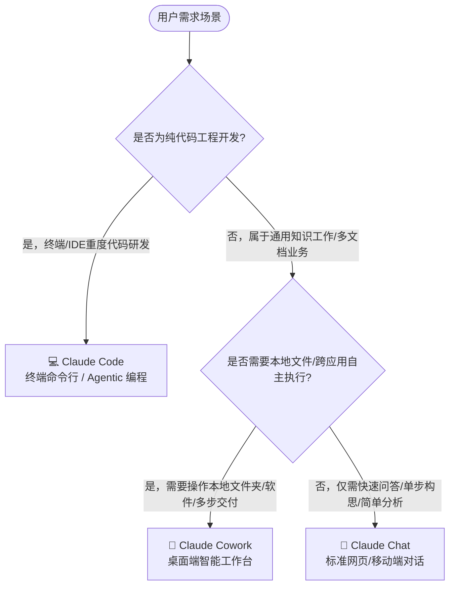
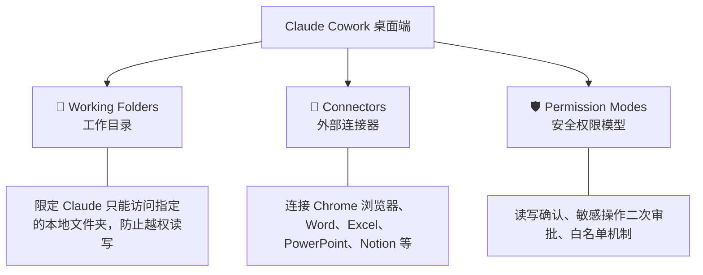
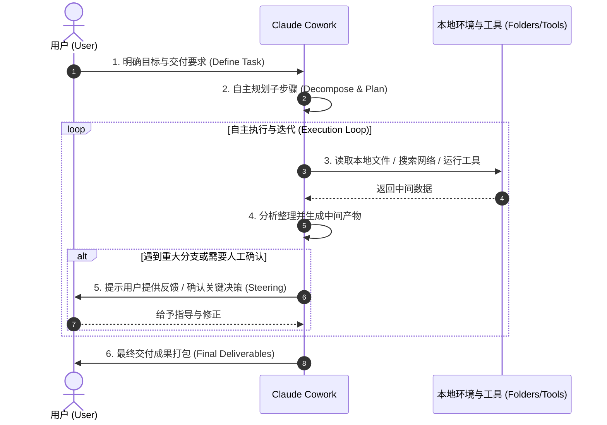
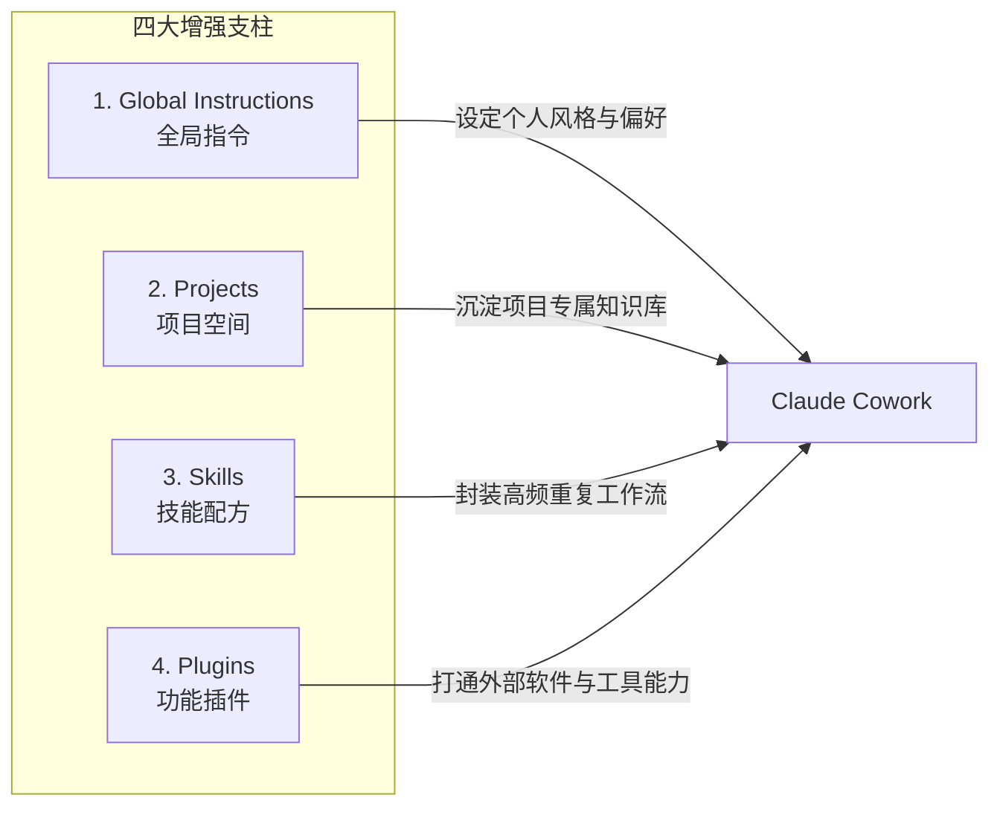

# Claude Academy: 《Introduction to Claude Cowork》学习笔记

> **课程出处**：Anthropic 官方 Claude Academy (`academy.claude.com/courses/introduction-to-claude-cowork`)  
> **课程定位**：从传统的“聊天对话框（Chat）”迈向“Agentic 智能工作台”，掌握将多步骤、跨工具复杂任务全权委派给 Claude Cowork 的实战方法  
> **课程体量**：14 节课 + 1 个结课测试（约 2.5 小时，含官方认证徽章）  
> **核心受众**：日常需要跨软件、跨文档处理复杂信息的知识工作者（无需编程基础）

---

## 目录
1. [Cowork 核心定位与工作流变革](#1-cowork-核心定位与工作流变革)
2. [三大工作形态对比：Chat vs Cowork vs Claude Code](#2-三大工作形态对比chat-vs-cowork-vs-claude-code)
3. [工作空间配置：Working Folders、Connectors 与权限控制](#3-工作空间配置working-foldersconnectors-与权限控制)
4. [核心执行循环：The Cowork Task Loop](#4-核心执行循环the-cowork-task-loop)
5. [效率倍增四大支柱：Instructions, Projects, Skills & Plugins](#5-效率倍增四大支柱instructions-projects-skills--plugins)
6. [进阶自动化：Scheduled Tasks（定时任务）](#6-进阶自动化scheduled-tasks定时任务)
7. [安全合规与人机协作最佳实践](#7-安全合规与人机协作最佳实践)
8. [实战 Cheatsheet 与决策清单](#8-实战-cheatsheet-与决策清单)

---

## 1. Cowork 核心定位与工作流变革

在传统的 AI 使用中，用户通常是在网页对话框里“一问一答”（Chat）；而 **Claude Cowork** 将 Claude 升级为**在桌面端直接帮你干活的自主 Agent（数字同事）**。



### 核心转变
- **从“单步生成”到“多步自主规划执行”**：Claude 可以自行拆解子任务、检索本地多个文档、调用浏览器查阅最新资料，并直接在本地生成或修改文件。
- **从“聊天记录”到“成品交付（Deliverables）”**：输出不再只是一段 markdown 回复，而是成套的分析研报、整理好的 Excel 表格、PPT 大纲或修改后的本地文件。

---

## 2. 三大工作形态对比：Chat vs Cowork vs Claude Code

Anthropic 针对不同场景构建了三大主力产品形态：



| 维度 | 🤖 Claude Chat (网页/App) | 👥 Claude Cowork (桌面工作台) | 💻 Claude Code (终端/IDE) |
| :--- | :--- | :--- | :--- |
| **核心定位** | 快速构思、单步问答、轻量摘要 | 跨软件多步任务委派、本地文件与研报交付 | 终端自主编程、大型代码库重构与自动化调试 |
| **交互形式** | 线性对话流（Turn-by-turn） | 任务会话（Working Sessions）+ 进度监控 | CLI 命令行交互 + IDE 扩展 |
| **环境访问** | 上传单个附件，云端沙箱运行 | 本地工作目录（Working Folders）+ 桌面连接器 | 深度访问终端、本地文件系统、Git 与编译运行环境 |
| **适合人群** | 所有通用用户 | 知识工作者、业务分析师、产品经理、运营 | 软件工程师、算法架构师、DevOps |

---

## 3. 工作空间配置：Working Folders、Connectors 与权限控制

要在桌面端安全、高效地运行 Cowork，必须正确配置文件权限与连接器：



### 关键配置要素：
1. **Working Folders（工作目录）**：
   - 建议为每个独立任务或项目指定专属文件夹。
   - Claude 会在工作目录内自动索引文件、读取参考资料、并在该目录下输出最终成果。
2. **Connectors（连接器）**：
   - 支持与常用生产力工具打通（如 Google Workspace、Microsoft Office、Figma 等）。
   - 让 Claude 可以直接抓取外部上下文并执行导出。
3. **安全权限管理（Permission Modes）**：
   - **Ask Before Action（操作前询问）**：针对删除、覆盖重要文件或外发请求等高危行为保持人类在环（Human-in-the-loop）。

---

## 4. 核心执行循环：The Cowork Task Loop

Cowork 的运行遵循严密的 **Task Loop（任务闭环）**：



### 任务引导技巧 (Steering)：
- **不要把 Cowork 当成黑盒完全不管**：在长耗时复杂任务中，注意观察 Claude 的执行步骤，在关键节点（如大纲拟定后、方案选择时）介入微调。
- **阶段性产物校验**：让 Claude 先输出第一版结构，确认无误后再让其批量填充完整内容。

---

## 5. 效率倍增四大支柱：Instructions, Projects, Skills & Plugins

Anthropic 提出了让 Claude 随时间推移不断变聪明的**四大复用构建块**：



1. **Global Instructions（全局指令）**：定义你的个人偏好、工作语气、默认输出语言与排版习惯。
2. **Projects（项目空间）**：针对中长期专题，沉淀专属的背景上下文与历史沉淀。
3. **Skills（技能定义）**：将高频使用的操作流（例如“编写竞品分析报告流程”、“会议纪要格式化”）固化为可复用的 SOP。
4. **Plugins（插件扩展）**：扩展 Cowork 的外部交互边界，将团队已有系统或第三方 SaaS 集成进来。

---

## 6. 进阶自动化：Scheduled Tasks（定时任务）

Claude Cowork 支持设定 **Scheduled Tasks（定时自动任务）**：

* **定期收集与汇总**：如每天早上自动汇总指定文件夹内的新增数据并生成晨报。
* **定期健康巡检**：定时检查团队共享文档或数据更新情况，输出差异比对。
* **解放重复机械劳动**：将例行化事务交给后台静默执行，人类仅负责审核最终成果。

---

## 7. 安全合规与人机协作最佳实践

在使用 Agent 访问本地系统时，需牢记安全合规的 **Diligence（勤勉审慎）** 原则：

* **数据敏感度隔离**：避免将包含机密凭证（API Keys、密码、绝密商业机密）的根目录直接设为 Working Folder。
* **输出质量把关**：将 Claude 生成的分析结论和报告作为“高完成度的专业初稿”，人类始终保留最终审核与决策权。
* **版本与防丢备份**：在对重要已有文件进行批量修改前，建立 Git 仓库或保留原始备份副本。

---

## 8. 实战 Cheatsheet 与决策清单

```markdown
### 💡 Claude Cowork 实战法则
1. 【定边界】：每次开工前，务必选对 Working Folder，绝不滥用全局权限。
2. 【讲清楚】：给出清晰的 "C-T-C-F"（背景 Context + 任务 Task + 约束 Constraints + 交付格式 Format）。
3. 【看过程】：关注执行日志与中间产物，适时 Steering 指导纠偏。
4. 【固资产】：把做得好的工作流提炼为 Skill / Plugin，沉淀为团队标准资产。
```
