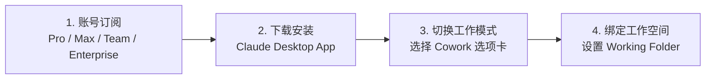
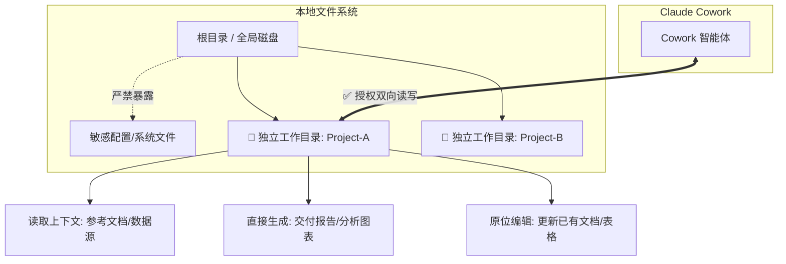
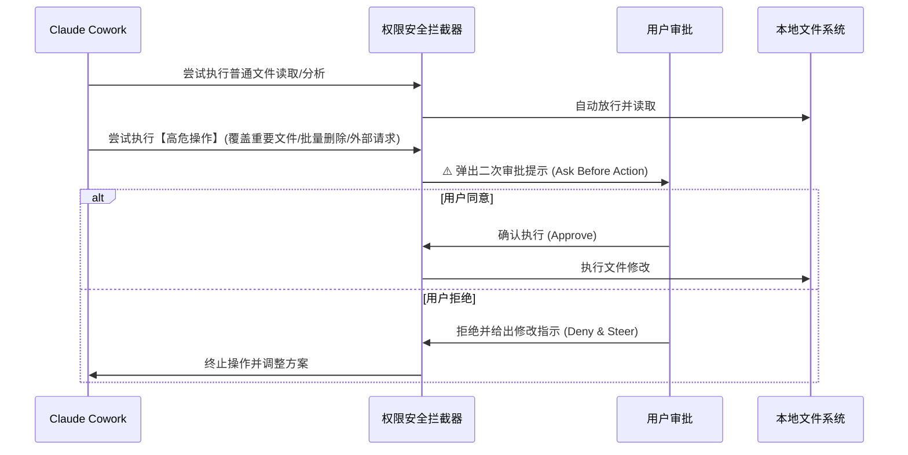

# Claude Cowork 实战: 《Getting Set Up》环境搭建与配置指南

> **课程出处**：Anthropic 官方 Claude Academy (`academy.claude.com/courses/introduction-to-claude-cowork/getting-set-up`)  
> **课程定位**：从零完成 Claude Cowork 桌面端安装、Working Folders 工作目录读写配置、外部应用连接与安全权限设定  
> **核心主题**：桌面端部署、Working Folders 核心机制、Connectors 联动、权限与安全隔离

---

## 目录
1. [前期准备与环境要求 (Prerequisites)](#1-前期准备与环境要求-prerequisites)
2. [核心机制：Working Folders (工作目录配置)](#2-核心机制working-folders-工作目录配置)
3. [连接生产力工具：Connectors (外部应用连接)](#3-连接生产力工具connectors-外部应用连接)
4. [安全与权限模型：Ask Before Action (审批机制)](#4-安全与权限模型ask-before-action-审批机制)
5. [常见问题排查 (Troubleshooting)](#5-常见问题排查-troubleshooting)
6. [配置检查清单 (Setup Checklist)](#6-配置检查清单-setup-checklist)

---

## 1. 前期准备与环境要求 (Prerequisites)

要在本地启用并流畅使用 Claude Cowork，需满足以下基础环境：

### 1.1 客户端与平台
- **桌面客户端**：Claude Cowork 专为 **Claude Desktop App** 原生设计（支持 macOS 与 Windows），需从官方下载最新版本 (`claude.com/download`)。
- **订阅要求**：Cowork 属于高级 Agentic 工作流特性，适用于 Claude 官方付费计划。

---

## 2. 核心机制：Working Folders (工作目录配置)

**Working Folders 是 Cowork 最核心的设计基石**。与传统网页端只读上传附件不同，Cowork 拥有对指定本地文件夹的**直接双向读写权限**。

### 2.1 Working Folders 核心能力
1. **全景上下文自动索引**：自动扫描并解析文件夹内的 Markdown、PDF、Word、Excel、代码等文件。
2. **原位编辑与新建**：可直接在本地创建新文件或在现有文件中做增量更新。
3. **结构化产出**：能够自主创建子文件夹并按规范整理归档中间产物与最终交付物。

### 2.2 目录管理最佳实践
- 💡 **一项目一目录**：为每个独立专题（如 `Q3-竞品分析`、`销售报表自动化`）建立专门的文件夹。
- ⚠️ **最小特权原则**：绝不要将用户根目录（如 `~` 或 `C:\`）、云盘根目录直接作为 Working Folder。

---

## 3. 连接生产力工具：Connectors (外部应用连接)

为了让 Claude 具备跨软件调取信息的能力，可在 Cowork 中配置 **Connectors**：

| 连接器类别 | 常见应用 | 赋能场景 |
| :--- | :--- | :--- |
| **办公套件** | Microsoft Word / Excel / PowerPoint | 直接读取表格公式、生成图表、排版输出演示文稿 |
| **浏览器生态** | Google Chrome | 实时检索网络公开资料、抓取行业动态、比对竞品数据 |
| **云端协作** | Google Drive / Notion / Figma | 检索企业内部云盘资产、同步知识库与产品设计稿 |

---

## 4. 安全与权限模型：Ask Before Action (审批机制)

Agent 在本地执行动作时，安全合规（Diligence）至关重要：

- **读写透明**：Cowork 的每一次文件读写、修改都在界面执行日志中有迹可循。
- **关键操作在环**：对于删除或破坏性修改，系统默认触发二次确认，保障本地数据安全。

---

## 5. 常见问题排查 (Troubleshooting)

| 异常现象 | 可能原因 | 解决办法 |
| :--- | :--- | :--- |
| **界面未显示 Cowork 选项** | 客户端版本过旧或未登录付费账号 | 1. 在官网下载最新 Desktop App 安装包覆盖更新 2. 检查当前登录账号的订阅状态 |
| **无法读取指定文件夹** | 操作系统权限限制（macOS 隐私权限） | 打开系统设置 $\rightarrow$ 隐私与安全性 $\rightarrow$ 文件与文件夹，确保 Claude Desktop 拥有读取权限 |
| **文件修改后未生效** | 本地文件正被其他软件独占锁定 | 关闭正在打开该文件的 Office/编辑器，让 Cowork 重新尝试写入 |

---

## 6. 配置检查清单 (Setup Checklist)

- [ ] 已安装最新版 Claude Desktop 客户端。
- [ ] 已登录具备相应权限的 Claude 账号。
- [ ] 针对当前学习/工作任务创建了独立的本地专用文件夹。
- [ ] 在 Cowork 界面将 Working Folder 指向该专用文件夹。
- [ ] 根据需要授权了 Chrome 或 Office 等配套 Connectors。
