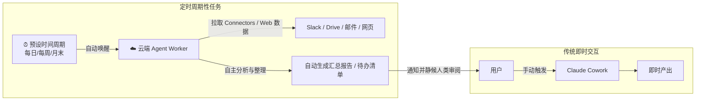
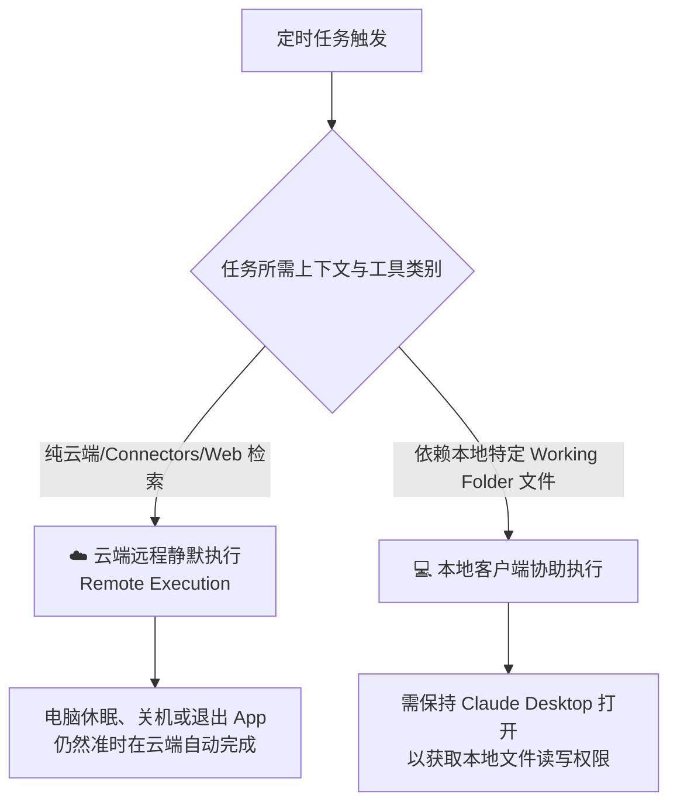
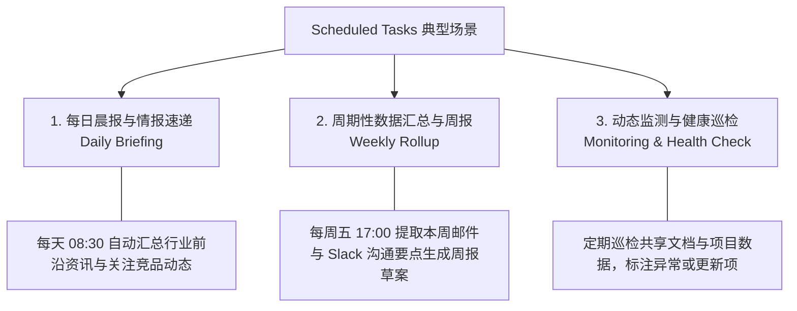
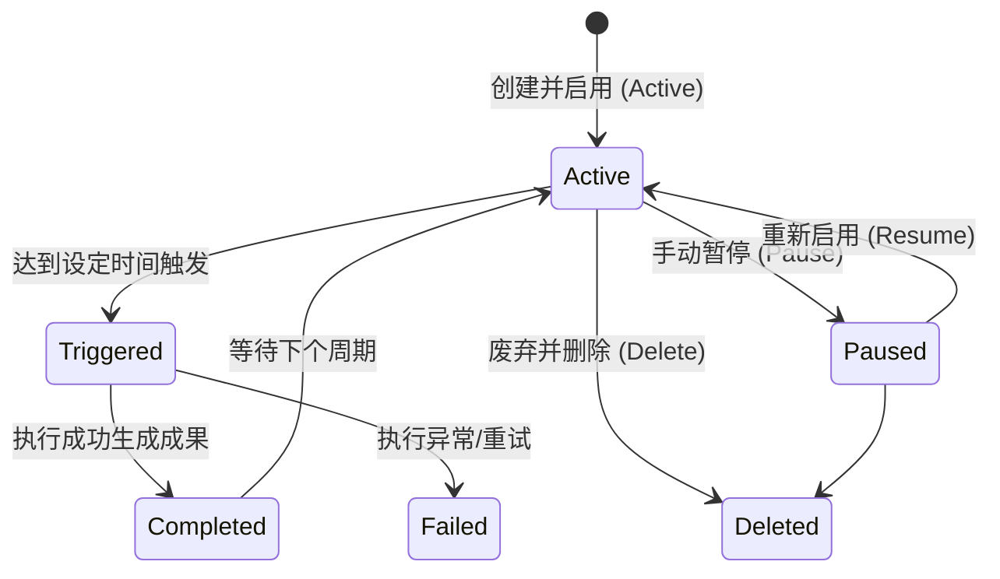

# Claude Cowork 实战: 《Scheduled Tasks》定时与周期性任务指南

> **课程出处**：Anthropic 官方 Claude Academy (`academy.claude.com/courses/introduction-to-claude-cowork/scheduled-tasks`)  
> **课程定位**：掌握 Claude Cowork 的定时触发与无人值守自动化能力，委托 Claude 在后台按预设周期自动处理跨应用多步骤工作流  
> **核心主题**：定时触发机制、云端后台执行 (Remote Execution)、Connectors 数据采集、生命周期管理、安全与最佳实践

---

## 目录
1. [核心概念与价值定位：从“实时交互”到“无人值守自动化”](#1-核心概念与价值定位从实时交互到无人值守自动化)
2. [运行机制：云端远程执行 (Remote Execution) 与本地依赖](#2-运行机制云端远程执行-remote-execution-与本地依赖)
3. [三大典型业务应用场景](#3-三大典型业务应用场景)
4. [创建与配置方式：UI 配置与 /schedule 指令](#4-创建与配置方式ui-配置与-schedule-指令)
5. [任务管理与生命周期控制 (Scheduled Hub)](#5-任务管理与生命周期控制-scheduled-hub)
6. [最佳实践法则与避坑指南](#6-最佳实践法则与避坑指南)
7. [实战 Cheatsheet 与配置速查](#7-实战-cheatsheet-与配置速查)

---

## 1. 核心概念与价值定位：从“实时交互”到“无人值守自动化”

在常规的工作模式中，用户需要坐在电脑前手动下达指令并等待响应。而 **Scheduled Tasks（定时任务）** 赋予了 Claude Cowork **主动、按需、周期性工作的能力**。



### 核心收益
- **释放例行重复劳动**：晨报汇总、周报初稿、竞品监控、数据拉取等机械任务完全托管。
- **异步交付就绪**：每天早晨上班或每周一开会前，Claude 已经自动把成套的分析结果和草稿准备好。

---

## 2. 运行机制：云端远程执行 (Remote Execution) 与本地依赖

了解 Scheduled Tasks 的底层运行环境对于合理设计任务至关重要：



- **Remote Execution（云端远程执行）**：
  - 当任务仅依赖云端连接器（如 Slack、Google Drive、Gmail、Notion）或公开网络搜索时，任务在 Anthropic 云端沙箱自动跑完，无需本地电脑开机。
- **本地文件联动**：
  - 若任务涉及本地指定目录的文件读写，则需要桌面端保持在线以同步本地上下文。

---

## 3. 三大典型业务应用场景



| 场景类别 | 典型触发周期 | 协同工具/Connectors | 交付成果 (Deliverables) |
| :--- | :--- | :--- | :--- |
| **每日晨报 (Daily Briefing)** | 工作日 08:30 | 浏览器检索、Slack、邮件 | 行业要闻速递、当天重点会议与待办提醒 |
| **项目周报 (Weekly Rollup)** | 每周五 17:00 | Google Docs、Notion、Jira | 本周项目进展摘要、风险点标注、下周计划 |
| **竞品/舆情监测** | 每日/每周 | Web Search、RSS 源 | 竞品版本发布记录、用户核心反馈对比表 |

---

## 4. 创建与配置方式：UI 配置与 /schedule 指令

Claude 提供了两种便捷的创建 Scheduled Task 方式：

### 4.1 方式一：对话中快捷指令 `/schedule`
在与 Cowork 协作并满意当前任务流程后，可直接输入 `/schedule`，将本次工作流固化为定时任务：
```text
/schedule 每天早上 9 点，检索关于 AI Agent 领域的最新 5 篇重要论文/发布动态，并生成 Markdown 格式的中文晨报
```

### 4.2 方式二：项目 (Project) 与 Scheduled 面板配置
1. 打开左侧导航栏的 **"Scheduled"** 专区。
2. 点击 **"New Scheduled Task"**。
3. 配置参数：
   - **Task Name**：任务名称（如 `每日竞品雷达`）。
   - **Instructions**：明确的任务提示词（遵循 C-T-C-F 原则）。
   - **Frequency & Time**：运行频率（Daily / Weekly / Monthly）及精确时区时间。
   - **Attached Project / Connectors**：关联的知识库或外部应用。

---

## 5. 任务管理与生命周期控制 (Scheduled Hub)

在 Claude 客户端左侧的 **"Scheduled"** 标签页中，可以对所有定时任务进行全生命周期管理：



- **Run History（执行历史）**：可查看过往每一次定时执行的具体日志、耗时与生成的成果。
- **Pause & Resume（暂停与恢复）**：休假或项目暂停期可一键暂停任务，避免无效消耗额度。
- **立即运行测试 (Run Now)**：正式投产前可手动点击立即触发一次，检验输出质量。

---

## 6. 最佳实践法则与避坑指南

### 💡 核心法则 1：Draft First（初稿先行，绝不盲目全自动外发）
- **原则**：刚配置好的 Scheduled Task 应定位为**“生成草稿与待办”**，由人类在上班后花 1~2 分钟检视确认，再决定是否发送或发布。
- **防范**：避免在未经验证的情况下直接配置“自动向全员群发邮件/消息”的高风险行为。

### 💡 核心法则 2：定期审计与“僵尸任务”清理
- 定期进入 Scheduled 列表，清理已结项或已过期的定时任务，避免空耗账户 Rate Limit 与 Token 额度。

### 💡 核心法则 3：明确约束与防幻觉兜底
- 在 Instructions 中明确加入约束：“若当天没有重大更新，直接输出‘今日无异常/无关键变更’，切勿编造虚假信息。”

---

## 7. 实战 Cheatsheet 与配置速查

```markdown
### ⏰ Scheduled Tasks 黄金四步法
1. 【验证在先】：先在普通 Cowork 会话中跑通 1~2 次，确保提示词和输出格式稳定。
2. 【轻量触发】：使用 `/schedule` 或 Scheduled 面板设置合理的周期与时区。
3. 【Draft 交付】：成果以“待审阅初稿/汇总摘要”呈现，人类保留最终把关权。
4. 【定期巡检】：每月复盘一次 Scheduled 列表，暂停或注销过期任务。
```
