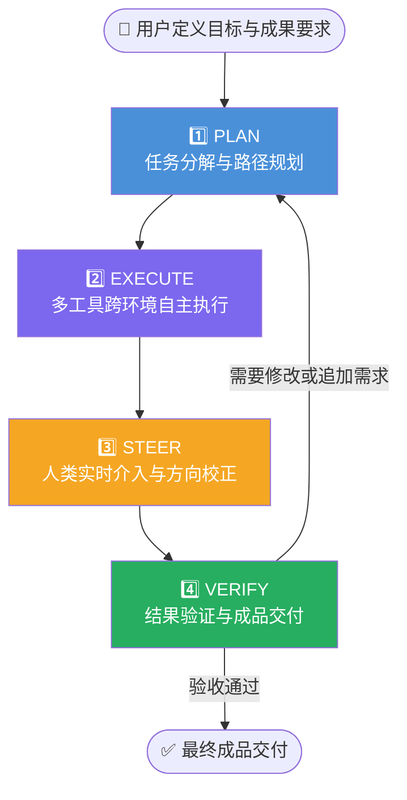
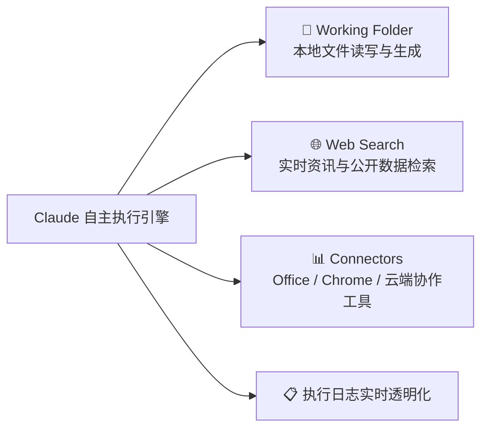
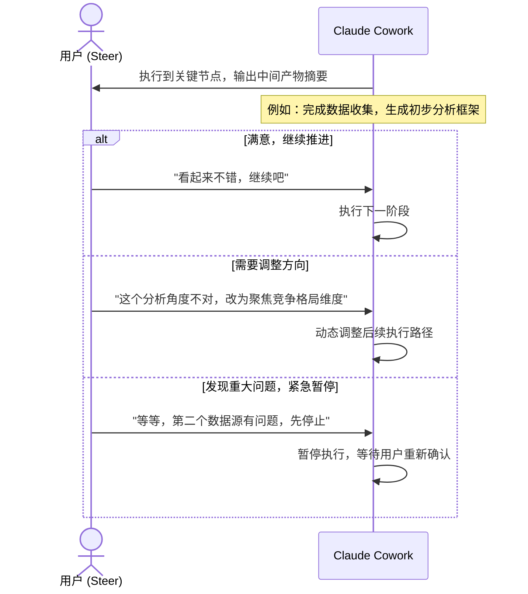
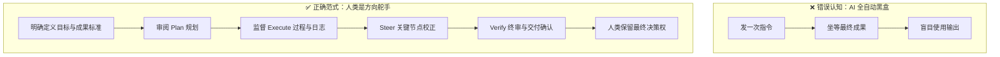

# Claude Cowork 实战: 《The Task Loop》任务执行闭环深度解析

> **课程出处**：Anthropic 官方 Claude Academy (`academy.claude.com/courses/introduction-to-claude-cowork/the-task-loop`)  
> **课程定位**：深度掌握 Claude Cowork 的核心执行机制——Task Loop（任务闭环），理解从"发指令"到"成品交付"的完整 Agentic 工作范式  
> **核心主题**：Plan → Execute → Steer → Verify 四阶段循环、人类在环 (Human-in-the-loop)、委派思维 (Delegation Mindset)

---

## 目录
1. [核心范式跃迁：从 Prompt 到 Delegate（委派）](#1-核心范式跃迁从-prompt-到-delegate委派)
2. [Task Loop 四阶段全景解析](#2-task-loop-四阶段全景解析)
3. [阶段一：Plan（任务分解与执行路径规划）](#3-阶段一plan任务分解与执行路径规划)
4. [阶段二：Execute（多工具跨环境自主执行）](#4-阶段二execute多工具跨环境自主执行)
5. [阶段三：Steer（实时介入与方向校正）](#5-阶段三steer实时介入与方向校正)
6. [阶段四：Verify（结果验证与成品交付）](#6-阶段四verify结果验证与成品交付)
7. [Human-in-the-Loop：人类角色的重新定位](#7-human-in-the-loop人类角色的重新定位)
8. [Task Loop 实战法则与 Cheatsheet](#8-task-loop-实战法则与-cheatsheet)

---

## 1. 核心范式跃迁：从 Prompt 到 Delegate（委派）

理解 Task Loop 的前提，是理解 Cowork 对人机协作范式的根本性重塑：

```mermaid
flowchart LR
    subgraph Chat [🤖 Chat 模式：Prompt & Response]
        direction LR
        U1[用户输入 Prompt] --> C1[Claude 生成一段回复]
        C1 --> U2[用户重新修改 Prompt]
        U2 --> C2[...迭代循环]
    end

    subgraph Cowork [👥 Cowork 模式：Delegate & Deliver]
        direction LR
        U3[用户明确目标与成果要求] --> Plan
        Plan --> Execute --> Steer --> Verify
        Verify --> D[📦 成品文件/成套报告直接交付]
    end

    Chat -- "思维升级<br>从"提问"到"委派"" --> Cowork
```

### 核心区别
| 维度 | Chat 模式 | Cowork Task Loop 模式 |
| :--- | :--- | :--- |
| **用户角色** | 持续提问的询问者 | 明确目标的任务发起者与监督者 |
| **Claude 角色** | 单步回复生成器 | 多步自主执行的 Agentic 协作者 |
| **输出形态** | 文本片段（需人工复制整合） | 直接写入本地的成套交付物 (Deliverables) |
| **迭代粒度** | 每条消息手动触发 | 内部自主拆解子任务、仅在关键节点请示人类 |

---

## 2. Task Loop 四阶段全景解析

Cowork 的核心执行引擎是一个严密的**四阶段闭环（Task Loop）**：



---

## 3. 阶段一：Plan（任务分解与执行路径规划）

**Plan 是整个 Task Loop 的基础**。Claude 在收到任务目标后，不会立即盲目执行，而是先进行**结构化任务拆解与路径规划**。

### 发生了什么
1. Claude 解析用户给出的目标、约束条件与交付要求。
2. 自动将复杂任务分解为有序的子步骤序列（SubTask List）。
3. 规划所需调用的工具、文件与 Connectors。
4. **在执行前主动输出执行计划，供人类审阅确认。**

### 关键实践技巧
> ✅ **在 Plan 阶段就介入审查**，是效率最高的 Steer 时机。一旦发现规划方向偏离，在 Plan 阶段纠正的成本远低于 Execute 执行到一半后的撤销。

```markdown
💬 示例审阅 Prompt：
"我看了你的计划，第 3 步直接删除旧文件有风险，先改成重命名存档，确认之后再进行后续步骤。"
```

---

## 4. 阶段二：Execute（多工具跨环境自主执行）

**Execute 是 Claude 自主发力的核心阶段**。Claude 按照 Plan 中规划的路径，在多工具、多文件、多环境中逐步执行：



### 执行特点
- **并行子任务处理**：对于可并行的步骤（如分别读取多个文档），Claude 会同时推进以提升效率。
- **执行日志透明化**：每一步操作（读取了哪个文件、调用了什么工具、写入了什么内容）均在界面实时展示，人类随时可观察。
- **遇到阻塞主动上报**：若遇到权限不足、文件找不到或逻辑分歧，Claude 会主动暂停并向用户请示，而非盲目猜测。

---

## 5. 阶段三：Steer（实时介入与方向校正）

**Steer 是 Task Loop 中"人类价值"最集中的体现**。人类不是旁观者，而是**方向舵手**。



### Steer 的三大时机
1. **Plan 输出后**（最高价值）：审核整体规划、调整策略方向。
2. **中间产物输出时**：校验阶段性成果质量，避免误差积累。
3. **遇到阻塞/分叉时**：Claude 主动请示，人类给予明确指引。

---

## 6. 阶段四：Verify（结果验证与成品交付）

**Verify 是 Task Loop 的收口阶段**。Claude 完成所有子任务后，会：

1. **自我审核（Self-Check）**：对比最终输出与最初目标，主动检查遗漏项与逻辑一致性。
2. **交付成果汇总**：列出所有生成或修改的文件清单、关键操作记录与主要发现摘要。
3. **提示人类终审**：明确标注哪些内容需要人工核查（如数据引用来源、判断性结论）。

### 人类终审核心清单
- [ ] 数据引用来源是否可信可溯源？
- [ ] 逻辑推断过程是否合理，有无跳步或幻觉？
- [ ] 文件命名与存储路径是否符合预期？
- [ ] 交付物格式与受众定位是否准确匹配？

---

## 7. Human-in-the-Loop：人类角色的重新定位

Task Loop 的设计哲学深刻体现了 **Human-in-the-Loop（人类在环）** 原则：



- **Claude 的角色**：高效执行者 + 主动沟通的协作者。
- **人类的角色**：目标设定者 + 关键节点审阅者 + 最终质量责任方。

---

## 8. Task Loop 实战法则与 Cheatsheet

```markdown
### 🔄 Task Loop 黄金法则

1. 【定义清晰才能委派彻底】
   - 在发起任务前，用 C-T-C-F（Context 背景 + Task 目标 + Constraints 约束 + Format 格式）
     清晰描述，Claude 的 Plan 质量与此直接相关。

2. 【Plan 阶段是干预成本最低的时机】
   - 花 30 秒审阅执行计划，远比执行到一半后撤销重来节省 10 倍时间。

3. 【保持 Steer 而非沉默】
   - 不要因为"不想打断 Claude"而放弃介入。定期检视执行日志，
     在偏差刚出现时纠正，而不是等到最后。

4. 【Verify 是责任边界】
   - Claude 的成果是"高质量专业初稿"，人类的终审确认才是最终输出的质量背书。
```
