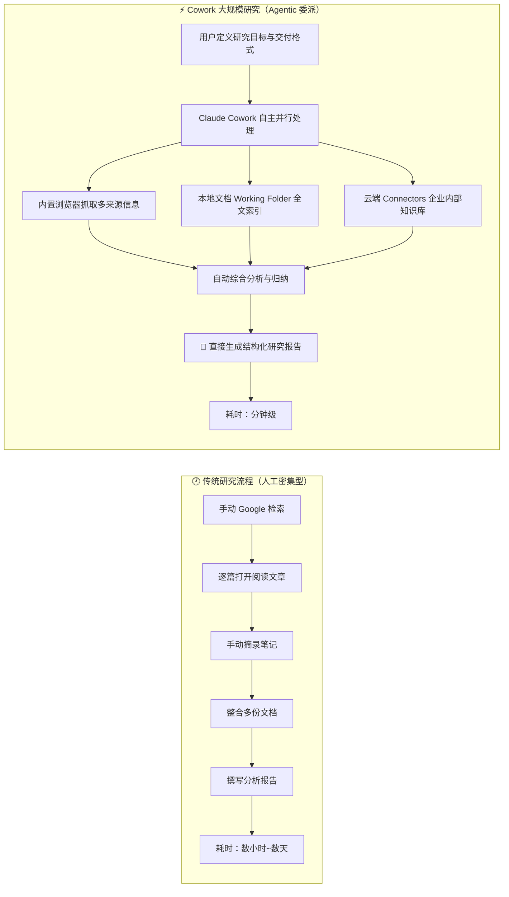
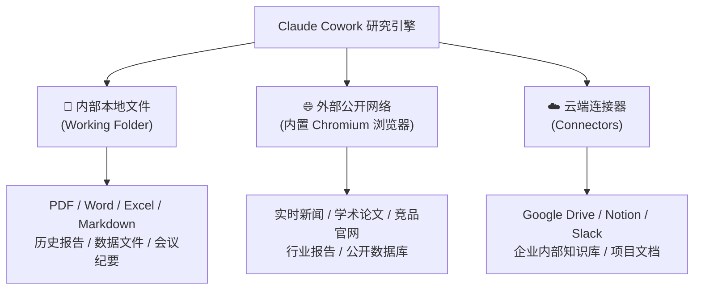
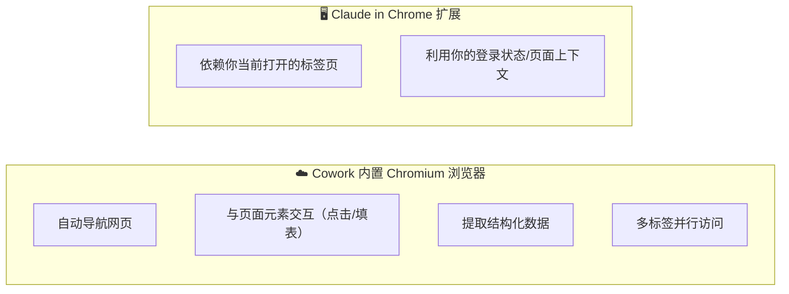
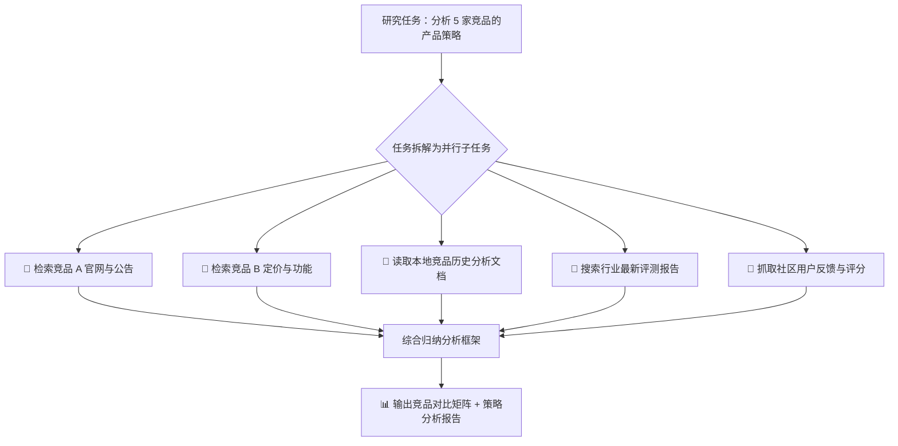
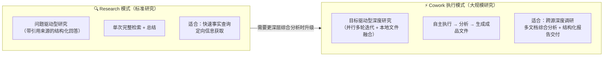
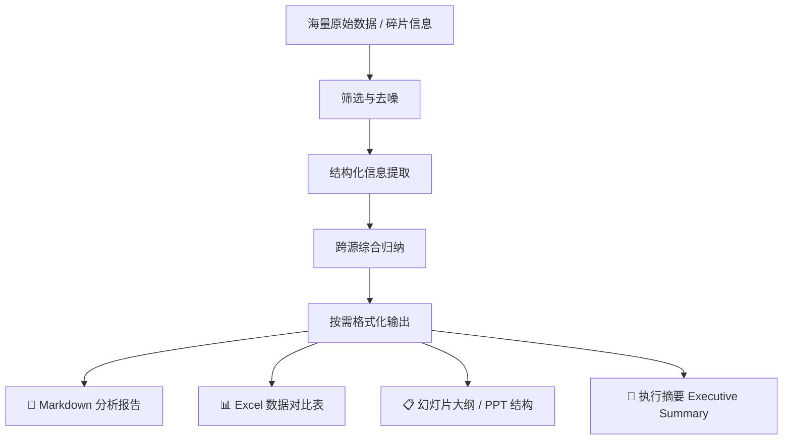

# Claude Cowork 实战: 《Research & Analysis at Scale》大规模研究与分析工作流

> **课程出处**：Anthropic 官方 Claude Academy (`academy.claude.com/courses/introduction-to-claude-cowork/research-analysis-at-scale`)  
> **课程定位**：掌握将 Claude Cowork 作为"超级研究员"的完整方法论，系统处理跨越海量内外部信息源的深度研究与结构化分析任务  
> **核心主题**：多源信息并行采集、内外部数据融合、内置 Chromium 浏览器研究、结构化分析交付、Research 模式 vs Cowork 执行

---

## 目录
1. [核心定位：从"搜索问答"到"委派深度研究"](#1-核心定位从搜索问答到委派深度研究)
2. [信息来源架构：内部文件 × 外部网络 × 云端连接器](#2-信息来源架构内部文件--外部网络--云端连接器)
3. [核心能力：内置 Chromium 浏览器与并行子任务处理](#3-核心能力内置-chromium-浏览器与并行子任务处理)
4. [典型研究场景与工作流实战](#4-典型研究场景与工作流实战)
5. [Research 模式 vs Cowork 执行模式辨析](#5-research-模式-vs-cowork-执行模式辨析)
6. [结构化交付：从原始数据到成品分析报告](#6-结构化交付从原始数据到成品分析报告)
7. [质量控制：研究信度与幻觉防范](#7-质量控制研究信度与幻觉防范)
8. [实战 Cheatsheet：大规模研究任务黄金法则](#8-实战-cheatsheet大规模研究任务黄金法则)

---

## 1. 核心定位：从"搜索问答"到"委派深度研究"

在传统的信息处理范式中，深度研究是极度耗时的人工密集型工作：搜索→阅读→筛选→归纳→撰写，每一步都依赖人类手工完成。Claude Cowork 的 **Research & Analysis at Scale** 能力将这一范式彻底颠覆：



---

## 2. 信息来源架构：内部文件 × 外部网络 × 云端连接器

Claude Cowork 的研究能力来自对**三大信息域**的统一调度：



| 信息域 | 代表来源 | 典型研究用途 |
| :--- | :--- | :--- |
| **本地文件（内部）** | Working Folder 内的各类文档 | 历史数据对比、内部基准线设定、存量知识调用 |
| **公开网络（外部）** | 网页、新闻、论文、竞品网站 | 行业趋势、竞品动态、最新数据与政策更新 |
| **云端连接器** | Drive、Notion、Slack | 团队协作记录、项目文档、客户沟通历史 |

---

## 3. 核心能力：内置 Chromium 浏览器与并行子任务处理

### 3.1 内置 Chromium 浏览器（独立研究浏览器）

Cowork 集成了一个**专属的 Chromium 浏览器沙箱**，专为 Agentic 研究设计：



| 特性 | 内置 Chromium（Cowork） | Claude in Chrome（扩展） |
| :--- | :--- | :--- |
| **最佳场景** | 独立后台批量研究、多网站并行抓取 | 需要你的登录态、当前操作页面上下文 |
| **运行环境** | 独立沙箱，不占你的浏览器 | 依附你的 Chrome 活动标签 |
| **数据访问** | 公开网页 + 可匿名访问内容 | 需登录的内部系统与平台 |

### 3.2 并行子任务处理（Parallel Execution）

大规模研究任务的关键提速来自**并行处理**能力：



---

## 4. 典型研究场景与工作流实战

| 研究场景 | 信息来源组合 | 交付物形态 |
| :--- | :--- | :--- |
| **竞品分析** | 竞品官网 + 行业评测 + 内部历史竞品档案 | 竞品对比矩阵 + SWOT 分析报告 |
| **市场调研** | 公开报告 + 新闻 + 学术论文 + 社区反馈 | 市场规模估算 + 趋势分析文档 |
| **技术选型调研** | GitHub + 技术博客 + 内部需求文档 | 技术方案对比表 + 推荐建议书 |
| **行业政策追踪** | 政府网站 + 新闻媒体 + 法规数据库 | 政策变化时间线 + 影响评估报告 |
| **客户/舆情分析** | 社区评论 + 客服记录（Slack/Drive） + 竞品评测 | 用户痛点地图 + 满意度趋势分析 |

---

## 5. Research 模式 vs Cowork 执行模式辨析

Claude 提供了两种不同深度的研究能力，理解二者的定位边界至关重要：



- **Research 模式**：类似"超级 Google 提问"，快速给出有来源引用的结构化答案。
- **Cowork 执行模式**：类似"委托一位全职研究员"，不仅搜索，还自主分析、综合、并直接写入本地成品文件。

---

## 6. 结构化交付：从原始数据到成品分析报告

Cowork 的研究流程最终必须落地为**可直接使用的成套成品**：



**关键实践**：在发起研究任务时，明确告知 Claude 期望的输出格式（如"请生成一份 Markdown 报告，包含执行摘要、关键发现、数据对比表和结论建议四个部分"），将显著提升交付质量。

---

## 7. 质量控制：研究信度与幻觉防范

大规模信息处理场景下，幻觉与错误引用风险需要特别关注：

- **要求标注来源**：在 Instructions 中明确要求"每条关键数据/结论需标注原始来源 URL 或文件名及页码"。
- **区分事实与推断**：要求 Claude 在报告中区分"已有数据支撑的结论"与"基于趋势的推断性建议"。
- **重点数据人工复核**：最终用于决策的关键数据（如市场规模数字、竞品价格、法规条款），务必返回原始来源做人工核查。
- **时效性标注**：要求 Claude 标注信息的采集时间，提示读者关注数据时效。

---

## 8. 实战 Cheatsheet：大规模研究任务黄金法则

```markdown
### 🔬 Research & Analysis at Scale 黄金五法则

1. 【定义研究边界】
   清晰说明研究范围：时间范围、地域范围、信息来源优先级（优先使用哪些）。
   例："重点参考 2024-2026 年的公开行业报告和竞品官网，辅以 Working Folder 内的历史数据"。

2. 【明确交付格式】
   指定最终报告的结构：章节划分、表格类型、字数范围。
   格式越清晰，Claude 生成的成品越接近可直接使用的状态。

3. 【启用来源追溯】
   要求标注信息来源，便于人工核查关键数据与事实。

4. 【善用并行优势】
   将大型研究任务拆分为并行子研究（各竞品/各地区/各时间段），
   让 Cowork 同步处理多个维度，最后归并综合。

5. 【终稿人工核查】
   研究报告中用于核心决策的关键数据，
   需回溯原始来源进行人工抽查验证，防止幻觉或信息过时。
```
