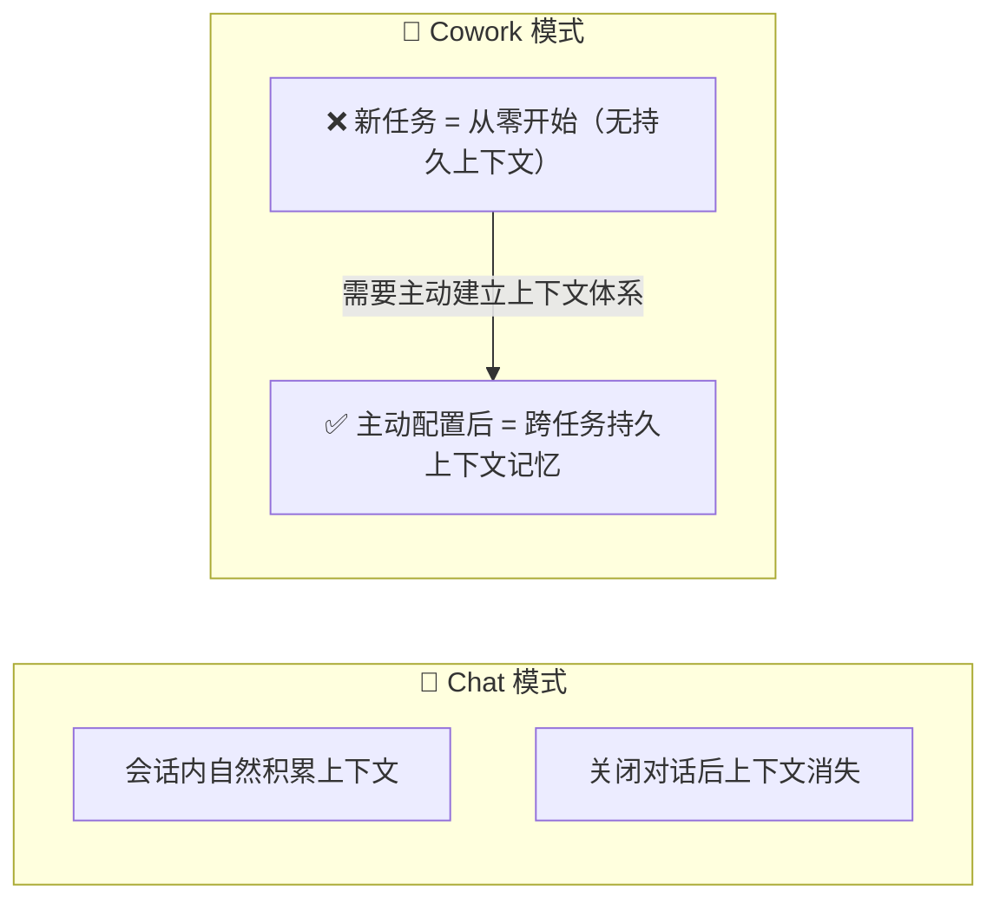
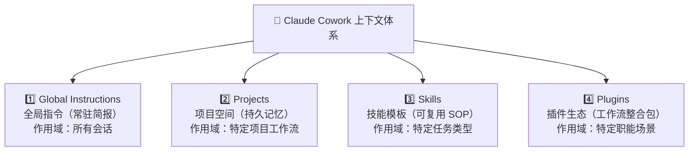
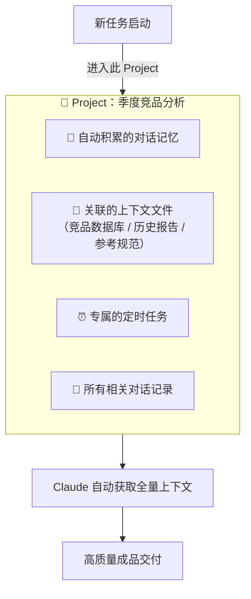
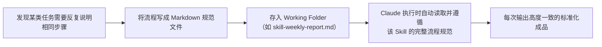
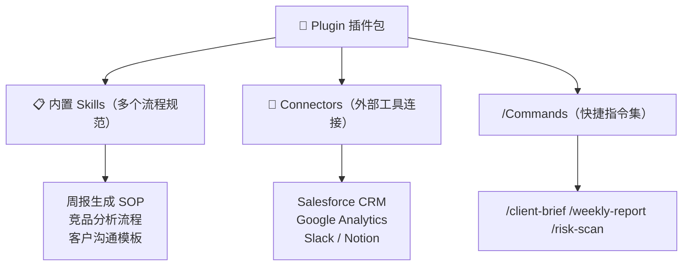
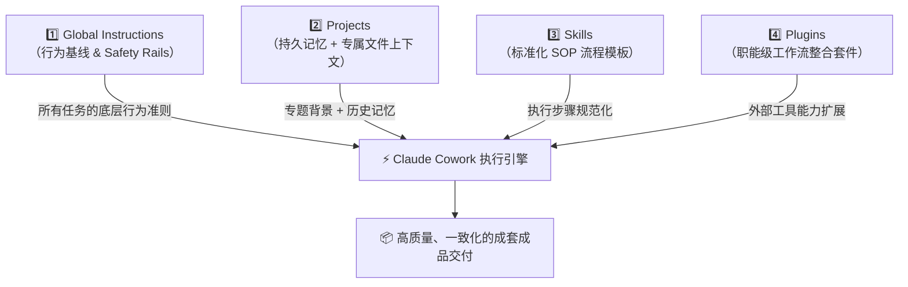

# Claude Cowork 实战: 《Giving Cowork Context》持久化上下文配置完全指南

> **课程出处**：Anthropic 官方 Claude Academy (`academy.claude.com/courses/introduction-to-claude-cowork/giving-cowork-context`)  
> **课程定位**：掌握如何为 Claude Cowork 建立持久化的业务上下文体系，让 Claude 从"陌生协作者"升级为"完全了解你工作方式的专属智能同事"  
> **核心主题**：Global Instructions 全局指令、Projects 项目空间记忆、Skills 可复用流程模板、Plugins 插件生态、四大上下文支柱架构

---

## 目录
1. [核心认知：为什么 Cowork 需要主动配置上下文](#1-核心认知为什么-cowork-需要主动配置上下文)
2. [四大上下文支柱总览](#2-四大上下文支柱总览)
3. [支柱一：Global Instructions（全局指令 / 常驻简报）](#3-支柱一global-instructions全局指令--常驻简报)
4. [支柱二：Projects（项目空间与持久记忆）](#4-支柱二projects项目空间与持久记忆)
5. [支柱三：Skills（可复用流程技能模板）](#5-支柱三skills可复用流程技能模板)
6. [支柱四：Plugins（插件生态与工作流整合）](#6-支柱四plugins插件生态与工作流整合)
7. [四大支柱协同作战：实战架构图](#7-四大支柱协同作战实战架构图)
8. [实战 Cheatsheet：上下文配置黄金法则](#8-实战-cheatsheet上下文配置黄金法则)

---

## 1. 核心认知：为什么 Cowork 需要主动配置上下文

Claude Chat（网页对话）会在每次对话中自然积累上下文；而 **Cowork 工作会话之间的上下文不会自动传递**——每次新任务对 Claude 而言都是全新开始，除非你主动建立持久化的上下文体系。



**结论**：Cowork 的能力上限，很大程度上取决于你为它配置的上下文质量——越完备的上下文 = 越少的重复说明 = 越高质量的交付成果。

---

## 2. 四大上下文支柱总览

Anthropic 将 Cowork 的上下文体系凝练为**四大核心支柱（Building Blocks）**：



| 支柱 | 作用域 | 核心价值 | 配置位置 |
| :--- | :--- | :--- | :--- |
| **Global Instructions** | 全局（所有会话） | 定义"我是谁、我如何工作"的基础行为准则 | 设置 → Cowork → Global Instructions |
| **Projects** | 特定项目空间 | 持久记忆 + 专属文件上下文 + 定时任务 | 项目列表 → 新建 Project |
| **Skills** | 特定任务类型 | 将高频流程固化为可复用 Markdown 规范文件 | Working Folder 内的 `.md` 文件 |
| **Plugins** | 特定职能场景 | 打包 Skills + Connectors + 命令的完整工作流套件 | Cowork 插件市场 / 自定义安装 |

---

## 3. 支柱一：Global Instructions（全局指令 / 常驻简报）

### 是什么
Global Instructions 是你的**"AI 工作说明书"**，它对 Claude 的每一次 Cowork 会话（包括普通任务和定时任务）永久生效，相当于给 Claude 发放了一份"永久员工入职指导手册"。

### 配置位置
> **Claude Desktop → 设置 (Settings) → Cowork → Global Instructions**

### 应该写什么

```markdown
## 推荐的 Global Instructions 结构模板

### 1. 身份与角色
我是 [你的职位] at [所在团队/公司]。
我的核心职责是 [核心工作重点]。

### 2. 工作风格与输出偏好
- 沟通风格：直接、结论优先，去除铺垫废话。
- 报告格式：使用 Markdown，结构层次清晰。
- 分析原则：数据驱动，结论需可追溯至来源。

### 3. 执行安全守则（Safety Rails）
- 执行任何实质性操作前，必须先输出计划并等待我确认。
- 禁止删除文件，只允许重命名归档。
- 涉及外发（邮件/消息）操作，必须二次确认。

### 4. 常用资源索引
- 主要工作目录：[路径]
- 核心参考文档：[文件名或描述]
```

### 核心价值
- **一次配置，永久生效**：不再每次任务都重新说明"请用中文""请附来源"等重复偏好。
- **安全兜底屏障**：通过 Safety Rails 防止高危操作在无人监督时自动执行。

---

## 4. 支柱二：Projects（项目空间与持久记忆）

### 是什么
Projects 是针对**特定业务专题**的独立持久化工作空间，区别于每次都重新开始的临时会话。



### Projects 的核心能力
1. **跨任务持久记忆**：Project 内的历史对话与决策会自动沉淀为记忆，后续任务可直接调用。
2. **专属文件上下文**：为 Project 指定参考文件夹或文档链接，项目内所有任务自动共享这些背景资料。
3. **专属定时任务**：每个 Project 可独立配置 Scheduled Tasks，定时任务将自动携带该 Project 的完整上下文运行。

### 最佳实践
- 为每个**中长期持续性专题**（如：某客户账号管理、某产品线追踪、某研究课题）建立专属 Project。
- 临时一次性任务无需新建 Project，直接在通用 Cowork 会话中处理即可。

---

## 5. 支柱三：Skills（可复用流程技能模板）

### 是什么
Skills 是**将高频重复工作流程固化为 SOP 文件**的机制。本质上是存储在工作目录内的 Markdown 格式"操作手册"，Claude 可在执行任务时主动调用。



### Skills 文件示例结构

```markdown
# Skill: 周报生成标准流程

## 触发条件
当用户要求生成本周工作周报时，遵循本流程。

## 数据来源
1. 读取 Working Folder/本周会议纪要/ 目录下的所有 .md 文件
2. 检索 Slack #项目进展 频道本周消息摘要
3. 读取本周任务清单文档

## 输出格式
### 结构
- 本周核心成果（3-5 条，结论优先）
- 进行中项目进展（每项目单独一段）
- 下周计划（明确到负责人与截止日）
- 风险与阻塞项（附建议解决方案）

## 输出规范
- 中文，专业简洁
- 每条内容不超过 50 字
- 使用 Markdown 格式便于复制到企业内网
```

### Skills 的价值
- **一致性保障**：无论谁发起任务，Claude 都按同一套 SOP 执行，消除输出差异。
- **持续改进**：发现 Skill 执行有偏差时，直接更新 `.md` 文件即可，无需重新解释。
- **团队资产**：Skills 文件可纳入版本控制（Git），成为团队可共享、可维护的 AI 工作规范资产。

---

## 6. 支柱四：Plugins（插件生态与工作流整合）

### 是什么
Plugins 是将 **Skills + Connectors（外部工具连接）+ Slash Commands（快捷指令）** 打包为一体的**完整工作流套件**，支持针对特定职能场景（如销售、法务、财务）一键安装启用。



### Plugins vs Skills 区分

| 维度 | Skills | Plugins |
| :--- | :--- | :--- |
| **粒度** | 单个流程规范文件 | 多个 Skills + Connectors + Commands 的完整打包 |
| **适用范围** | 单一任务类型 | 完整职能场景（如整个销售工作流） |
| **获取方式** | 自己编写 Markdown 文件 | 官方/社区市场安装 或 自定义开发 |

---

## 7. 四大支柱协同作战：实战架构图



---

## 8. 实战 Cheatsheet：上下文配置黄金法则

```markdown
### 🧩 Giving Cowork Context 黄金法则

1. 【Global Instructions 是第一优先级】
   上线 Cowork 的第一件事：写好 Global Instructions。
   包含：身份角色 + 输出风格 + 安全守则（Safety Rails）。

2. 【Project 对应长期专题，临时任务无需新建】
   中长期持续性工作建 Project；一次性任务直接用通用 Cowork 会话。

3. 【Skills 解决"我又要重复说这个"的痛点】
   每当你发现自己在向 Claude 解释同样的步骤，就把它写成 Skill 文件。

4. 【Plugin 是团队标准化的最高形态】
   当个人 Skills 成熟稳定后，可封装为 Plugin，在团队内共享标准化工作流。

5. 【上下文质量 = 输出质量】
   "垃圾进，垃圾出"同样适用于 AI。
   花在配置上下文上的时间，会以 10 倍效率提升的形式回报到每次任务中。
```
