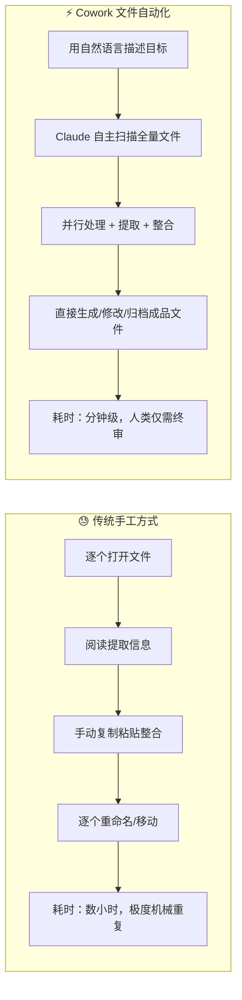
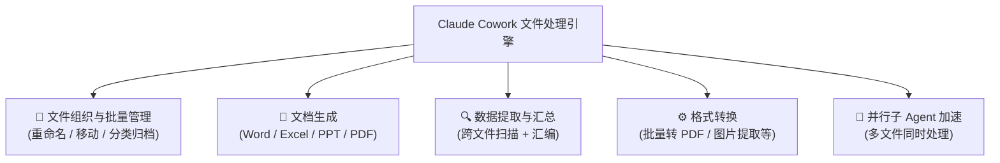
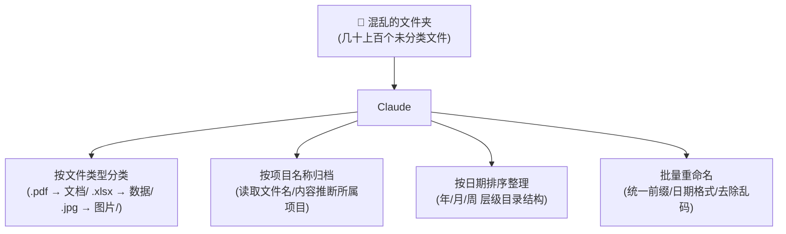
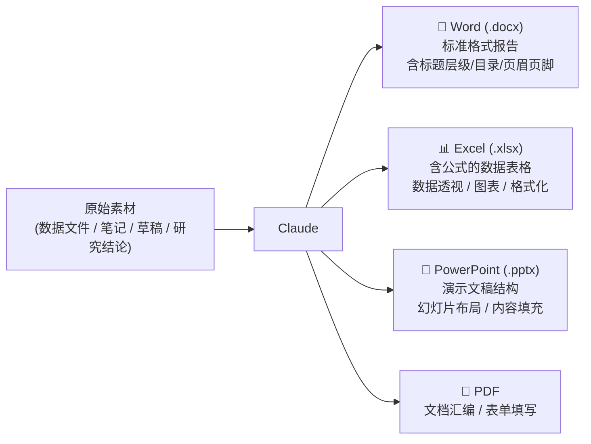
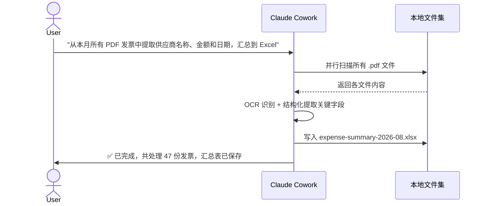
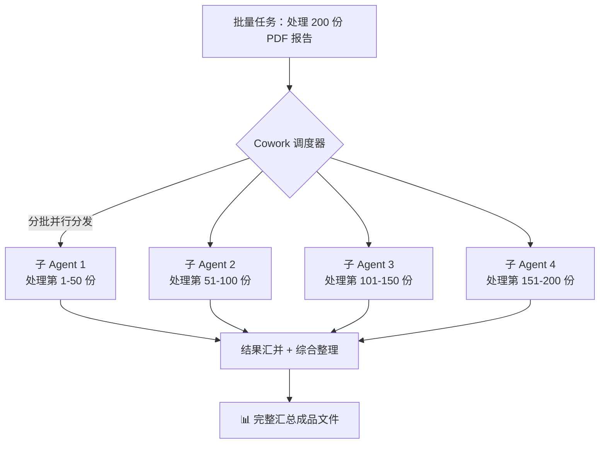
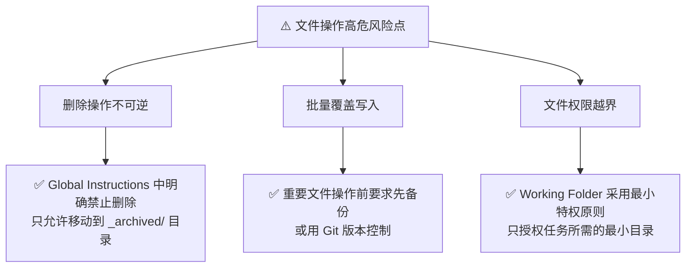

# Claude Cowork 实战: 《File & Document Tasks》文件与文档自动化处理完全指南

> **课程出处**：Anthropic 官方 Claude Academy (`academy.claude.com/courses/introduction-to-claude-cowork/file-document-tasks`)  
> **课程定位**：掌握如何将 Claude Cowork 作为本地文件与文档的自主处理引擎，覆盖批量操作、多格式文档生成、数据提取与综合整理等核心场景  
> **核心主题**：本地文件直接读写、批量操作、Office 文档生成、PDF 处理、数据提取与汇总、并行子 Agent 加速

---

## 目录
1. [核心范式：从"人工搬运"到"文件自动化处理"](#1-核心范式从人工搬运到文件自动化处理)
2. [文件操作全能力矩阵](#2-文件操作全能力矩阵)
3. [能力一：文件组织与批量管理](#3-能力一文件组织与批量管理)
4. [能力二：多格式文档生成（Word / Excel / PPT / PDF）](#4-能力二多格式文档生成word--excel--ppt--pdf)
5. [能力三：跨文件数据提取与综合汇总](#5-能力三跨文件数据提取与综合汇总)
6. [能力四：批量处理与并行子 Agent 加速](#6-能力四批量处理与并行子-agent-加速)
7. [Microsoft 365 深度集成](#7-microsoft-365-深度集成)
8. [安全操作规范：文件任务的高危风险防范](#8-安全操作规范文件任务的高危风险防范)
9. [典型场景速查 Cheatsheet](#9-典型场景速查-cheatsheet)

---

## 1. 核心范式：从"人工搬运"到"文件自动化处理"

在没有 Cowork 的世界里，处理大量本地文件是典型的"脑力外包但体力密集"的重复劳动：



---

## 2. 文件操作全能力矩阵



| 能力类型 | 代表任务 | 输入 | 输出 |
| :--- | :--- | :--- | :--- |
| **文件组织** | 整理混乱下载目录 | 杂乱文件夹 | 按类型/项目/日期分类的有序目录 |
| **文档生成** | 从数据生成分析报告 | 原始数据 / 草稿笔记 | `.docx` / `.xlsx` / `.pptx` 成品文件 |
| **数据提取** | 从多份 PDF 发票提取金额 | 批量 PDF 文件 | 汇总 Excel 表格 |
| **批量操作** | 按规则批量重命名 | 大量文件 | 符合命名规范的整齐文件集 |
| **格式转换** | 将 Word 文档转为 PDF | `.docx` 文件 | `.pdf` 格式文件 |

---

## 3. 能力一：文件组织与批量管理

这是最直观、最能立竿见影提升效率的文件任务类型。

### 典型场景



### 示例任务 Prompt
```text
请整理我的 Working Folder/项目归档/ 目录：
1. 将所有 PDF 文件移至子目录 "文档/"
2. 将所有 Excel 文件移至 "数据/"
3. 对文件名中包含 "draft" 或 "草稿" 的文件统一重命名，在文件名末尾加上 "_待审阅"
4. 整理完成后生成一份目录结构清单 directory-map.md
```

---

## 4. 能力二：多格式文档生成（Word / Excel / PPT / PDF）

Cowork 能直接在本地生成**具备完整格式、公式与结构**的 Office 文档：



### 文档生成最佳实践
- **明确结构要求**：在 Prompt 中指定文档的章节结构、表格列名、图表类型，生成质量显著更高。
- **数据源引用**：指定从哪些本地文件中读取数据（如"从 `sales-2026Q2.xlsx` 的 Sheet1 中读取数据"）。
- **格式规范**：如有公司/团队模板，将其放入 Working Folder 并在 Instructions 中注明"参照 `company-template.docx` 的样式规范"。

---

## 5. 能力三：跨文件数据提取与综合汇总

这是 Cowork 文件处理中技术含量最高、价值最大的能力之一。



### 高价值提取场景
| 场景 | 原始文件 | 提取内容 | 交付成品 |
| :--- | :--- | :--- | :--- |
| 发票/费用报销 | 批量 PDF 发票 | 供应商、金额、日期、税号 | Excel 费用汇总表 |
| 合同信息管理 | 多份合同 .docx | 甲乙方、合同金额、有效期、关键条款 | 合同台账 Excel |
| 会议纪要整合 | 多份会议 Markdown | 决策事项、行动项、负责人、截止日期 | 待办清单 + 决策日志 |
| 简历筛选 | 批量候选人 PDF | 学历、工作经验、技能关键词 | 候选人对比矩阵表 |

---

## 6. 能力四：批量处理与并行子 Agent 加速

当任务涉及**大量独立文件**时，Cowork 会自动启用**并行子 Agent（Sub-Agent Parallelism）**机制：



- **速度优势**：并行处理使大批量任务的耗时从线性 O(n) 降低至近似 O(1)。
- **无需手动配置**：Cowork 自动判断任务规模并决定是否启用并行子 Agent。

---

## 7. Microsoft 365 深度集成

通过 Connectors，Cowork 可以直接与 Microsoft 365 套件深度协作：

| Office 应用 | Cowork 支持的操作 |
| :--- | :--- |
| **Word** | 读取 / 编辑 / 生成完整文档，维持样式与格式 |
| **Excel** | 读取数据 / 写入公式 / 生成图表 / 数据透视分析 |
| **PowerPoint** | 生成演示文稿结构 / 填充内容与图表 |
| **Outlook** | 读取邮件摘要 / 整理附件 / 辅助起草回复（需 Connector 授权） |

---

## 8. 安全操作规范：文件任务的高危风险防范

文件操作涉及本地数据的直接修改，需特别注意安全合规：



### 推荐的 Safety Rails 配置（写入 Global Instructions）
```markdown
### 文件操作安全守则
- 禁止任何形式的永久删除，所有"删除"操作改为移动至 `_archived/YYYY-MM-DD/` 目录
- 批量修改 10 个以上文件前，必须先生成操作预览清单并等待我确认
- 禁止访问或修改 Working Folder 范围之外的任何目录
- 覆盖已有重要文件前，先在同目录创建 `.bak` 备份副本
```

---

## 9. 典型场景速查 Cheatsheet

```markdown
### 📂 File & Document Tasks 实战 Prompt 模板

#### 📁 文件整理
"整理 [目录路径]，按 [规则：类型/项目/日期] 分类，
对 [特定文件类型] 重命名为 [命名格式]，
完成后生成目录清单 index.md"

#### 📊 数据提取汇总
"扫描 [目录] 中所有 [.pdf/.xlsx/.docx] 文件，
提取 [字段：金额/日期/名称/关键条款]，
汇总到 [output-file.xlsx] 的 Sheet1，
按 [排序字段] 降序排列"

#### 📄 文档生成
"根据 [数据来源文件]，生成一份 [文档类型：Word/Excel/PPT]，
结构包含 [章节/表格列/幻灯片主题]，
参照 [模板文件名] 的样式规范，
保存到 [输出路径]"

#### 🔄 批量重命名
"将 [目录] 中所有符合 [规则：包含/不包含/日期格式] 的文件，
重命名为 [新命名格式：前缀_YYYYMMDD_原文件名]，
操作前生成预览清单供我确认"
```
