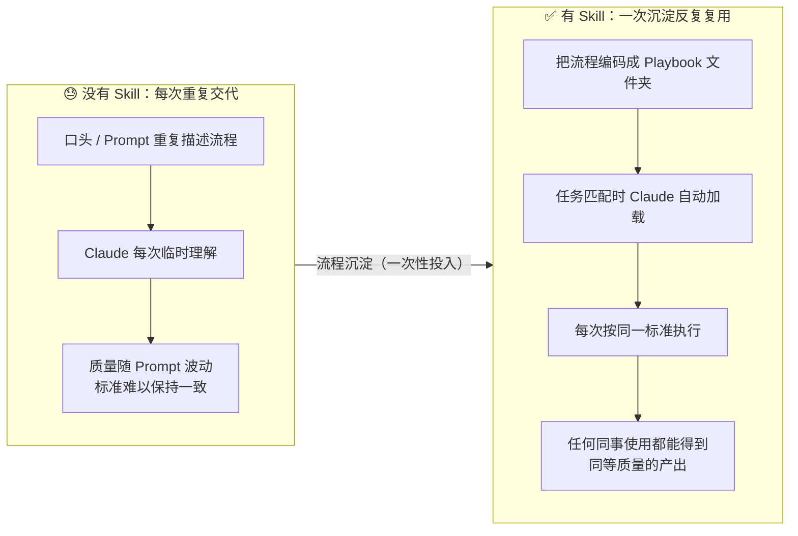
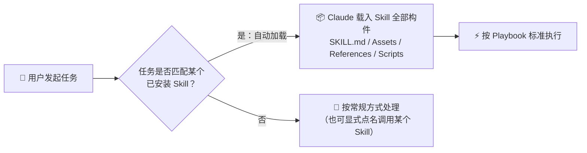
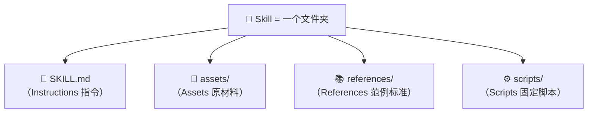
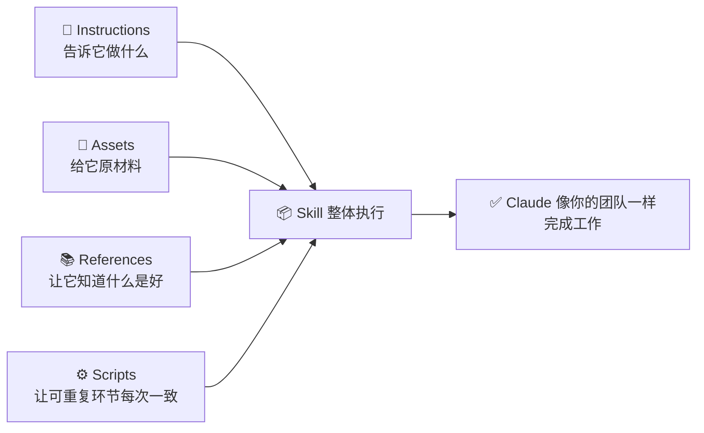
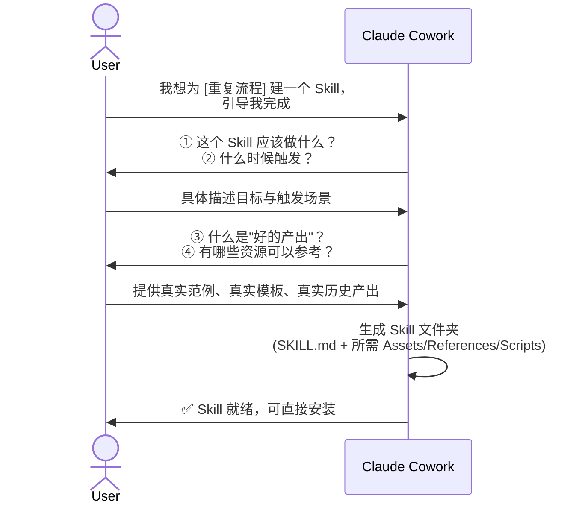
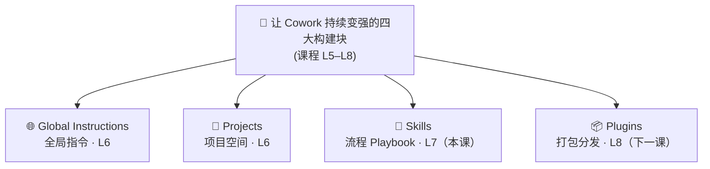

# Claude Cowork 实战: 《Skills: Teach Claude Cowork your way》技能系统完全指南

> **课程出处**：Anthropic 官方 Claude Academy (`academy.claude.com/courses/introduction-to-claude-cowork/file-document-tasks`)
> **课程定位**：掌握 Cowork 的 Skill 机制——把重复性工作流程沉淀为可复用的 Playbook，让 Claude 按你的标准和方式自主完成整类任务
> **核心主题**：Skill 定义与自动触发、四大构件（SKILL.md / Assets / References / Scripts）、用 Claude 构建 Skill、Skill 管理与迭代
> **课程时长**：约 10 分钟（第 7/14 课）
> ⚠️ **改版说明**：课程已由旧版 7 课扩容为 14 课 + 1 测验；本课 URL slug 沿用旧版 `file-document-tasks`，但内容已更新为《Skills》主题

---

## 目录
1. [Skill 是什么：一份可复用的 Playbook](#1-skill-是什么一份可复用的-playbook)
2. [触发机制：自动匹配与显式调用](#2-触发机制自动匹配与显式调用)
3. [Skill 的四大构件](#3-skill-的四大构件)
4. [官方示例：三类典型 Skill 形态](#4-官方示例三类典型-skill-形态)
5. [用 Claude 构建 Skill：最快的路径](#5-用-claude-构建-skill最快的路径)
6. [Skill 的管理与迭代](#6-skill-的管理与迭代)
7. [Skill 在上下文体系中的位置](#7-skill-在上下文体系中的位置)
8. [实战 Cheatsheet](#8-实战-cheatsheet)

---

## 1. Skill 是什么：一份可复用的 Playbook

课程给出的定义：

> A skill is a **reusable playbook** — a folder of files and resources — that teaches Claude how to do a specific kind of work **the way you'd want it done**.

Skill 本质上是一个**文件夹**，里面装着教会 Claude"如何按你的标准完成某类工作"的全部材料。当你发起一个匹配该 Skill 的任务时，Claude 自动加载这份 Playbook 并照着执行。



### 核心价值
- **对个人**：不用再反复解释"这件事该怎么做"。
- **对团队**：Skills 把你的具体工作流打包，**团队里任何人都能运行它并获得同样质量的结果**——这是把个人经验资产化的关键机制。

---

## 2. 触发机制：自动匹配与显式调用

Skills 的触发方式有两种：

| 触发方式 | 说明 | 示例 |
| :--- | :--- | :--- |
| **自动匹配**（默认） | Claude 在任务开始时识别到任务与某个已安装 Skill 匹配，**自动加载**该 Skill，无需点名 | 直接说"帮我整理这次会议的纪要"，自动触发 `meeting-recap` Skill |
| **显式调用** | 在 Prompt 中明确指定使用某个 Skill | "use the board memo drafting skill" |

> 💡 课程原文："Skills are automatically used during the task **right when you need them**."——Skill 在恰好的时机自动生效，这是它与"手动粘贴一大段指令模板"的本质区别。



---

## 3. Skill 的四大构件

一个 Skill 远不止"一段很长的指令"。课程明确了 Skill 可以包含的**四类文件**，以及它们如何协同工作——这正是"把真实流程编码到 Claude 能像你团队一样执行"的方法：



### 3.1 四大构件详解

| 构件 | 物理形态 | 作用 | 类比：给新同事的入职材料 |
| :--- | :--- | :--- | :--- |
| **Instructions**<br>（指令） | `SKILL.md` 文件 | 告诉 Claude：这个 Skill **做什么、何时用、怎么做** | 一份写得足够具体的 Runbook（操作手册） |
| **Assets**<br>（资产） | Logo、品牌模板、幻灯片母版、字体等 | 产出"真实感"成品的**原材料** | 公司物料包（品牌规范、模板文件） |
| **References**<br>（参考） | 优秀产出示例、风格指南、条款库 | 定义**"什么是好的"**——Claude 学习对标的标杆 | 过往的范例作品集 |
| **Scripts**<br>（脚本） | 小段可执行代码 | 处理**必须每次一模一样**的环节：方差计算、结构化对比、图表格式化、文档重排 | 固定的 Excel 模板 / 小工具 |

### 3.2 构件组合原则：The mix follows the work

> **"Include what needs to be included, nothing more."**（需要什么放什么，多余的一概不放）

- 有些 Skill **只有一个 SKILL.md**——对于简单流程，这完全够用
- 有些是 SKILL.md + 品牌资产文件夹
- 有些四类俱全
- **组合方式由工作本身的性质决定**，不要为了"完整"而堆砌

### 3.3 四大构件如何协同



---

## 4. 官方示例：三类典型 Skill 形态

课程以三个交互式示例展示不同形态的 Skill：

| 示例 Skill | 应用场景 | 构件组合（典型形态） |
| :--- | :--- | :--- |
| **meeting-recap** | 会议纪要自动整理 | 以 SKILL.md 指令为核心的**轻量纯指令型** |
| **board-memo** | 董事会备忘录撰写 | 指令 + **Assets**（品牌模板/Logo）+ **References**（过往备忘录范例） |
| **variance-analysis** | 财务方差分析 | 指令 + **Scripts**（固定口径的方差计算脚本） |

三个示例恰好覆盖了从"纯指令"到"全构件"的谱系，印证了 **The mix follows the work** 原则。

---

## 5. 用 Claude 构建 Skill：最快的路径

课程明确指出：**构建 Skill 最快的方式就是让 Claude 帮你做**。

### 开场 Prompt 模板

```text
I want to build a skill for [the recurring process you're tired of
re-explaining]. Walk me through what you need to know.

（我想为「某个你厌倦了反复解释的重复流程」建一个 Skill，
请引导我完成你需要了解的信息。）
```

### 构建流程



### 关键实践
- **回答越具体越好**：指向真实的工作范例、真实的模板、真实的历史产出，而不是抽象描述
- **产出物即安装包**：Claude 最终生成一个包含 SKILL.md 及所需构件的 Skill 文件夹，开箱可装

---

## 6. Skill 的管理与迭代

### 6.1 查看与修改
- 安装后，可在 **Customize** 面板中找到已安装的 Skill
- 修改无需动手编辑文件：**直接用对话下修正指令**，Claude 原地更新 Skill

```text
💬 示例迭代修正：
"Add a step that flags any deal over $100K that slipped two stages —
that always matters."

（加一个步骤：任何超过 10 万美元且掉落两个阶段的交易都要标记出来
——这一点始终重要。）
```

### 6.2 跨会话与跨项目通用
> Skills work the same way inside **any conversation**, including conversations **inside a project**.

- 你为方差分析构建的 Skill，会在任何"方差分析"任务出现时自动生效
- 无论在**默认 Cowork 会话**，还是在某个**特定财务项目**的会话中，行为一致
- 这意味着 Skill 是**能力级**的沉淀，不绑定于某个具体项目

---

## 7. Skill 在上下文体系中的位置

本课是新版课程第 5 课《Get better results faster》引出的"让 Cowork 越用越强"四大构建块之一（详见 [06. Giving Cowork Context](06-giving-cowork-context-notes.md)）：



| 构建块 | 作用范围 | 定位类比 |
| :--- | :--- | :--- |
| Global Instructions | 所有会话 | 公司级员工手册 |
| Projects | 特定工作流 | 项目作战室（含专属上下文与记忆） |
| **Skills** | 任务匹配即触发 | 岗位 SOP 手册（怎么做事） |
| Plugins | 可安装/分发的完整包 | 部门工具箱（Skills + Connectors + Subagents 打包） |

> 🔗 衔接下一课：**Skills 打包"你的具体工作流"；Plugins 则把多个 Skill 和 Connector 捆绑为一个围绕某类工作的可安装包**——这正是 L8 的主题。

---

## 8. 实战 Cheatsheet

```markdown
### 📜 Skills 实战速查

#### 1. 构建 Skill 的开场 Prompt
"I want to build a skill for [重复流程]. Walk me through what you need to know."
（回答时提供：做什么 / 何时触发 / 什么是好产出 / 有哪些真实范例与资源）

#### 2. SKILL.md 编写要领
像给新同事写 Runbook 一样写：
- 足够具体，让"新人"不用追问就能干活
- 说清三件事：做什么 (what)、何时用 (when)、怎么做 (how)

#### 3. 构件取舍原则
- 只有一个 SKILL.md？对简单流程完全够用
- 需要品牌一致 → 加 Assets
- 需要对标"什么是好" → 加 References
- 有必须每次一致的机械环节 → 加 Scripts
- 原则：Include what needs to be included, nothing more

#### 4. 迭代修正话术
"Add a step that ... — that always matters."
（直接描述要补充/修改的规则，Claude 原地更新 Skill）

#### 5. 入口与触达
- 管理入口：Customize 面板
- 触发：任务匹配自动加载；也可显式 "use the xxx skill"
- 跨会话、跨项目通用
```

### 课程官方"课后反思"

> 想一个你反复执行的过程——一份定期要跑的报表、一种固定的输出格式、一份总要过的 Checklist。把它记下来，**这就是你的第一个 Skill 候选**。不必现在就做，等有时间时回来和 Claude 一起构建。
