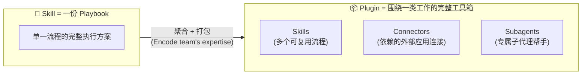
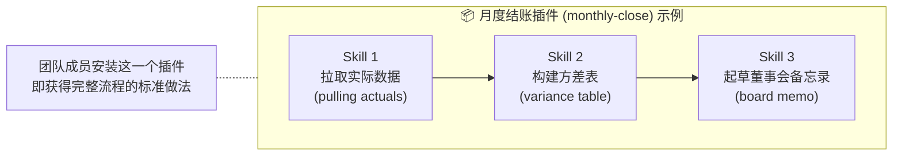
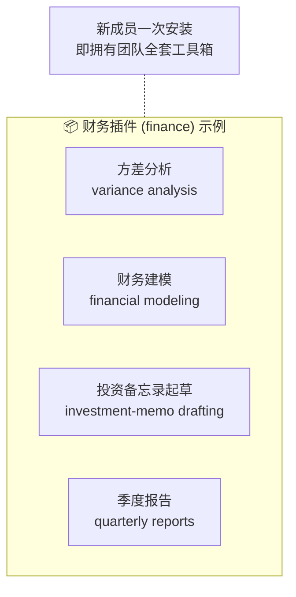
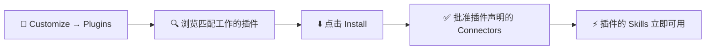
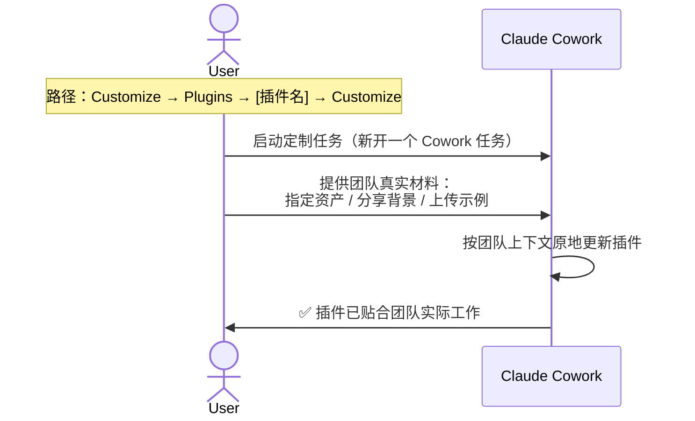
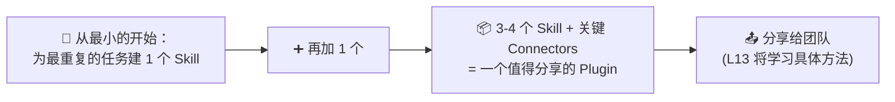

# Claude Cowork 实战: 《Plugins: Encode your team's expertise》插件系统与团队专家经验封装指南

> **课程出处**：Anthropic 官方 Claude Academy (`academy.claude.com/courses/introduction-to-claude-cowork/plugins-cowork-as-a-specialist`)
> **课程定位**：掌握 Cowork 的 Plugin 机制——把围绕某类工作的多个 Skill 及其依赖的 Connectors、Subagents 打包成可安装的"团队工具箱"，让专家经验随安装传播而非锁在个人脑子里
> **核心主题**：Plugin 定义与打包内容、两种插件形态、Marketplace 安装、定制与自建、Subagent 概念
> **课程时长**：约 15 分钟（第 8/14 课）

---

## 目录
1. [Plugin 是什么：围绕"一类工作"的打包](#1-plugin-是什么围绕一类工作的打包)
2. [Subagent：Skill 内部的专属帮手](#2-subagentskill-内部的专属帮手)
3. [两种插件形态](#3-两种插件形态)
4. [官方示例：Legal 法务插件解剖](#4-官方示例legal-法务插件解剖)
5. [安装插件：Anthropic Marketplace](#5-安装插件anthropic-marketplace)
6. [定制插件：从通用默认到团队专属](#6-定制插件从通用默认到团队专属)
7. [自建插件：从小做起](#7-自建插件从小做起)
8. [上手实操：/setup-cowork](#8-上手实操setup-cowork)
9. [Skill vs Plugin 对比与实战 Cheatsheet](#9-skill-vs-plugin-对比与实战-cheatsheet)

---

## 1. Plugin 是什么：围绕"一类工作"的打包

课程给出的定义：

> A plugin is a **packaged set of skills built around a job**. Where a skill is one playbook, a plugin is several — skills, plus the connectors and subagents they depend on.



### 核心价值：专家经验随安装传播

- **Plugin 教会 Claude 你团队的工作方式**：装上财务插件，Claude 就懂你们团队分析股票的方法；装上法务插件，它就懂你们的合同 Playbook
- **The expertise travels with the install, not the person**——经验跟着"安装"走，而不是跟着"人"走。这是把团队知识资产化、新人即插即用的关键
- **Anthropic 已为常见岗位发布官方插件**：财务、法务、销售、市场营销、客户支持、产品管理等，可开箱即用、二次定制，或完全自建

---

## 2. Subagent：Skill 内部的专属帮手

本课首次引入 **Subagent（子代理）** 概念：

> A subagent is a **purpose-built helper** a skill can spin up to handle one part of the work **in its own context** — e.g., a research subagent for a research step, a drafting subagent for a drafting step.

| 要点 | 说明 |
| :--- | :--- |
| **本质** | Skill 可按需"拉起"的专职帮手 |
| **独立上下文** | 在自己的上下文窗口中处理工作，不挤占主任务空间 |
| **专职分工** | 研究步骤配研究 Subagent，起草步骤配起草 Subagent——一个环节一个专职帮手 |
| **与 Plugin 的关系** | Subagent 是 Plugin 打包的组成要素之一（Skills + Connectors + Subagents） |

---

## 3. 两种插件形态

课程明确了 Plugins 的两种形态（Two shapes），**两种都常用、都有价值**：

### Shape 1：端到端流程打包（End-to-end process bundled）

当工作包含**多个顺序步骤**时，把每一步的 Skill 打包进一个 Plugin，让整个流程作为一个整体运行。



### Shape 2：团队最常用技能集合（Team's most-used skills bundled）

针对团队**一组高频重复工作**，把最重要的 Skill 捆绑成单个 Plugin。这些 Skill **彼此独立、无依赖关系**，只是团队最常调用的工具集。



### 两种形态的共同本质

> The shape that matters in either case: **a plugin is a package built around *workflows***.

判断标准是"围绕某个工作流"：
- "客户成功团队的续约准备" 是一个 Plugin
- "我们基金的股票研究" 是一个 Plugin
- "CFO 办公室的月度董事会周期" 是一个 Plugin

---

## 4. 官方示例：Legal 法务插件解剖

课程交互示例展示了一个 Marketplace 上的法务插件（Anthropic 出品，v1.2.0），是理解 Plugin 构成的最佳样板：

| 组成部分 | 内容 |
| :--- | :--- |
| **描述** | The contract and review work a legal team does most.（法务团队最常做的合同与审查工作） |
| **Skills（5 个）** | `/nda-review` 按内部 Playbook 审查修订 NDA · `/contract-summary` 从任意合同提取关键条款/日期/义务 · `/clause-library` 查找特定条款的预批准备选措辞 · `/regulatory-check` 标记草稿中的司法辖区合规问题 · `/counterparty-research` 拉取公开文件与历史交易记录 |
| **Connectors（5 个）** | Box · Egnyte · Slack · M365 · Atlassian |

> 💡 **观察要点**：这 5 个 Skill 正是"Shape 2 形态"——彼此独立的法务高频技能集合；而 5 个 Connectors 说明 Plugin 打包时会连同工作所需的**外部应用访问能力**一起声明。安装时需逐一批准这些 Connector 权限。

> ⚠️ **Stay in the loop**：Plugin 让 Claude 能运行你的工作流，但**产出仍需你亲自审阅**——人在环原则不因插件化而改变。

---

## 5. 安装插件：Anthropic Marketplace

官方插件的安装路径：



- 官方插件覆盖知识工作最常见的岗位角色，每个都由 Anthropic 构建维护，**作为起点**——可直接使用，也可塑造成团队自己的版本
- 安装完成后，插件内的所有 Skills **立即可被任务自动匹配调用**

---

## 6. 定制插件：从通用默认到团队专属

课程强调的重要观念：

> A plugin from the marketplace is a **strong default, not a final answer**.
> （Marketplace 插件是一个强力的默认起点，而非最终答案。）

插件内的 Skills 和 Connectors 用的是**通用版工作流**，而你的团队有自己的模板、定义和步骤——因此**任何已安装插件都可以被塑造**。

### 定制路径与流程



### 官方定制示例 Prompt

```text
💬 Here are our last three red-lined NDAs. Update the /nda-triage skill
in this plugin so the format and tone match these.

（这是我们最近三份修订过的 NDA。请更新插件中的 /nda-triage Skill，
使其格式和语气与这些范例保持一致。）
```

> 💡 与定制 Skill 的思路一致：**用真实范例说话**。对插件塑造越贴合团队的实际工作，产出的杠杆效应越大（The more you shape it to your team's actual work, the more leverage it produces）。

---

## 7. 自建插件：从小做起

当团队的工作流**不存在现成插件**时，可以与 Cowork 协作自建：它会打包工作流所需的 Skills、纳入依赖的 Connectors，并封装成便于安装到 Cowork 实例的 Plugin。

### 渐进式构建路径



### 自建前必查：组织目录

> Your admin may have already published plugins for your organization — **check the Directory (Customize → Plugins) before you build anything yourself**.

管理员可能已为组织发布了内部插件——**自建之前先查目录**，避免重复造轮子。

---

## 8. 上手实操：/setup-cowork

课程提供的快速上手入口——在新 Cowork 会话中输入：

```text
/setup-cowork
```


---

## 9. Skill vs Plugin 对比与实战 Cheatsheet

### Skill 与 Plugin 的关系对比

| 维度 | 📜 Skill | 📦 Plugin |
| :--- | :--- | :--- |
| **本质** | 一份可复用的 Playbook（一个文件夹） | 围绕一类工作的打包集合 |
| **构成** | SKILL.md (+ Assets / References / Scripts) | 多个 Skills + Connectors + Subagents |
| **解决的问题** | "这件事该怎么做" | "这类工作团队的完整做法" |
| **形态** | 单一流程 | ① 端到端流程链 ② 团队常用技能集 |
| **获取方式** | 用 Claude 构建 / Customize 管理 | Marketplace 安装 / 定制官方插件 / 自建 |
| **分发** | 个人使用为主 | 面向团队安装与组织分发（L13） |
| **类比** | 岗位 SOP 手册 | 部门工具箱 |

### 实战 Cheatsheet

```markdown
### 📦 Plugins 实战速查

#### 1. 安装官方插件
路径：Customize → Plugins → 浏览 → Install → 批准 Connectors
快速选型：新会话输入 /setup-cowork，Claude 访谈后推荐匹配插件

#### 2. 两条核心观念
- Marketplace 插件是 strong default（好起点），不是 final answer（终稿）
- The expertise travels with the install, not the person

#### 3. 定制插件（贴合团队）
路径：Customize → Plugins → [插件名] → Customize
方法：像带新同事一样给团队真实材料——
"Here are our last three [真实产出]. Update the /[skill-name]
skill in this plugin so the format and tone match these."

#### 4. 自建插件路线
最小重复任务 → 1 个 Skill → 逐步累加 → 3-4 个 Skill + Connectors
→ 值得分享的 Plugin（L13 学习团队分发）
⚠️ 自建前先查 Directory：管理员可能已发布内部插件

#### 5. 安全底线
插件化 ≠ 免审阅：产出仍由你终审（Stay in the loop）
安装插件时逐项确认其声明的 Connector 权限
```

### 课程衔接

> 🔗 **下一课预告**：至此你已让 Cowork 在桌面端"属于你"。下一模块（L9–L10）将把 Cowork **扩展到桌面之外**——进入你的浏览器（Claude in Chrome），以及 Word / Excel / PowerPoint / Outlook 等 M365 应用。
