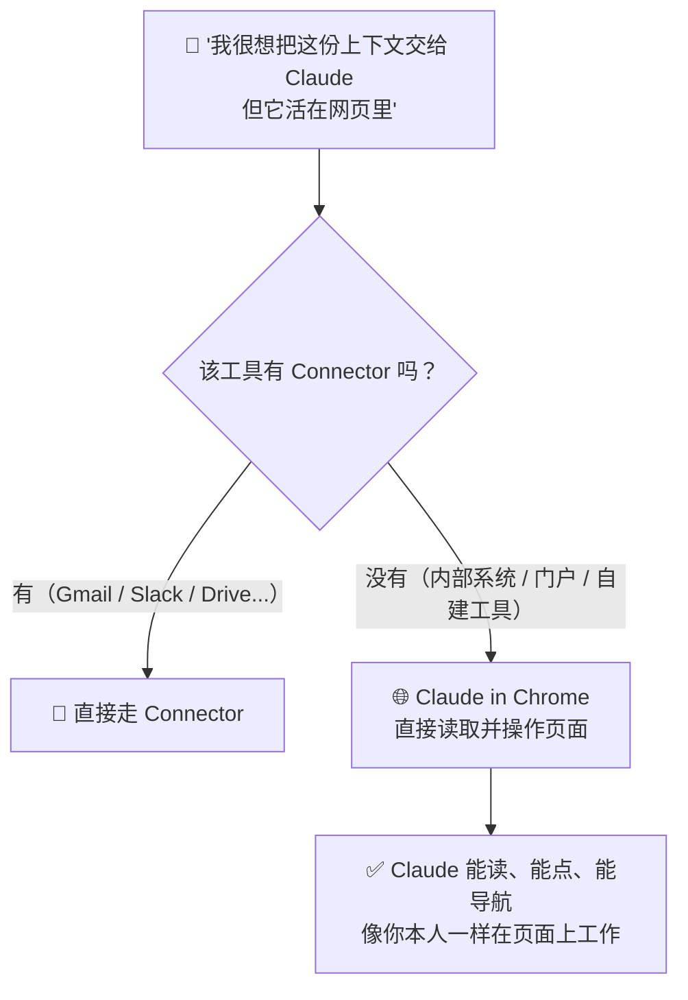
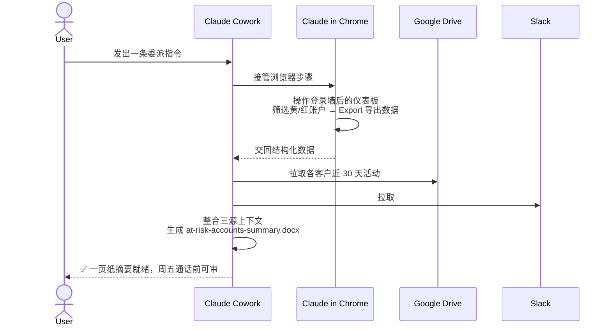

# Claude Cowork 实战: 《Claude in Chrome》浏览器内 AI 协作桥梁指南

> **课程出处**：Anthropic 官方 Claude Academy (`academy.claude.com/courses/introduction-to-claude-cowork/claude-in-chrome`)
> **课程定位**：掌握 Claude in Chrome——为没有 Connector 的浏览器工具（内部仪表板、供应商门户、登录后的 Web 应用）架起 AI 协作桥梁，并与 Cowork 联动完成"一次委派、多源上下文"的成品交付
> **核心主题**：无 Connector 工具的浏览器桥接、Chrome 与 Cowork 协同、敏感操作审批、登录与访问边界
> **课程时长**：约 10 分钟（第 9/14 课 · "Use Claude wherever you work" 模块第 1 课）

---

## 目录
1. [定位：没有 Connector 的工具怎么办](#1-定位没有-connector-的工具怎么办)
2. [解锁的四类真实工作场景](#2-解锁的四类真实工作场景)
3. [与 Cowork 协同：一次委派、多源上下文](#3-与-cowork-协同一次委派多源上下文)
4. [注意事项：登录、访问边界与操作审批](#4-注意事项登录访问边界与操作审批)
5. [实战 Cheatsheet](#5-实战-cheatsheet)

---

## 1. 定位：没有 Connector 的工具怎么办

Connector 机制再丰富，也覆盖不了所有工具——尤其是企业内部系统。**Claude in Chrome 就是这个缺口的桥梁**：

> **Claude in Chrome is the bridge for tools that don't have a connector.** For anything that lives in a browser, Claude can read and act on those pages.



### 三大关键要点（Key Takeaways）

| 要点 | 说明 |
| :--- | :--- |
| **浏览器即接口** | 只要在浏览器里能打开的工具，Claude 就能读取并在页面上执行操作 |
| **Chrome 与 Cowork 协同** | Claude 在浏览器中收集信息、执行动作，再把结果带回 Cowork 构建成品交付物——**一次对话，两个界面（One conversation, both surfaces）** |
| **人类保持掌控** | 默认情况下，敏感操作前 Claude 都会请示，你可逐项批准或拒绝 |

---

## 2. 解锁的四类真实工作场景

### 2.1 内部仪表板（Internal dashboards）

- 财务团队的 Tableau 视图、销售运营的 Looker 仪表板、每个周一都要看的 BI 指标
- Claude 可以**拉取数字、下载到本地**，并把这些上下文用于 Cowork 任务

### 2.2 供应商门户与客户系统（Vendor portals and customer systems）

- 没有 API 的采购门户、藏在单点登录（SSO）后面的 CRM、每张工单都要分诊的客服系统
- Claude 能**像你本人一样**在门户中导航、拉取所需内容并执行操作

### 2.3 登录后的 Web 应用（Web apps behind a login）

- 任何有浏览器界面的工具——**包括团队自建的系统**——都变得可被"脚本化"驱动：

```text
💬 官方示例 Prompt：
"Open the procurement system, find every PO from our top ten suppliers
in Q3, and pull the line items into a spreadsheet."

（打开采购系统，找出第三季度来自我们前十大供应商的所有采购订单，
把明细行拉到一张电子表格里。）
```

### 2.4 以交付物收尾的网络调研（Web research that ends in a deliverable）

- 打开十个标签页、逐页提取内容、整理成一份简报——**全程无需复制粘贴**

> 💡 **判断模式**：任何时候你发现自己在想 *"I'd love to give this context to Claude, but it lives on the web"*（真想把这份上下文给 Claude，可它在网页上）——**Claude in Chrome 就是答案**。

---

## 3. 与 Cowork 协同：一次委派、多源上下文

本课的核心实战演示——团队客户健康仪表板在登录墙后且无 Connector，需要一份"所有黄/红状态账户"的一页纸摘要。**只需在 Cowork 中发一条指令**：

```text
💬 Cowork Prompt（官方演示）：
"Open the customer health dashboard in Chrome, pull every account
showing yellow or red, and for each one, pull the past 30 days of
activity from the customer's folder in Drive and recent threads in
#customer-success in Slack. Build a one-page summary I can review
before my Friday call."

（在 Chrome 中打开客户健康仪表板，拉取所有黄/红状态账户；
对每个账户，从 Drive 的客户文件夹拉取过去 30 天活动，
并从 Slack #customer-success 频道拉取近期讨论。
构建一份一页纸摘要，供我周五通话前审阅。）
```

### 完整协同流程



### 协同要点
- **分工自然发生**：浏览器内的步骤交给 Claude in Chrome，数据拿回后由 Cowork 接续加工
- **One delegation, three sources of context**——一次委派，贯通浏览器（无 Connector 系统）+ Drive（Connector）+ Slack（Connector）三种上下文源
- 交付物仍是**写回你文件夹的真实文件**，而非聊天窗口里的文字

---

## 4. 注意事项：登录、访问边界与操作审批

### 4.1 需要你先登录（You need to be signed in）

- **Claude 不能替你登录任何系统**
- 如果工具需要认证：你先在自己浏览器里登录一次，Claude 在你**已认证的会话**中工作

### 4.2 谨慎划定网页访问边界（Be deliberate about access）

- 与 Connector 同理，**Claude 能看到你能看到的一切**——但在开放的 Web 上，这包括你有权访问的**任何内容**
- 对敏感站点：**收窄 Claude 可操作的范围**，并在批准前**审阅每个动作**

### 4.3 敏感操作逐项审批

- 默认开启：敏感动作执行前 Claude 会请求确认，你逐项 Approve / Deny

> 🔗 **官方设置指引**：[Get started with Claude in Chrome](https://support.claude.com/en/articles/12012173-get-started-with-claude-in-chrome)

---

## 5. 实战 Cheatsheet

```markdown
### 🌐 Claude in Chrome 实战速查

#### 1. 何时使用（判断口诀）
"我很想把这份上下文交给 Claude，但它活在网页里" → Claude in Chrome
典型对象：内部仪表板 / 无 API 门户 / SSO 后的 CRM / 团队自建 Web 系统

#### 2. 联动 Cowork 的委派 Prompt 骨架
"Open [系统/仪表板] in Chrome, pull [目标数据],
and for each [条目], pull [补充上下文] from [Connector 应用],
build a [交付物] I can review before [截止节点]."

#### 3. 使用前置条件
- 你先在浏览器完成登录（Claude 不能替你登录）
- Claude 在你已认证的会话中工作

#### 4. 安全守则
- 敏感站点收窄 Claude 的可操作范围
- 每个敏感动作执行前审阅，逐项批准/拒绝
- 开放 Web 上 Claude 权限 = 你的全部访问权限，勿过度授权

#### 5. 课后练习（官方建议）
挑一个手头"活在无 Connector 浏览器工具里"的任务：
打开 Cowork → 描述任务 → 让 Claude 在 Chrome 中工作 →
把洞察交回 Cowork 构建成品
```

### 课程衔接

> 🔗 **下一课预告**：L10《Claude for Microsoft 365》——Claude 将以 Add-in 形式直接出现在 Word、Excel、PowerPoint、Outlook 中，覆盖大量工作真正落地的地方。
