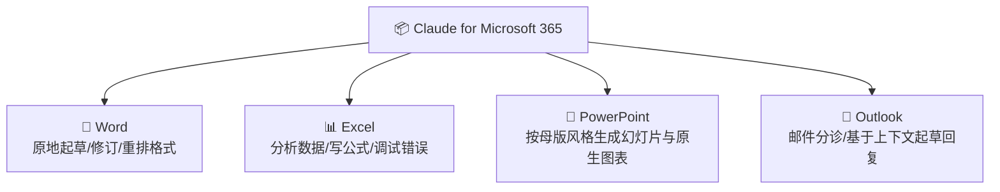
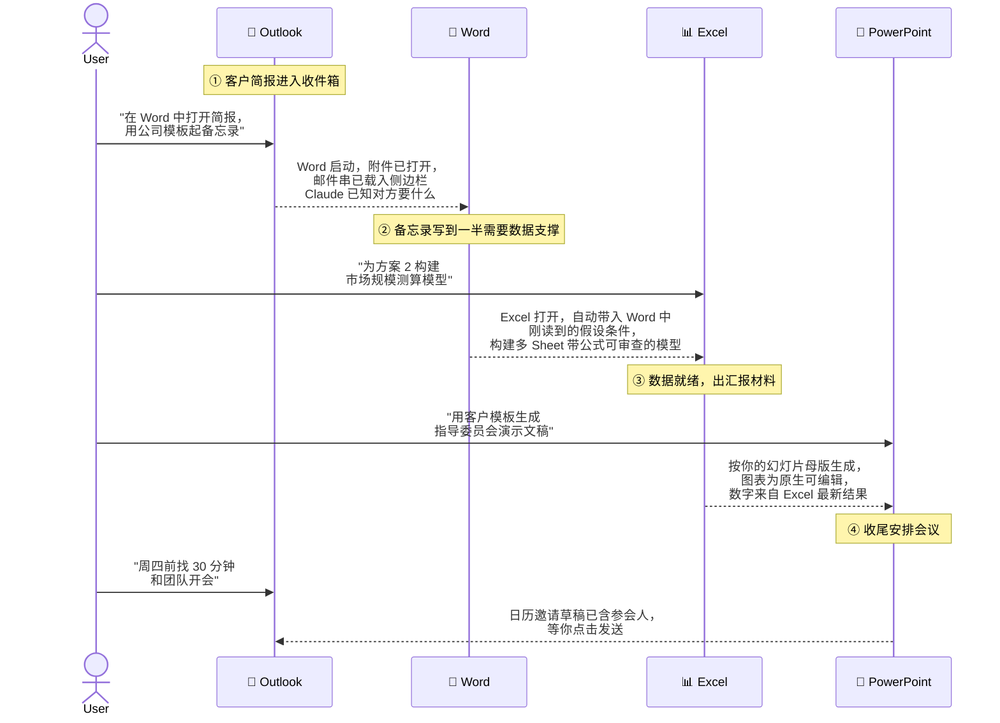
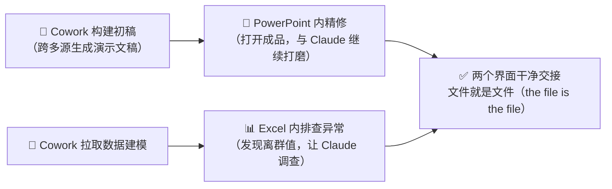

# Claude Cowork 实战: 《Claude for Microsoft 365》Office 套件内嵌 AI 协作指南

> **课程出处**：Anthropic 官方 Claude Academy (`academy.claude.com/courses/introduction-to-claude-cowork/claude-for-microsoft-365`)  
> **课程定位**：掌握 Claude 以 Add-in 形式嵌入 Word / Excel / PowerPoint / Outlook 的文档内协作——在"你正在编辑的文件"上原地工作，并在一次对话中跨应用传递上下文  
> **核心主题**：四大 Office 应用内的具体能力、跨应用上下文流转（Outlook→Word→Excel→PPT→Outlook）、M365 vs Cowork 选型法则  
> **课程时长**：约 5 分钟（第 10/14 课 · "Use Claude wherever you work" 模块第 2 课）

---

## 目录
1. [定位：Claude 住进文档里](#1-定位claude-住进文档里)
2. [四大应用内的具体能力](#2-四大应用内的具体能力)
3. [跨应用上下文流转：一次对话贯穿四个应用](#3-跨应用上下文流转一次对话贯穿四个应用)
4. [选型法则：M365 还是 Cowork](#4-选型法则m365-还是-cowork)
5. [上手实操与安装](#5-上手实操与安装)
6. [实战 Cheatsheet](#6-实战-cheatsheet)

---

## 1. 定位：Claude 住进文档里

Claude for Microsoft 365 与前几课的工具形态都不同——**Claude 直接出现在你打开的文档内部**：

> **Claude lives inside the document.** Claude shows up as an add-in inside Word, Excel, PowerPoint, and Outlook, working on the files and spaces you have open.



### 三大关键要点（Key Takeaways）

| 要点 | 说明 |
| :--- | :--- |
| **文档内嵌** | 以 Add-in 形式在四个应用内工作，直接操作你**当前打开**的文件与空间 |
| **一次对话跨应用携带上下文** | 在 Excel 里建好分析 → 交给 PowerPoint 出幻灯片；用 Word 备忘录作为 Outlook 回复草稿的素材源 |
| **与 Cowork 是不同时刻的不同工具** | Cowork 跨多源构建**成品交付物**；M365 内的 Claude 用于**精修、调试、塑造你正在处理的文件**，并把该文件的上下文带入你正在构建的其他文档 |

---

## 2. 四大应用内的具体能力

### 2.1 Excel——数据分析与公式引擎

| 能力 | 说明 |
| :--- | :--- |
| 分析数据、编写公式 | 直接在工作簿内生成公式 |
| 调试 `#REF!` 错误与循环引用 | 原地排错 |
| 跑情景测试（Scenario tests）而不破坏模型 | 试算安全 |
| 从模板建表、**引用回具体单元格**（cite back to specific cells） | 产出可溯源——Claude 会指明结论来自哪个单元格 |

```text
💬 最强招式（The strongest move）：
"Pull the actuals from the Q3 sheet, compare them to the Q3 plan
in the same workbook, and write the variance commentary in column F
next to each line item."

（从 Q3 工作表拉取实际数，与同一工作簿中的 Q3 计划对比，
在 F 列为每个行项目写方差说明。）
```

### 2.2 PowerPoint——模板风格的幻灯片生成

| 能力 | 说明 |
| :--- | :--- |
| 读取幻灯片母版、字体与配色 | 生成的幻灯片**自动匹配你的模板风格** |
| 生成**原生可编辑图表** | 不是贴图（not pasted images），后续可改 |
| 对当前选中的幻灯片操作 | 上下文就是你正在看的那页 |

```text
💬 最强招式：
"Take the analysis I just did in Excel and turn it into a
three-slide deck for the QBR, using our deck template."

（把我刚在 Excel 做的分析转成三页 QBR 演示文稿，用我们的模板。）
```

### 2.3 Word——原地起草与修订

| 能力 | 说明 |
| :--- | :--- |
| 原地起草、修订、重排格式 | 直接改你手上的文档 |
| 处理批注（Comments）与修订（Tracked Changes） | 融入传统审校工作流 |
| 从连接的数据源拉取上下文 | 让草稿有据可依（grounded） |

```text
💬 最强招式：
"Draft the executive summary based on the body of this memo and
the source data referenced in the appendix."

（基于本备忘录正文和附录引用的源数据，起草执行摘要。）
```

### 2.4 Outlook——带全局上下文的邮件分诊

| 能力 | 说明 |
| :--- | :--- |
| 邮件分诊（Triage） | 结合你其余工作的上下文处理收件箱 |
| 起草回复 | 回复内容反映**过往邮件串、日历上下文、近期决策** |

---

## 3. 跨应用上下文流转：一次对话贯穿四个应用

本课的核心亮点——**跨应用流转（Cross-app move）**是"M365 + Claude"区别于单应用工作的关键。你不是在"一个文档上"工作，而是**把它的上下文带进下一个文档**。

官方演示了一条完整的链路：



### 流转的本质

> **The cross-app move is where M365 plus Claude starts to feel different from working in any single app.**

- 每一跳都是**自然语言一句话**，Claude 自动完成"打开目标应用 + 携带上文 + 执行操作"
- 文件之间不再是割裂的孤岛：邮件的诉求 → 备忘录的假设 → 模型的数字 → 演示文稿的图表 → 会议的邀请，**上下文全程不断线**

---

## 4. 选型法则：M365 还是 Cowork

课程给出的实用判断规则：

| 维度 | 🔌 Claude in Cowork | 📄 Claude in M365 |
| :--- | :--- | :--- |
| **典型场景** | 工作需要**从多个来源拉取**、最终产出交付物 | 你正**在 Office 文件内部**工作 |
| **例子** | 从 20 个源文件构建简报；从 CRM + 3 个 Slack 频道汇总报告；按计划定时运行工作流 | 原地编辑文档；把上下文从一个应用带到下一个应用 |
| **工作重心** | 跨源**构建**成品 | **精修、调试、塑造**已有文件 |

### 真实工作往往是两者接力



> 💡 **The two surfaces hand off cleanly — and the file is the file in both cases.**（两个界面干净交接——无论在哪边，文件始终是同一个文件。）

---

## 5. 上手实操与安装

### 安装入口

| 组件 | 说明 |
| :--- | :--- |
| **Word / Excel / PowerPoint Add-in** | 安装指引：[Work across Excel, PowerPoint, and Word](https://support.claude.com/en/articles/13892150-work-across-excel-powerpoint-and-word)（含设置与套餐可用性） |
| **Claude for Outlook** | 独立 Beta，单独的应用商店条目：[Claude for Outlook](https://support.claude.com/en/articles/14855664-use-claude-for-outlook) |
| **IT 管理提示** | 若 Add-in 由 IT 团队统一管理，先与 IT 确认 |

### 课后练习（官方建议）

打开本周正在处理的一个真实文档，在应用内做**一次**操作：精修一段文字 / 调试一个公式 / 从 Word 段落构建一页幻灯片。

> 第一次看到 Claude 直接操作你眼前的文档时，"先聊天再复制粘贴"模式的差距就真正显现了。

---

## 6. 实战 Cheatsheet

```markdown
### 📄 Claude for Microsoft 365 实战速查

#### 1. 选型口诀
- 多源汇聚 → 成品交付物 → Cowork
- 已在 Office 文件内 → 原地精修/跨应用带上下文 → M365 Add-in
- 真实工作两者接力：Cowork 出初稿 → M365 里继续打磨（文件不变）

#### 2. 各应用"最强招式"模板
- Excel: "从 [Sheet] 拉取实际数，与 [计划] 对比，
  在 [F 列] 为每个行项目写方差说明"（要求引用具体单元格）
- PPT: "把 [Excel 分析] 转成 [N] 页 [场景] 演示文稿，用我们的模板"
  （自动匹配母版/字体/配色，图表为原生可编辑）
- Word: "基于 [正文] 和 [附录源数据] 起草 [执行摘要]"
  （支持批注与修订模式）
- Outlook: 回复自动反映邮件串、日历与近期决策

#### 3. 跨应用流转链（一句话一跳）
邮件诉求 → Word 备忘录 → Excel 模型 → PPT 演示 → Outlook 会议邀请
关键：上下文全程携带，文件就是文件

#### 4. 安装备注
- Word/Excel/PPT：一个 Add-in；Outlook：独立 Beta 单独安装
- Add-in 受 IT 管理时先走 IT 流程
```

### 课程衔接

> 🔗 **下一课预告**：至此你已见完 Cowork 的全部现身之处——桌面端、浏览器、文档内部。**模块 4（L11–L14）转向"把真实工作交给它之后"的关键议题**：安全地工作（L11）、验证你构建的 Skill 是否可靠（L12）、与团队分享（L13）。
