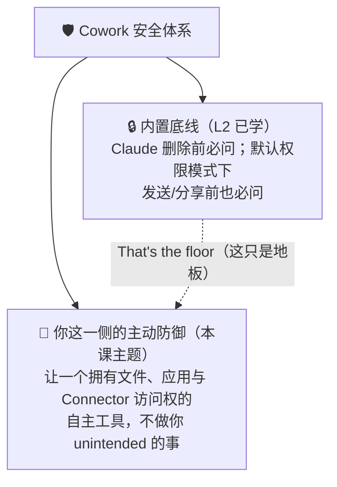
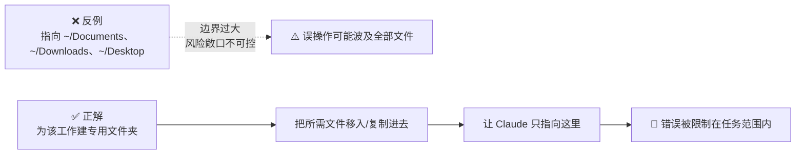
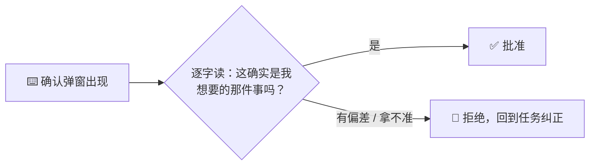

# Claude Cowork 实战: 《Best practices for working safely》安全工作最佳实践指南

> **课程出处**：Anthropic 官方 Claude Academy (`academy.claude.com/courses/introduction-to-claude-cowork/permissions-usage-choosing-your-model`)  
> **课程定位**：在把真实工作交给 Cowork 之后，掌握"你这一侧"要做的安全功课——工作区设置、防误伤的 Prompt 写法、执行中的三个检查点，以及何时不应使用 Cowork  
> **核心主题**：专用 Working Folder、不可再生文件先备份、破坏性动词消歧、边界声明、执行中三查、不当使用场景清单  
> **课程时长**：约 9 分钟（第 11/14 课 · "Sharing and safety in Claude Cowork" 模块第 1 课）

---

## 目录
1. [课程定位：底线之上，你还要做什么](#1-课程定位底线之上你还要做什么)
2. [第一道防线：让错误够不到重要的东西](#2-第一道防线让错误够不到重要的东西)
3. [第二道防线：写不给错误动作留空间的 Prompt](#3-第二道防线写不给错误动作留空间的-prompt)
4. [第三道防线：执行中的三个检查](#4-第三道防线执行中的三个检查)
5. [何时 Cowork 不是正确的工具](#5-何时-cowork-不是正确的工具)
6. [课后反思：官方"找隐患"互动练习](#6-课后反思官方找隐患互动练习)
7. [实战 Cheatsheet](#7-实战-cheatsheet)

---

## 1. 课程定位：底线之上，你还要做什么

课程开宗明义地区分了两层安全机制：



> **That's the floor.** ——内置机制只是及格线；真正的安全来自你在**事前设置、事中监督**上叠加的主动动作（pre-emptive moves）。

---

## 2. 第一道防线：让错误够不到重要的东西

**杠杆率最高的一招，是你指向 Claude 的那个文件夹**——它就是 Claude 可读、可写、（经你确认后）可删的边界。

### 2.1 用专用工作文件夹，不用"大杂烩"

> 把 Claude 指向 Documents、Downloads 或 Desktop，**等同于让一位新同事翻遍你的所有文件**。



### 2.2 开始前，备份"不可再生"的文件

- 判断标准：**这个文件重要，且无法重新生成**——老客户交付物、无法补发的合同、丢了会心疼的任何东西
- 备份位置要求：**放在 Cowork 够不到的地方**——云端备份、另一个文件夹、一块没连接的硬盘
- 底层逻辑：Claude 删除前确实会问，但**点错确认框的代价 = 文件本身的代价**

### 2.3 新工作流先用副本试跑

- 例：要建一个每周五定时运行的任务，**第一次运行对着数据副本跑**
- 确认行为符合预期后，再把任务指向正式目录

---

## 3. 第二道防线：写不给错误动作留空间的 Prompt

> How you ask matters as much as what folder you point at.（怎么问，和指向哪个文件夹同样重要。）

### 3.1 破坏性动词要消歧（Be specific about destructive verbs）

英语（及中文）中的常见动词存在多义性，而**错误的那种解读一旦执行可能不可逆**：

| 模糊表述 | 可能被解读为… | 消歧写法 |
| :--- | :--- | :--- |
| "Cut the section"（剪切这一节） | ① 从视图中移除 ② 从文件中删除 | *"Remove the section from the draft, **but keep the file**."* |
| "Update the file"（更新文件） | ① 重写整份 ② 追加内容 | *"**Add a new appendix; don't rewrite** the existing sections."* |

> 💡 判断标准：**如果错误的解读不可恢复，就必须点名你要的是哪一种。**

### 3.2 在 Prompt 中声明边界（Name the bounds）

边界声明一举两得：既收窄 Cowork 的动作范围，又给你一条**识别漂移（drift）的清晰基线**。

```text
💬 官方示例边界声明：
- "Only the 3 most recently updated files in this folder."
  （只处理该文件夹中最近更新的 3 个文件）
- "Only contracts that closed in Q3."
  （只处理 Q3 成交的合同）
- "Don't message anyone — draft only."
  （不要给任何人发消息——只起草）
```

### 3.3 定时任务初期只让它"起草"

- 定时任务在你**不在场时运行**——这正是风险所在
- 在确认任务按预期运行之前，Prompt 里明确要求：**草拟后交你审阅，而不是代你发送**

---

## 4. 第三道防线：执行中的三个检查

### 4.1 检查一：计划生成后，读一遍（Read the plan）

- Claude 开始任务时会在进度面板（progress tab）列出**它打算做什么**
- 快速浏览三个问题：
  - 计划合理吗？
  - 步骤顺序对吗？
  - 用的数据源对吗？
- 发现问题随时重定向（与 L4 Task Loop 的"Plan 阶段是干预成本最低时机"一脉相承）

### 4.2 检查二：留意异常模式（Watch for unexpected patterns）

- **不需要逐条验证每个命令**，但要警惕两类信号：
  - Claude 在碰**你没提到过的文件或网站**
  - 范围在**悄悄超出你的委托**（scope creep）
- > **"Something feels off" is a real signal — pay attention to this.**（"感觉不太对"是一个真实信号——认真对待它。）

### 4.3 检查三：郑重对待确认弹窗（Approve confirmation prompts deliberately）

- 对一切**发送、发布、分享**类动作，保持 **"Ask before acting"（行动前先问）** 权限模式
- 弹窗出现时，**认真读完再点**



> ⚠️ 课程金句：**大多数事故不是安全机制失效，而是有人随手点掉了一个并非本意的确认框。** 弹窗之所以存在，正因为这个动作重要——像对待重要动作那样对待它。

---

## 5. 何时 Cowork 不是正确的工具

课程给出一张简短的排除清单：

| 不适用场景 | 原因 |
| :--- | :--- |
| **需要审计轨迹的合规工作流** | Cowork 活动不会进入审计日志或数据导出；Compliance API 可返回 Cowork 会话记录，但仅限 **Claude Enterprise 组织**且为 Beta |
| **任何你不敢让聪明但手快的新同事**<br>**在无人监督下做的事** | 例：把法律文件发给交易对手、发布公开公告、推送面向客户的变更。<br>原则：**Claude can prepare; you ship.**（Claude 负责准备，你负责发出） |
| **超出 IT 明确批准边界的高度敏感个人数据** | 数据安全边界以 IT 审批为准 |

> 🔗 **延伸阅读**（官方支持文档）：[Use Claude Cowork safely](https://support.claude.com/en/articles/13364135-use-claude-cowork-safely)——覆盖其余需要多加思考的场景，厘清内置护栏与你各自的责任边界。

---

## 6. 课后反思：官方"找隐患"互动练习

课程设计了一个交互式排险练习：屏幕上是一个即将运行的 Cowork 任务，**其中 5 处会让谨慎的同事停下来**，需要你找出来。

**任务画像**（练习素材）：

```text
任务：清理上季度客户文件——归档旧东西，并在每个客户的
Slack 频道发一条"文件夹已整理"的通知

- 定时：每周五 17:00 自动运行
- 文件夹：~/Documents/Work
- 模型：Sonnet 4.6
- Connectors：Microsoft 365、Asana
- 浏览器：Claude in Chrome 可操作已授权标签页
```

**官方提示的排查维度**（原文：Look at the connectors, the folder, the prompt wording, and what runs when）：

| 排查维度 | 本例中的疑点 |
| :--- | :--- |
| **Connectors** | 挂载了 M365、Asana、Chrome 多个连接器——真的都需要吗？ |
| **文件夹** | `~/Documents/Work` 是大杂烩路径而非任务专用目录 |
| **Prompt 措辞** | "archive the old stuff" 是含糊的破坏性动词；"post a note in each client's Slack channel" 是无人监督下的外部发送动作 |
| **运行时机** | 每周五 17:00 定时自动跑——你不在场，初版就该"只起草、不发送" |

### 迁移到你自己的任务上（官方反思问题）

- 你会让 Claude 指向哪个文件夹？里面有没有不该被够到的东西、需要先备份的不可再生文件？
- 你会写的 Prompt 里，有没有需要消歧的破坏性动词？

---

## 7. 实战 Cheatsheet

```markdown
### 🛡️ Cowork 安全工作速查

#### 1. 事前设置（Set up）
- 专用 Working Folder，绝不指向 Documents / Downloads / Desktop
- 不可再生文件 → 备份到 Cowork 够不到的地方（云端/外接盘）
- 新工作流（尤其定时任务）→ 首跑对副本，验证后再指向正式目录

#### 2. Prompt 三招（Write）
- 破坏性动词消歧：错误解读不可逆时，点名你要的含义
  × "Cut / Update the file"
  ✓ "Remove from the draft, but keep the file"
  ✓ "Add a new appendix; don't rewrite existing sections"
- 声明边界："Only the 3 most recently updated files"
  "Only contracts that closed in Q3" "Don't message anyone — draft only"
- 定时任务初期只起草："草拟后交我审阅，不要代我发送"

#### 3. 执行中三查（In the moment）
- ① 读 Plan：计划合理吗？顺序对吗？数据源对吗？
- ② 盯异常：碰到没提过的文件/网站？范围悄悄变大？→ 停任务
  （"Something feels off" 是真实信号）
- ③ 慎批弹窗：逐字读完再点；发送/发布/分享保持 Ask before acting

#### 4. 排除清单（When NOT to use）
- 需要审计轨迹的合规流程（审计日志不含 Cowork 活动）
- 不敢让聪明同事无人监督做的事 → "Claude can prepare; you ship."
- 超出 IT 批准边界的敏感个人数据

#### 5. 延伸阅读
Use Claude Cowork safely（官方支持文档）：
https://support.claude.com/en/articles/13364135-use-claude-cowork-safely
```

### 课程衔接

> 🔗 **下一课预告**：L12《Validating skills for plugins》——如何用轻量级 Evals（评估）验证你构建的 Skill / Plugin 的输出是否可靠，**在依赖它或分享给他人之前**先测过。
