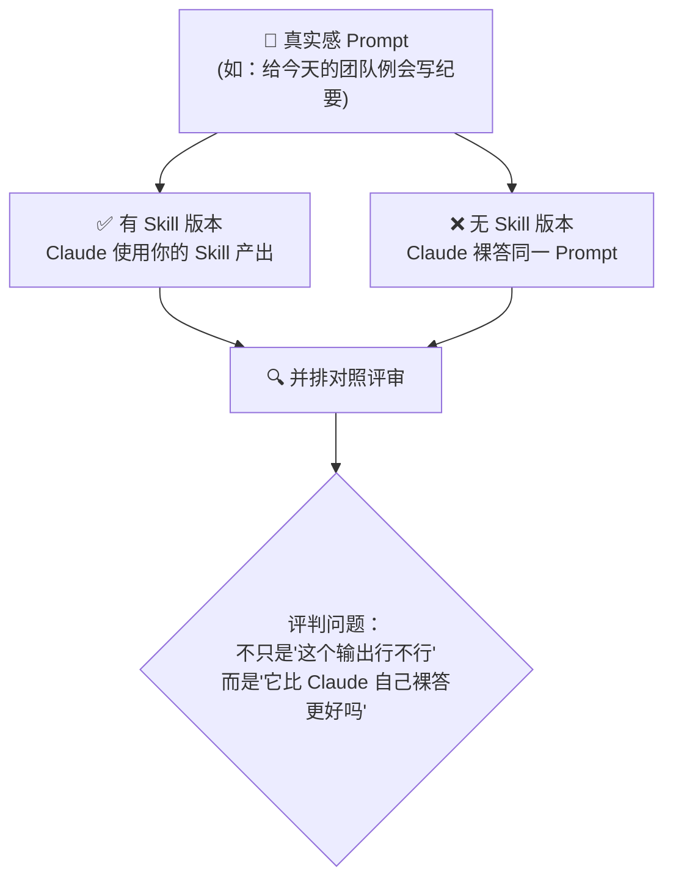
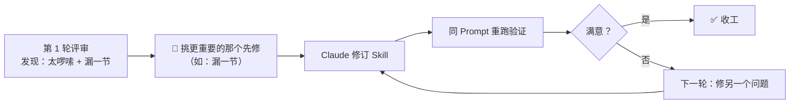
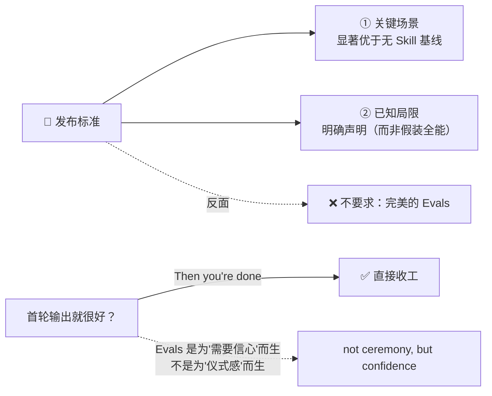

# Claude Cowork 实战: 《Validating skills for plugins》用 Evals 验证 Skill 与 Plugin 指南

> **课程出处**：Anthropic 官方 Claude Academy (`academy.claude.com/courses/introduction-to-claude-cowork/validating-skills-for-plugins`)
> **课程定位**：在依赖或分享你构建的 Skill / Plugin 之前，用轻量级 Evals（评估）验证其输出质量——像测试小产品一样测试你要交付给他人使用的自动化
> **核心主题**：Eval 的定义与必要性、skill-creator 内置评估机制（有/无 Skill 对照实验）、反馈驱动迭代、发布标准
> **课程时长**：约 8 分钟（第 12/14 课 · "Sharing and safety in Claude Cowork" 模块第 2 课）

---

## 目录
1. [为什么必须验证：Skill 就是一个小产品](#1-为什么必须验证skill-就是一个小产品)
2. [Eval 是什么：别被这个词吓到](#2-eval-是什么别被这个词吓到)
3. [评估系统如何运作：skill-creator 内置机制](#3-评估系统如何运作skill-creator-内置机制)
4. [迭代循环：反馈即修复](#4-迭代循环反馈即修复)
5. [发布标准：多好才算够好](#5-发布标准多好才算够好)
6. [官方示例：会议纪要 Skill 的对照实验](#6-官方示例会议纪要-skill-的对照实验)
7. [实战 Cheatsheet](#7-实战-cheatsheet)

---

## 1. 为什么必须验证：Skill 就是一个小产品

课程的核心类比：

> When you build a skill or bundle them into a plugin, you're essentially **building a small product** that other people will use. And like anything you'd hand to a colleague — a template, a spreadsheet model, a checklist — **it's worth a test drive before it leaves your desk**.

### 为什么你自己用没事，别人用会出事

```mermaid
flowchart LR
    subgraph 你自己用 ["👤 你自己用：问题被"免疫力"掩盖"]
        A["你知道怎么绕过问题"] --> B["你知道确切该问什么、<br>给什么文件"]
        B --> C["你知道产出"应该长什么样"]
    end

    subgraph 同事用 ["👥 同事用：暴露真实弱点"]
        D["措辞稍有不同的请求"] --> E["略有差异的输入"]
        E --> F["💥 边界情况（Edge Case）<br>不常见但真实的场景：<br>请求刚好超出 Skill 设计范围"]
    end

    你自己用 -. "Skill 最容易在这里绊倒<br>而且使用者不知道原因" .-> 同事用
```

> 💡 **Edge case（边界情况）**是课程特别强调的概念：*an unusual-but-real situation, like a request that's just outside what the skill was designed for*——不常见但真实存在、刚好落在 Skill 设计范围之外的请求。这正是 Skill 最容易失败、且使用者最摸不着头脑的地方。

**Evals 的意义**：在别人踩坑之前，先自己踩一遍（catch those stumbles before someone else does）。

---

## 2. Eval 是什么：别被这个词吓到

课程刻意给 Eval 祛魅：

> **An eval is just a try-out**: a realistic request goes in, you look at what comes out, and you tell Claude what to fix. **No code, no test scripts** — just your judgment about whether the result is **good enough to put your name on**.

| 误区 | 实际 |
| :--- | :--- |
| ❌ 要写测试代码 | ✅ 零代码、零测试脚本 |
| ❌ 复杂的工程流程 | ✅ 就是一次"试车"（try-out）：真实请求进 → 看产出 → 告诉 Claude 修什么 |
| ❌ 走形式的仪式 | ✅ 判断标准只有一条：**这个结果好到敢署上你的名字吗**（good enough to put your name on） |

---

## 3. 评估系统如何运作：skill-creator 内置机制

**skill-creator** 是 Claude 内置的 Skill 构建助手，**Evals 是构建流程的内置环节**（walks you through evals as part of the process），无需单独搭建。

### 核心机制：有/无 Skill 对照实验

skill-creator 会为你的 Skill 生成 **2 个以上真实感 Prompt**，并为每个 Prompt 产出**一对输出**：



> 💡 **关键洞察**：第二个无 Skill 输出是**对照基线（comparison point）**。评估的真正问题不是 "is this output okay"，而是 **"is this output better than what Claude would have done on its own"**——你的 Skill 到底带来了什么增量价值？

### 评审时的两个问题

在评审页上用大白话给出反馈，每对输出只需回答：

1. **带 Skill 的版本是我会用的那个吗？**
   - 是 → 记下它好在哪，让 Skill 保持这个优势
2. **如果不是，缺了什么/哪里不对？**
   - 要具体：✅ "语气太正式了"、"漏了执行摘要"——Claude 有据可依
   - 不要说：❌ "感觉不太对"——Claude 无从下手

---

## 4. 迭代循环：反馈即修复

提交反馈后，Claude 依据你的意见**直接修订 Skill**——重写指令、调整示例、收紧要求，然后**用同样的 Prompt 重跑**，验证修改是否生效。

### 迭代法则：一次只改一件事



- **为什么一次只改一件**：如果同时修"啰嗦"和"漏节"，重跑后你**说不清是哪个改动起的作用**；逐项修，才能看清什么真正推动了改善（tell what actually moved the needle）
- **这是循环，不是一次性闸门**（It's a loop, not a one-time gate）
- 典型节奏：**大多数 Skill 一到两轮就能达标**

---

## 5. 发布标准：多好才算够好

课程明确反对"完美主义闸门"：

> The bar for shipping a skill — to yourself, to a teammate — **isn't perfect evals**. It's that:
> 1. **The cases you care about pass meaningfully better than the baseline**（你在意的场景，显著优于基线）
> 2. **You've named the cases you don't yet handle**（明确说清你还不支持哪些场景）



> 💡 **And if the outputs already look great on the first pass? You're done.** Evals 不是必须跳过的圈（a hoop to jump through）——需要信心时才用，不为流程而流程。

---

## 6. 官方示例：会议纪要 Skill 的对照实验

课程的交互练习展示了三组对照评审，第一组是"典型场景"（Typical case）——为产品例会写纪要（笔记在 `notes/2026-05-01-product-sync.md`），对照结果如下：

### 有 Skill 版本（4/4 通过）vs 无 Skill 版本（1/4 通过）

| 评估规则（House Rules） | ✅ 有 Skill | ❌ 无 Skill |
| :--- | :--- | :--- |
| 开头先给决策（Leads with decisions） | ✓ 决策置顶：新用户流程周一周投 10% 等 | × 决策埋在叙事段落里 |
| 每个行动项有负责人和日期 | ✓ Maya→周五 / Devon→周三 / Priya→下周一 | × 只说"Maya 说她会…"，无明确期限 |
| 开放问题单独标出 | ✓ *"新文案上 10% 前需要法务确认吗？"* | × 淹没在"还有一些讨论"里 |
| 150 字以内 | ✓ | ✓ |

### 产出形态对比

| 维度 | 有 Skill | 无 Skill |
| :--- | :--- | :--- |
| **结构** | 决策 / 行动项 / 开放问题 三段式 | 大段会议叙事（"团队今天进行了富有成效的讨论…"） |
| **可执行性** | 谁做什么、何时做完，一目了然 | 需读者自己从流水账里捞信息 |
| **结尾** | 干净收束 | 出现空话式总结（"富有成效、有清晰下一步"） |

> 💡 **练习要点**（官方原文）：每对输出，选出**你真的会发出去的那个版本**，并写下**一行**你会告诉 Claude 修改的反馈——这就是整个循环（That's the whole loop）。

---

## 7. 实战 Cheatsheet

```markdown
### 🧪 Evals 验证 Skill 实战速查

#### 1. 心法
- Skill = 小产品：交付他人前先试车（test drive before it leaves your desk）
- Eval = 试车，不是考试：零代码，真实请求进 → 看产出 → 告诉 Claude 修什么
- 唯一标准：结果好到敢署你的名字吗？

#### 2. 机制（skill-creator 内置）
- 自动生成 ≥2 个真实感 Prompt
- 每个 Prompt 产出一对输出：有 Skill vs 无 Skill（对照基线）
- 评判问题：不是"行不行"，而是"比裸答更好吗"（增量价值）

#### 3. 反馈写法
✅ 具体："语气太正式了" / "漏了执行摘要" / "行动项没写截止日期"
❌ 空泛："感觉不太对"（Claude 无从下手）

#### 4. 迭代纪律
- 一次只改一件事 → 同 Prompt 重跑 → 看清什么真正起了作用
- 循环而非闸门；大多数 Skill 1-2 轮达标
- 首轮就很好 → 直接收工，不为仪式而评估

#### 5. 发布标准（两条，而非完美）
① 你在意的场景显著优于基线
② 明确声明尚未支持的边界情况（named the cases you don't handle）

#### 6. 特别关注：Edge Case
- 请求刚好超出 Skill 设计范围（不常见但真实）
- 同事的措辞/输入与你的习惯略有不同
- 这是 Skill 最容易绊倒、使用者最不明白原因的地方
```

### 课程衔接

> 🔗 **下一课预告**：L13《Share what you build with your team》——从"这对我有用"走向"这对团队有用"：把个人工作流变成共享基础设施的模式与选择。
