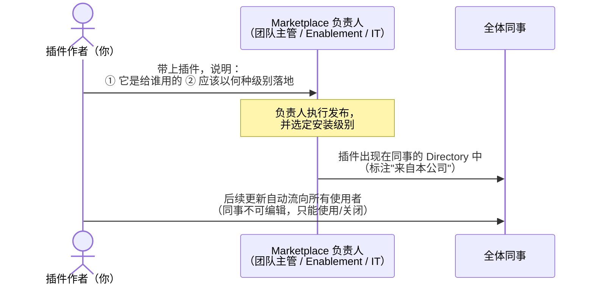
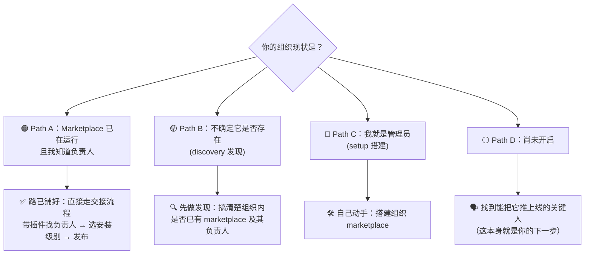
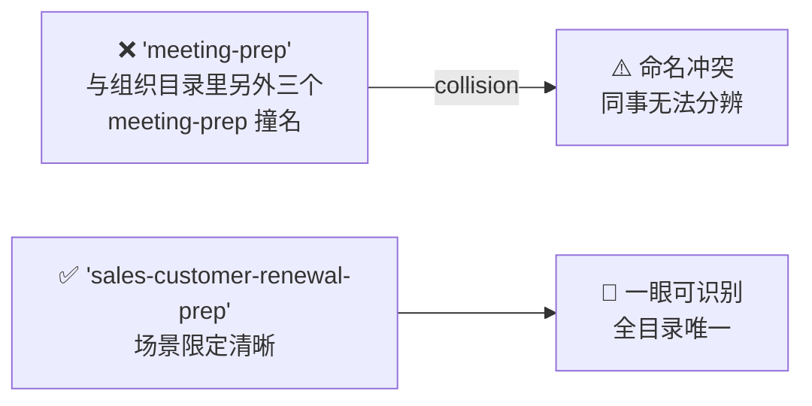

# Claude Cowork 实战: 《Share what you build with your team》团队分发与共享插件治理指南

> **课程出处**：Anthropic 官方 Claude Academy (`academy.claude.com/courses/introduction-to-claude-cowork/share-what-you-build-with-your-team`)  
> **课程定位**：掌握 Skill/Plugin 从"个人好用"规模化到"全团队可用"的最后一公里——通过组织私有 Marketplace 分发插件，以及让共享插件长期保持健康的治理习惯  
> **核心主题**：私有 Marketplace 分发机制、四种安装级别（Available/Default/Required/Hidden）、三条分发路径、共享插件健康维护四习惯  
> **课程时长**：约 8 分钟（第 13/14 课 · "Sharing and safety in Claude Cowork" 模块第 3 课）

---

## 目录
1. [课程定位：从个人工作流到团队基础设施](#1-课程定位从个人工作流到团队基础设施)
2. [分发机制：组织私有 Marketplace](#2-分发机制组织私有-marketplace)
3. [四条分发路径：按你组织的现状对号入座](#3-四条分发路径按你组织的现状对号入座)
4. [健康习惯：防止共享插件悄悄过期](#4-健康习惯防止共享插件悄悄过期)
5. [课后反思与实战 Cheatsheet](#5-课后反思与实战-cheatsheet)

---

## 1. 课程定位：从个人工作流到团队基础设施

本课承接 L8（打包）与 L12（验证），解决规模化三部曲的最后一环：


> 课程开篇的入场券判断：**By this point, your team has a handful of skills that have earned their place**——技能已经"挣得了一席之地"（经 Evals 验证、在多人用例上站得住），才进入分发阶段。

---

## 2. 分发机制：组织私有 Marketplace

### 2.1 什么是私有 Marketplace

在大公司内，官方推荐的插件分发渠道是**组织私有 Marketplace**——一个由管理员管理的"公司批准插件目录"。

### 2.2 分发的本质：一次交接（hand-off）



### 2.3 四种安装级别

发布时负责人为插件选择"以什么方式落地"：

| 级别 | 落地方式 | 同事能否关闭 | 适用场景 |
| :--- | :--- | :--- | :--- |
| **Available**（可安装） | 出现在公司 Directory，**想要的人自行安装** | —（不装就没有） | ✅ **大多数团队插件的正确选择** |
| **Installed by default**（默认安装） | 打开 Cowork 时**已装好**，可自行关闭 | ✅ 可以 | 希望全员开箱即用的一般工具 |
| **Required**（强制安装） | **安装且常开，无法关闭** | ❌ 不可以 | 合规检查等**必须人人按同一方式运行**的工作 |
| **Hidden**（隐藏上架） | 在 Marketplace 中但**不显示在 Directory** | — | 预发布测试（staging）或受限范围的分阶段推广 |

> 💡 **Hidden 是课程互动环节补充的第四级**：上架但不可见——用于暂存或灰度，是规模化推广前的缓冲带。

### 2.4 同事视角

- 插件出现在他们的 Directory 中，**标注来自你们公司**，与 Anthropic 公共插件并列
- 可正常使用、可关闭（Required 除外），**不可编辑**
- **更新由维护者单向推送**——作者改，大家自动拿到新版

---

## 3. 四条分发路径：按你组织的现状对号入座

课程强调：**What you see depends on how your org has set things up**——你分享插件时看到什么，取决于组织的配置现状。四种情况对应四条路径：



| 路径 | 触发条件 | 下一步行动 |
| :--- | :--- | :--- |
| **A. hand-off（交接）** | Marketplace 已运行、认识负责人 | 直接交接：带上插件，说明受众与期望落地级别 |
| **B. discovery（发现）** | 不确定 Marketplace 是否存在 | 先摸清组织内现状与负责人是谁 |
| **C. setup（搭建）** | 你本人就是管理员 | 搭建组织 Marketplace，成为别人交接的对象 |
| **D. 推动上线** | 组织尚未启用 | 找到能拍板的人推动开启 |

> 💡 **共同目标**（课程原文）：*a skill that started on one laptop becomes something a teammate can install and run*——让始于一台笔记本的技能，变成同事可安装可运行的东西。

---

## 4. 健康习惯：防止共享插件悄悄过期

课程给出一组简短但关键的治理实践（Habits worth keeping），防止共享插件 **quietly going stale（悄悄过期）**：

### 习惯一：单一负责人（One owner）

> Every shared plugin has a **named person** who reviews changes, runs the evals after edits, and decides when to update or retire it.

- 必须是**具名的人**，不是"团队共管"
- 职责三件套：审变更、改后跑 Evals、决定何时更新或退役

### 习惯二：每次发布前必跑 Evals（Evals before every publish）

- 把 **Eval 循环当作发布闸门**（Treat the eval loop as the gate）
- 原则：改动之后，你在意的场景若不再达标，**就不要推给所有人**（与 L12 的发布标准呼应）

### 习惯三：命名要具体（Name skills and plugins specifically）



> 💡 大组织插件目录里同名插件会互相冲突——**命名带上业务场景限定词**是低成本高回报的卫生习惯。

### 习惯四：设定回顾节奏（Set a review rhythm）

- **每季度（Quarterly）**是合理起点
- 回顾三件事：**装了什么、什么真的在被用、什么已过期**
- 该退役的退役（Retire what nobody runs）；有人提出改进机会的适时修订

---

## 5. 课后反思与实战 Cheatsheet

### 官方反思问题

1. 你和身边同事今天在 Cowork 里最依赖的 Skills 是哪些？哪两三个最适合**第一个**打包成团队 Plugin？
2. 你组织里，**谁能把插件送上 Marketplace**？（团队主管 / Enablement / IT？）
3. > **If you don't know the answer to the second question yet, that's your real next step.**（如果第二问你还答不上来——找到这个人，就是你真正的下一步。）

### 实战 Cheatsheet

```markdown
### 📤 团队分发与插件治理速查

#### 1. 规模化三步曲
个人 Skills → 打包成 Plugin（L8）→ Evals 验证（L12）
→ Marketplace 分发（本课）→ 治理维护（本课）

#### 2. 分发 = 交接（hand-off）
找 Marketplace 负责人（团队主管/Enablement/IT），
说明：① 给谁用 ② 期望的安装级别

#### 3. 安装级别选型
- Available：大多数团队插件 ✅（想装的人自装）
- Installed by default：开箱即用，可关
- Required：合规类强制，装且常开（慎用）
- Hidden：上架不可见，预发布/灰度
- 更新由维护者单向推送，同事只读不可编辑

#### 4. 健康四习惯
① One owner：具名负责人（审变更/跑 Evals/定去留）
② 每次发布前必过 Eval 闸门，不达标不推送
③ 命名带场景限定：sales-customer-renewal-prep > meeting-prep
④ 季度回顾：装了什么/真在用什么/什么过期了，该退役就退役

#### 5. 找不到 Marketplace？
先答两个问题：哪几个 Skill 值得打包？谁能把它推上 Marketplace？
答不出第二问 → 找到那个人就是你的下一步
```

### 课程衔接

> 🔗 **下一课预告**：L14《Wrap up and next steps》——最后一课：回顾整个课程的成长弧线，以及保持势头的下一步行动。
