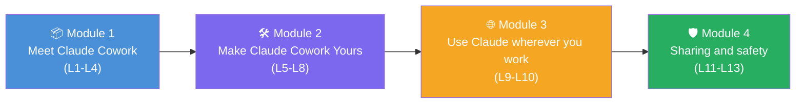
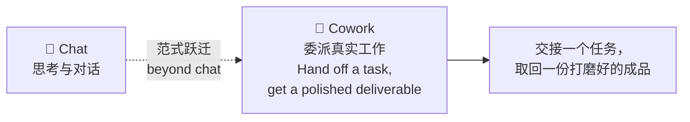
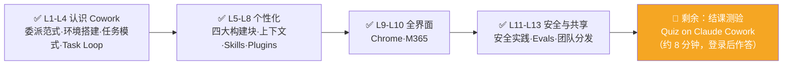

# Claude Cowork 实战: 《Wrap up and next steps》课程总结与进阶路线图

> **课程出处**：Anthropic 官方 Claude Academy (`academy.claude.com/courses/introduction-to-claude-cowork/troubleshooting-next-steps`)  
> **课程定位**：Cowork 101 收官课——回顾四大模块的能力弧线，选定本周就做的一个行动，并规划课程之后的学习进阶路径  
> **核心主题**：四模块全景回顾、五个"本周行动"选项、进阶学习路径推荐  
> **课程时长**：约 2 分钟（第 14/14 课 · "Sharing and safety in Claude Cowork" 模块第 4 课）

---

## 目录
1. [课程全景回顾：四大模块的能力弧线](#1-课程全景回顾四大模块的能力弧线)
2. [贯穿全课的主线](#2-贯穿全课的主线)
3. [本周行动：五选一](#3-本周行动五选一)
4. [进阶学习路径](#4-进阶学习路径)
5. [Cowork 学习完成度总结](#5-cowork-学习完成度总结)

---

## 1. 课程全景回顾：四大模块的能力弧线

| 模块 | 主题 | 你获得了什么 |
| :--- | :--- | :--- |
| **Module 1** Meet Claude Cowork | Cowork 是什么、与 Chat/Code 的区别、它为哪类工作而生、你的第一个真实任务 | 认识委派范式：描述目标 → Claude 规划执行 → 你全程掌舵 |
| **Module 2** Make Claude Cowork Yours | Global Instructions、Projects、Skills、Plugins | 当 Cowork **知道你所知道的、能访问你所能访问的、按你团队的方式做事**时，能力会发生质的跃升 |
| **Module 3** Use Claude wherever you work | Claude in Chrome、Claude for M365（Word/Excel/PPT/Outlook） | Cowork 延伸到桌面之外：浏览器里的无 Connector 系统 + Office 文档内部 |
| **Module 4** Sharing and safety | 负责任地使用自主权（安全实践）、验证你构建的东西（Evals）、把个人工作流变成团队基础设施（分发治理） | 把 Cowork 交给真实工作后，让它**安全、可靠、可规模化** |

---

## 2. 贯穿全课的主线

> **The throughline: Cowork goes beyond chat to allow you to delegate real work. Everything else in the course builds on that.**  
> （主线：Cowork 超越了对话，让你得以委派真实的工作。课程中的其他一切，都建立在这句话之上。）

- **Hand off a task, get a polished deliverable**——交接任务、收回成品，这八个字就是整门课的全部
- 四大模块都是这句话的展开：怎么发起（M1）、怎么个性化（M2）、在哪里发生（M3）、怎么安全规模化（M4）

---

## 3. 本周行动：五选一

课程强调：**Pick ONE of these to do this week**（本周只选一个做）——贵在启动，不在贪多。

| # | 行动 | 具体做法 |
| :--- | :--- | :--- |
| ① | **设置记忆** | 写一段**五句话**的 Global Instructions；或为手头一条工作流建一个 Project |
| ② | **安排定时任务 / 云端运行** | 把一个周期性交付物挂上节奏；或在云端跑 Cowork（Beta，部分套餐）——下次下班路上灵感来了，直接用手机委派 |
| ③ | **安装一个插件** | Customize → Plugins，装最贴近你岗位的插件，用本周真实工作跑一遍 |
| ④ | **试用 Claude in Chrome 或 M365** | 挑与你真实工作最贴合的那个界面，装上，在一个任务上用起来 |
| ⑤ | **分享你构建的东西** | 把你觉得好用的用例、跑出好结果的工作流、或你建的 Skill 分享给团队——**你可能正是帮他们解锁 Claude 的那个人** |

> 💡 五个行动恰好分别对应 M2 / M1(L3) / M2(L8) / M3 / M4 的课程内容——是一次"学以致用"的自检菜单。

---

## 4. 进阶学习路径

课程推荐的后续学习：

| 路径 | 内容定位 | 链接 |
| :--- | :--- | :--- |
| **AI Fluency: Framework & Foundations** | 与 AI 高效协作的基础：提示词、评估输出、判断 AI 何时是/不是正确的工具 | [academy.claude.com/courses/ai-fluency-framework-foundations](https://academy.claude.com/courses/ai-fluency-framework-foundations) |
| **AI Capabilities and Limitations** | 生成式 AI 在各模态、各界面上能做什么的深度考察 | [academy.claude.com/courses/ai-capabilities-and-limitations](https://academy.claude.com/courses/ai-capabilities-and-limitations) |
| **Claude 101** | 跨所有界面使用 Claude 的伴生课程（已完成 ✅） | [academy.claude.com/courses/claude-101](https://academy.claude.com/courses/claude-101) |
| **Claude use-case library** | 用例库，筛选 Claude Cowork 分类获取"下一个该委派什么"的灵感 | [academy.claude.com/all?kind=use-case](https://academy.claude.com/all?kind=use-case) |

---

## 5. Cowork 学习完成度总结

截至本课，《Introduction to Claude Cowork》（新版 14 课）全部课程学习完毕：

> 📌 **下一步**：完成 [Quiz on Claude Cowork](https://academy.claude.com/courses/introduction-to-claude-cowork/quiz-on-claude-cowork) 结课测验（约 8 分钟，需登录 Claude 账号，计入成绩与 Completion badge 徽章资格）。
