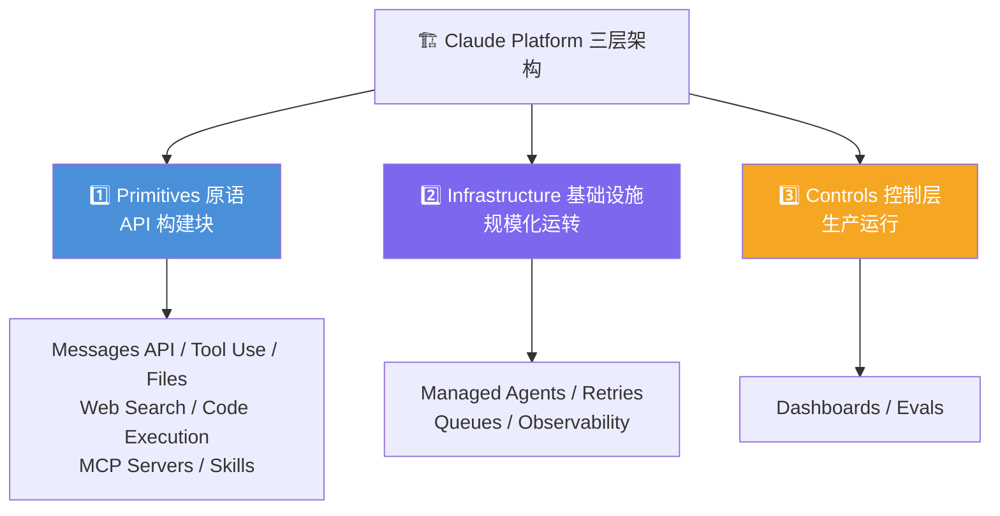
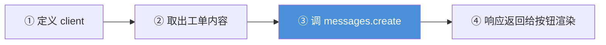
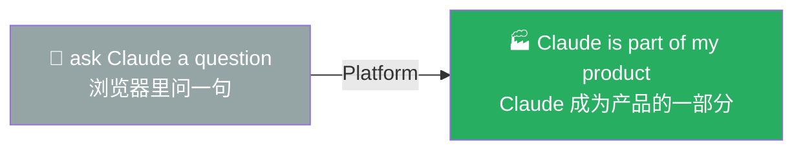

# Claude Platform 101: 《What is the Claude Platform?》从对话到产品化

> **课程出处**：Anthropic 官方 Claude Academy (`academy.claude.com/courses/claude-platform-101/what-is-the-claude-platform`)  
> **课程定位**：Claude Platform 101 开篇——Platform 是 Anthropic 提供的**以编程方式构建 Claude 应用**的基础设施：不再是浏览器里聊天，而是从代码发出结构化请求、拿回结构化响应，并掌控每一个细节（用哪个模型、花多少 token、能用什么工具、遵循什么系统指令）  
> **核心主题**：Platform 四大组成、三层架构（Primitives / Infrastructure / Controls）、messages.create 首个代码示例  
> **课程时长**：约 6 分钟（第 1/13 课）

---

## 目录
1. [Platform 是什么](#1-platform-是什么)
2. [三层架构](#2-三层架构)
3. [实战示例：客服工单草稿](#3-实战示例客服工单草稿)
4. [核心转变：从"问 Claude"到"Claude 成为产品的一部分"](#4-核心转变从问-claude到claude-成为产品的一部分)
5. [实战 Cheatsheet](#5-实战-cheatsheet)

---

## 1. Platform 是什么

> The **Claude Platform** is Anthropic's infrastructure for building with Claude **programmatically**.

**Platform 四大组成**：

| 组成 | 作用 |
| :--- | :--- |
| **REST API** | 任何语言都能调用 |
| **SDKs** | 各编程语言官方封装（TypeScript / Python 等） |
| **CLIs** | 命令行接口 |
| **Console** | 管理 API Key、监控用量、部署 Managed Agents、测试 Prompt |

与前三个板块的本质区别：Claude.ai / Cowork / Claude Code 都是**用现成的产品**，Platform 是**把 Claude 变成你自己产品的一部分**。

---

## 2. 三层架构



**官方口诀**：

> **Build with primitives, scale on infrastructure, run with control.**  
> （用原语构建，靠基础设施扩展，用控制层运行。）

- **Primitives**：代码里真正调用的东西（Messages API、工具、Skills、MCP……）
- **Infrastructure**：当一次 Claude 调用变成一千次时，让系统不崩的管道（重试、队列、可观测性）
- **Controls**：上线后团队用的仪表盘和 Evals

Claude Console 本身就按这个结构组织（构建 / Agent 管理 / 分析三大区）。

---

## 3. 实战示例：客服工单草稿

场景：客服应用加一个按钮——按团队语气和规范，基于工单内容**起草回复**。



官方示例（**Python SDK**）：

```python
client = anthropic.Anthropic()
response = client.messages.create(
    model="claude-haiku-4-5",  # 简单起草任务 → Haiku 足够
    max_tokens=1024,
    system=TONE_AND_GUIDELINES,
    messages=[
        {"role": "user", "content": ticket_content}
    ],
)
draft = response.content
```

**四个参数各司其职**：

| 参数 | 作用 | 示例中的选择 |
| :--- | :--- | :--- |
| `model` | 用哪个模型处理请求 | 简单起草任务 → **Haiku** |
| `max_tokens` | 响应长度上限 | 1024 |
| `system` | 系统提示词，定义角色 | 团队语气 + 规范 |
| `messages` | 消息数组（user/assistant 角色） | 工单内容作为 user 输入 |

---

## 4. 核心转变：从"问 Claude"到"Claude 成为产品的一部分"

> You're not building a chatbot from scratch. You're **adding Claude into a product that already exists**, and the API is how you wire it in.

- 不是从零造聊天机器人，而是**把 Claude 接进已有产品**
- 需要完整 Agent 时，Platform 不只给模型——**Managed Agents 直接替你运行**



---

## 5. 实战 Cheatsheet

```markdown
### 🏗️ Platform 概念速查

#### 1. 定义
Platform = 以编程方式构建 Claude 应用的基础设施
（结构化请求进 → 结构化响应出，掌控模型/预算/工具/指令每个细节）

#### 2. 四大组成
REST API / SDKs / CLIs / Console（Key·用量·Managed Agents·Prompt 测试）

#### 3. 三层架构口诀
Build with primitives, scale on infrastructure, run with control
- Primitives：Messages API、Tool Use、Files、Web Search、Code Execution、MCP、Skills
- Infrastructure：Managed Agents、Retries、Queues、Observability
- Controls：Dashboards、Evals

#### 4. messages.create 四参数
model（选模型）/ max_tokens（响应上限）/ system（角色定义）/ messages（对话数组）

#### 5. 核心思想
把 Claude 接进已有产品（不是从零造聊天机器人）
```

### 课程衔接

> 🔗 **下一课**：L2《Your first API call》——20 行代码发出第一个真实请求。
