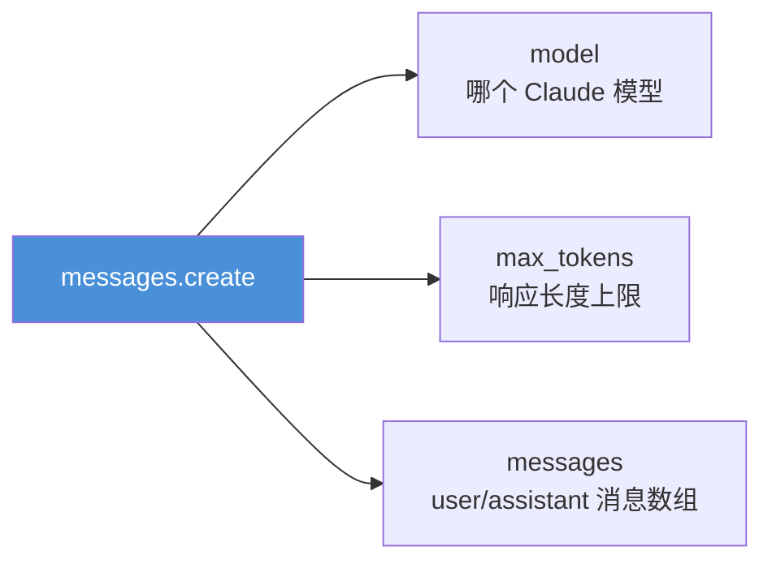
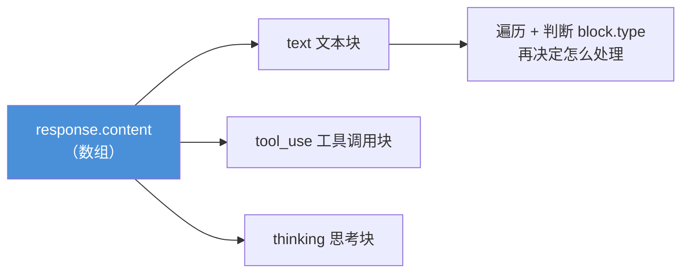
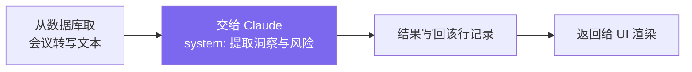

# Claude Platform 101: 《Your first API call》第一个 API 调用

> **课程出处**：Anthropic 官方 Claude Academy (`academy.claude.com/courses/claude-platform-101/your-first-api-call`)  
> **课程定位**：不到 20 行代码，给 Claude 发点真东西、拿回结构化洞察——从环境搭建到读懂响应结构，走通第一个完整调用  
> **核心主题**：API Key 安全管理、messages.create 请求解剖、system 塑造人格、响应 content 是 block 数组  
> **课程时长**：约 5 分钟（第 2/13 课）

---

## 目录
1. [环境搭建](#1-环境搭建)
2. [请求解剖](#2-请求解剖)
3. [实战示例：审查有 bug 的代码](#3-实战示例审查有-bug-的代码)
4. [从脚本到产品](#4-从脚本到产品)
5. [实战 Cheatsheet](#5-实战-cheatsheet)

---

## 1. 环境搭建

三步走：

1. 到 **platform.claude.com** 获取 **API Key**（需先购买少量额度）
2. Key 存进 **`.env.local`** 文件——**绝不硬编码进源码**
3. 安装 SDK：`npm install @anthropic-ai/sdk`（Python 则 `pip install anthropic`）

> ⚠️ **安全红线**：把 Key 硬编码在源文件里，正是它们最终泄漏到 GitHub 上的方式——放进环境变量文件，且确保 `.env.local` 在 `.gitignore` 里。

---

## 2. 请求解剖

每次 API 调用都走 **`messages.create`**，指定三样东西：



最小形态（TypeScript）：

```typescript
import Anthropic from "@anthropic-ai/sdk";
const client = new Anthropic();
const msg = await client.messages.create({
  model: "claude-sonnet-5",
  max_tokens: 2048,
  messages: [{
    role: "user",
    content: "Hello, Claude",
  }],
});
```

消息结构与在 Claude.ai 里对话的组织方式一致：`user` 角色标记用户输入，`assistant` 角色标记 Claude 的历史回复。

---

## 3. 实战示例：审查有 bug 的代码

一个文件、约 20 行——让 Claude 审查一段有 bug 的代码：

```typescript
import Anthropic from "@anthropic-ai/sdk";
const client = new Anthropic();

const buggyCode = `
function add(a, b) {
  return a - b;
}
`;

const response = await client.messages.create({
  model: "claude-sonnet-5",
  max_tokens: 2048,
  system: "You are a terse senior code reviewer. Give feedback in one paragraph.",
  messages: [
    { role: "user", content: `Review this code:\n${buggyCode}` },
  ],
});

for (const block of response.content) {
  if (block.type === "text") {
    console.log(block.text);
  }
}
```

### 两个关键点

1. **`system` 塑造人格**：要"言简意赅的资深审查者"而不是话痨——直接写明即可
2. **`response.content` 是 block 数组，不是字符串**：



基础文本回复通常只有一个 `text` 块，但 Claude 可能返回**多种块**——所以**永远循环 + 判断类型**。

运行结果：Claude 一眼指出 `add` 实际在做减法，一段话讲完。这就是整个 API 调用。

---

## 4. 从脚本到产品

同一个 `messages.create` 形态，就是产品里"摘要接口"的引擎：



> 💡 同一个调用，只是**包在一个路由处理器里**——从脚本到产品，变的只是外壳。

---

## 5. 实战 Cheatsheet

```markdown
### 📞 第一次 API 调用速查

#### 1. 准备
- Key：platform.claude.com（先充值）
- 存 .env.local，绝不硬编码（泄漏到 GitHub 的头号原因）
- 安装：npm install @anthropic-ai/sdk / pip install anthropic

#### 2. 请求三要素
messages.create({ model, max_tokens, messages })

#### 3. system 塑造人格
"You are a terse senior code reviewer..." → 输出风格随指令改变

#### 4. 响应结构（易错点）
response.content 是【block 数组】不是字符串
可能包含 text / tool_use / thinking 多种块
→ 永远 for 循环 + 判断 block.type

#### 5. 心法
脚本到产品的距离 = 一个路由处理器
```

### 课程衔接

> 🔗 **下一课**：L3《Choosing the right model》——四个模型层级如何权衡质量与成本。
