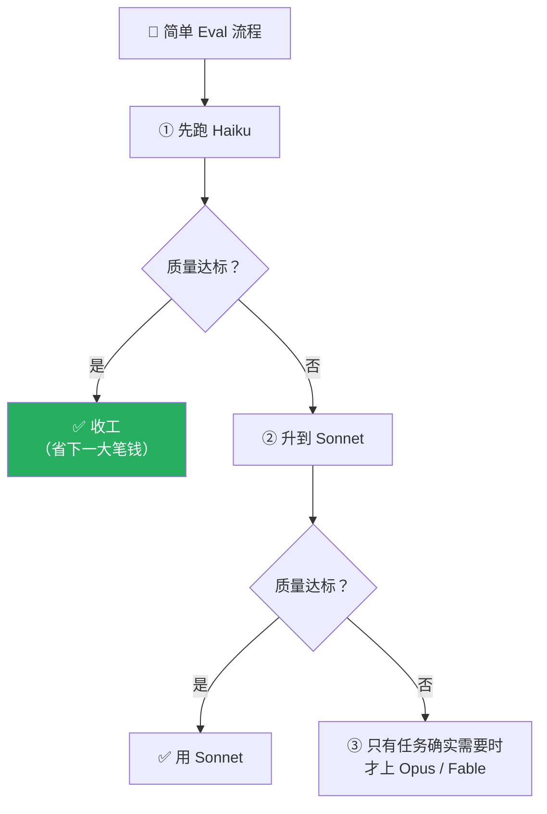
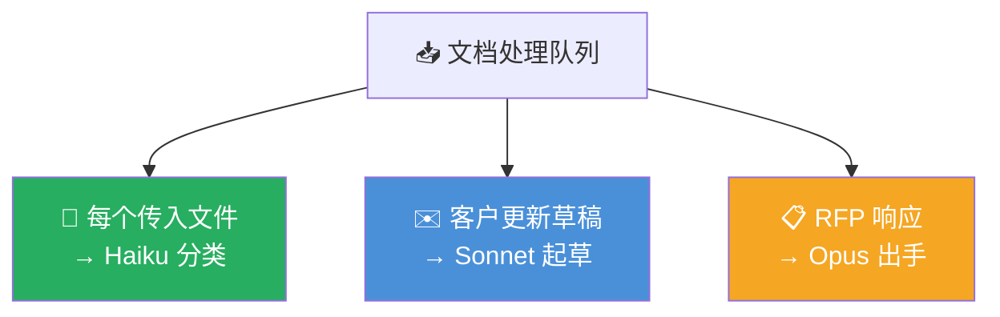

# Claude Platform 101: 《Choosing the right model》用评测说话的模型选型

> **课程出处**：Anthropic 官方 Claude Academy (`academy.claude.com/courses/claude-platform-101/choosing-the-right-model`)  
> **课程定位**：默认选最聪明的模型，账单会吓到你；选最便宜的，产出又撑不住——本课给出"评测驱动"的选型方法：从便宜往上试，停在"你真的敢上线"的那一档  
> **核心主题**：四档模型定位、简单 Eval 方法论（自下而上）、response.usage 计费依据、生产环境按任务路由  
> **课程时长**：约 5 分钟（第 3/13 课）

---

## 目录
1. [四档模型](#1-四档模型)
2. [先做一个简单评测](#2-先做一个简单评测)
3. [三档对比实验](#3-三档对比实验)
4. [生产环境：按任务路由](#4-生产环境按任务路由)
5. [实战 Cheatsheet](#5-实战-cheatsheet)

---

## 1. 四档模型

通过 API 的 `model` 参数选择：

| 档位 | 定位 | 成本/速度 | 适用场景 | 当前模型 ID |
| :--- | :--- | :--- | :--- | :--- |
| **Fable** | 全家最强，位于 Opus 之上的新层级 | 显著高于 Opus | 最艰深的挑战，值得为额外能力付费 | `claude-fable-5` |
| **Opus** | 三大核心家族中最强 | 最慢、最贵 | 深度推理、复杂分析、多步编码、细腻写作 | `claude-opus-5` |
| **Sonnet** | **甜蜜点**：智能/速度/成本均衡 | 中 | 大多数生产工作的默认选择 | `claude-sonnet-5` |
| **Haiku** | 最快、最便宜 | 极快、极省 | 高吞吐低复杂度：分类、抽取、路由 | `claude-haiku-4-5` |

> 📅 **版本说明**：Claude Fable 5 自 2026 年 6 月 9 日起 GA；课程视频录制时用的是更早的模型（Opus 4.7 / Sonnet 4.6），代码已用当前模型 ID，实际延迟和 token 数会有差异。

---

## 2. 先做一个简单评测

写生产代码之前，搭一个简单 **evaluation（评测）**：

- **输入集**：从**真实工作负载**里取 **20-30 个有代表性的例子**——不需要多花哨
- **评分标准**：想清楚"好的输出"对你的场景意味着什么
- **方法**：自下而上逐级测试



---

## 3. 三档对比实验

同一个 Prompt 分别发三个模型，观察**延迟和 token 数**：

```python
models = ["claude-haiku-4-5", "claude-sonnet-5", "claude-opus-5"]
for model in models:
    response = client.messages.create(
        model=model,
        max_tokens=300,
        messages=[{"role": "user", "content": prompt}],
    )
    print(model, response.usage)
```

两个要点：

- 循环里**只换 `model` 字段**——同 Prompt、同 max_tokens，变量唯一
- **`response.usage`** 直接返回输入/输出 token 数——**账单就是按这个算的**

### 实验结论（两句话定义类问题）

| 模型 | 表现 |
| :--- | :--- |
| Opus | 耗时最久、打磨最细——但对两句话的定义，润色是**浪费** |
| Sonnet | 行文稍紧凑 |
| Haiku | 常常**一秒内**返回，答案非常称职——**这类场景完美** |

> 🎯 **本课金句**：**The right model is the cheapest one whose output you'd actually ship.**  
> （正确的模型 = 产出你真的敢上线的最便宜那档。）

定义类问题 Haiku 足矣；起草监管回复，同样的对比跑一遍，多半停在 Opus。**评测的形状每次都一样。**

---

## 4. 生产环境：按任务路由

真实应用里，**同一个端点内**把不同工作路由给不同模型——运营仪表盘的文档处理路由：



> **One queue, three models, picked per task.**（一个队列，三个模型，按任务挑选。）

---

## 5. 实战 Cheatsheet

```markdown
### 🎚️ 模型选型速查

#### 1. 四档定位
Fable（最强·最贵·艰深挑战）> Opus（深度推理·慢·贵）
> Sonnet（均衡·生产默认） > Haiku（最快最省·分类/抽取/路由）

#### 2. 选型方法论（自下而上）
真实负载取 20-30 例 → 先跑 Haiku → 不行升 Sonnet → 再不行才 Opus/Fable
停在"产出你真的敢上线"的最便宜那档

#### 3. 计费依据
response.usage 返回 input/output tokens —— 账单按此计算

#### 4. 生产路由
同一端点内按任务分层：分类 Haiku / 起草 Sonnet / RFP Opus
一个队列，三个模型，按任务挑选

#### 5. 金句
The right model is the cheapest one whose output you'd actually ship.
```

### 课程衔接

> 🔗 **下一课**：L4《The agent loop explained》——单次调用只返回一个响应；要自动化工作流，需要 Agent Loop。
