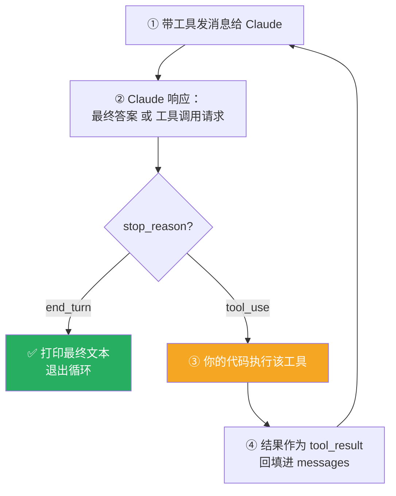

# Claude Platform 101: 《The agent loop explained》亲手实现 Agent 循环

> **课程出处**：Anthropic 官方 Claude Academy (`academy.claude.com/courses/claude-platform-101/the-agent-loop-explained`)  
> **课程定位**：单次 API 调用只返回一个响应；要自动化工作流，Claude 需要"行动 → 看结果 → 决定下一步 → 继续"——这个模式就是 **Agentic Workflow**，本课用 40 行 Python 从零手写这个循环  
> **核心主题**：Agent 的定义、五步循环、stop_reason 切换、工具结果回填、所有权分工  
> **课程时长**：约 7 分钟（第 4/13 课）

---

## 目录
1. [Agent 到底是什么](#1-agent-到底是什么)
2. [五步循环](#2-五步循环)
3. [最小可运行示例：get_weather](#3-最小可运行示例get_weather)
4. [生产环境的同一循环](#4-生产环境的同一循环)
5. [实战 Cheatsheet](#5-实战-cheatsheet)

---

## 1. Agent 到底是什么

> An **agent** is an autonomous version of Claude, running **both sides of the messaging loop** without a human in the middle.

- Agent = Claude 的**自主版本**：消息循环的**两侧都由它扮演**，中间没有人类
- 收到任务 → 挑工具 → 在循环里执行代码 → **直到 Claude 自己判定任务完成**

> 💡 呼应 Claude Code L2 的 Agentic Loop 五步——产品端的循环（Cowork / Claude Code）和 API 端的循环（本课）是**同一个思想的两层实现**。

---

## 2. 五步循环



对话视角：user 开场 → agent 调工具 → 工具返回结果 → agent 继续——**像一场你来我往的对话，直到拿到答案**。

---

## 3. 最小可运行示例：get_weather

任务："What should I wear in Austin today?"——Claude 自己**无法知道天气**，必须调工具、读结果、再作答。

```python
import anthropic

client = anthropic.Anthropic()

# ① tools 数组：告诉 Claude 有什么可用
#    —— name + description + 输入的 JSON schema
tools = [
    {
        "name": "get_weather",
        "description": "Get the current weather for a city.",
        "input_schema": {
            "type": "object",
            "properties": {
                "city": {"type": "string", "description": "The city to get weather for"},
            },
            "required": ["city"],
        },
    }
]

# ② run_tool：这里只是硬编码查询
#    真实应用中会查数据库、调 API……
def run_tool(name, tool_input):
    if name == "get_weather":
        return f"Weather in {tool_input['city']}: 95F, sunny"
    raise ValueError(f"Unknown tool: {name}")

messages = [
    {"role": "user", "content": "What should I wear in Austin today?"}
]

# ③ Agent 循环：每次迭代发消息，按 stop_reason 分支
while True:
    response = client.messages.create(
        model="claude-sonnet-5",
        max_tokens=1024,
        tools=tools,
        messages=messages,
    )

    if response.stop_reason == "end_turn":
        # Claude 认为任务完成：打印最终文本，跳出
        for block in response.content:
            if block.type == "text":
                print(block.text)
        break

    if response.stop_reason == "tool_use":
        # 找出 tool_use 块并逐个执行
        tool_results = []
        for block in response.content:
            if block.type == "tool_use":
                result = run_tool(block.name, block.input)
                tool_results.append(
                    {
                        "type": "tool_result",
                        "tool_use_id": block.id,   # 与请求的 id 对应
                        "content": result,
                    }
                )
        # ④ 把 assistant 响应和工具结果都推回 messages，进入下一轮
        messages.append({"role": "assistant", "content": response.content})
        messages.append({"role": "user", "content": tool_results})
```

### 运行轨迹（两轮）

| 轮次 | stop_reason | 发生了什么 |
| :--- | :--- | :--- |
| 第一轮 | `tool_use` | Claude 请求调用 `get_weather("Austin")`，代码返回 95F 晴 |
| 第二轮 | `end_turn` | Claude 建议"穿轻薄透气的衣服" |

**两次 API 调用、一次工具执行、一个最终答案——整个循环就这么多。**

### 三个关键件

| 构件 | 职责 |
| :--- | :--- |
| **tools 数组** | 告诉 Claude 有什么可用（name + description + JSON schema） |
| **run_tool** | 你的执行层（demo 里是硬编码；真实应用连数据库/API） |
| **while 循环** | 按 `stop_reason` 分支：`end_turn` 收工 / `tool_use` 执行并回填 |

---

## 4. 生产环境的同一循环

生产场景（如自动审查端点）：合规 Agent 读结构报告 → 工具查建筑规范 → 逐条把风险发现写回数据库。

**循环形状与 demo 完全一致**，差异只在：

- 工具是真的（不是 mock 天气）
- 结果以 **server-sent events** 流式推给 UI
- 发现持久化到 risk-finding 表

> 🎯 **所有权分工（本课金句）**：**You own the loop and the tools. Claude owns the reasoning.**  
> （你拥有循环和工具，Claude 拥有推理。）  
> 不想自己拥有循环时——**Managed Agents** 在 Anthropic 基础设施上替你跑这个循环。

---

## 5. 实战 Cheatsheet

```markdown
### 🔄 Agent 循环速查

#### 1. 定义
Agent = 自主版 Claude：两侧消息循环都归它跑，无人居中
（收到任务 → 挑工具 → 循环执行 → 自判完成）

#### 2. 五步循环
带工具发消息 → 响应是答案或工具请求 → 执行工具 →
结果回填 messages → 循环，直到 stop_reason == "end_turn"

#### 3. 两个 stop_reason
- end_turn：Claude 完成，取最终文本，break
- tool_use：遍历 content 找 tool_use 块，执行，
  以 tool_result（带 tool_use_id）作为 user 消息回填

#### 4. messages 回填要点
每轮把【assistant 响应 + 工具结果】都 append 进去
（漏掉 assistant 响应会破坏对话结构）

#### 5. 所有权分工
You own the loop and the tools. Claude owns the reasoning.
不想拥有循环 → Managed Agents（Anthropic 替你跑）

#### 6. 心法
天气 demo 到生产合规 Agent，循环形状不变
变的只是工具真实性与周边管道（SSE / 持久化）
```

### 课程衔接

> 🔗 **下一课**：L5《What is tool use?》——深入工具定义、多工具选择与 Tool Runner。
