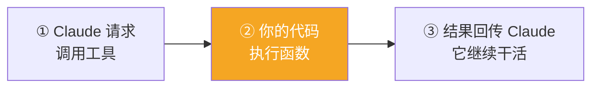

# Claude Platform 101: 《What is tool use?》工具使用与 Tool Runner

> **课程出处**：Anthropic 官方 Claude Academy (`academy.claude.com/courses/claude-platform-101/what-is-tool-use`)  
> **课程定位**：Claude 无法自己访问你的项目管理系统、数据库、文件——**Tools** 给它访问外部数据与动作的能力；本课讲清工具定义、description 的决定性作用、多工具选择，以及砍掉样板的 **Tool Runner**  
> **核心主题**：工具三要素、"Claude 请求、你的代码执行"、description 决定调用质量、switch 分发、Tool Runner 免样板  
> **课程时长**：约 8 分钟（第 5/13 课）

---

## 目录
1. [工具是什么：谁执行是关键](#1-工具是什么谁执行是关键)
2. [工具如何定义：三要素 JSON Schema](#2-工具如何定义三要素-json-schema)
3. [多工具：让 Claude 自己挑](#3-多工具让-claude-自己挑)
4. [Tool Runner：砍掉样板代码](#4-tool-runner砍掉样板代码)
5. [实战 Cheatsheet](#5-实战-cheatsheet)

---

## 1. 工具是什么：谁执行是关键

> A tool is a **function you define and expose to Claude**. You describe what it does and what inputs it takes, and Claude decides when to call it.

**必须内化的关键**：**Claude 不执行工具——你的代码执行。**



---

## 2. 工具如何定义：三要素 JSON Schema

工具以 **JSON Schema** 形式传入请求体的 `tools` 数组：

```json
{
  "name": "lookup_building_code",
  "description": "Look up a specific building code section by its identifier. Returns the full text of that code section.",
  "input_schema": {
    "type": "object",
    "properties": {
      "section": {
        "type": "string",
        "description": "The building code section to look up"
      }
    },
    "required": ["section"]
  }
}
```

| 要素 | 作用 |
| :--- | :--- |
| `name` | 工具名 |
| `description` | **Claude 读了决定调不调** |
| `input_schema` | 输入参数的 JSON Schema |

> ⚠️ **description 是第一大翻车原因**：描述含糊 → 工具误用或该抓的工具不抓。**写具体**——这是 Agent 失灵的第一名原因。

### 调用时序

1. Claude 响应带 `stop_reason: "tool_use"`——这是**信号**
2. 你的循环调用 `lookup_building_code`，参数由 Claude 给出
3. 结果作为 **tool result**（一条含 `tool_result` 块的 user 消息，靠 `tool_use_id` 与调用绑定）回填
4. Claude 继续——如此往复直到拿齐所需信息

---

## 3. 多工具：让 Claude 自己挑

有意思的不是单工具，而是**多个工具让 Claude 挑选用哪个、按什么顺序**。

场景：打包去丹佛三天，要**今天的天气**和**未来几天的预报**——声明两个工具：

```typescript
const tools = [
  {
    name: "get_weather",
    description: "Get today's current weather for a city.",
    input_schema: {
      type: "object",
      properties: {
        city: { type: "string", description: "The city to check" }
      },
      required: ["city"]
    }
  },
  {
    name: "get_forecast",
    description: "Get the weather forecast for the next few days for a city.",
    input_schema: {
      type: "object",
      properties: {
        city: { type: "string", description: "The city to check" }
      },
      required: ["city"]
    }
  }
];
```

循环与 L4 完全一致，唯一新件是**按工具名分发的 `runTool`**：

```typescript
function runTool(name, input) {
  switch (name) {
    case "get_weather":  return getWeather(input.city);
    case "get_forecast": return getForecast(input.city);
  }
}

while (true) {
  const response = await client.messages.create({
    model: "claude-sonnet-5",
    max_tokens: 1024,
    messages,
    tools,
  });

  if (response.stop_reason !== "tool_use") break;  // 最终答案

  messages.push({ role: "assistant", content: response.content });

  const toolResults = response.content
    .filter((block) => block.type === "tool_use")
    .map((block) => ({
      type: "tool_result",
      tool_use_id: block.id,
      content: runTool(block.name, block.input),
    }));

  messages.push({ role: "user", content: toolResults });
}
```

**扩展公式**：加第三个工具 = 数组加一项 + switch 加一个 case。

### Claude 怎么选的

运行可见：Claude 先调 `get_weather` 再调 `get_forecast`（有时同轮并发，有时先后）——它**读 description**，把你的 Prompt 映射到"今天的天气"和"接下来几天"，各配对的工具。

> 💡 这就是 description 决定论：**工具描述写得越准，选择就越对**——与 Claude Code L10 的 Skill description、L9 的 Subagent description 同一逻辑。

---

## 4. Tool Runner：砍掉样板代码

手写循环的两个红色警报：

- 两个简单查询写了**一大坨代码**
- 真实代码库里**不想为每个函数手写 JSON Schema**——"等于把代码写两遍"

**Tool Runner**（SDK beta，支持 TypeScript / Python / Ruby / C# / Go / Java / PHP）：每个工具**定义一次**，runner 内部处理整个 tool use / tool result 循环。

```typescript
// 还是那两个查询——就是普通的 TypeScript 函数
function getWeather(city: string) { /* ...existing lookup */ }
function getForecast(city: string) { /* ...existing lookup */ }

const runner = client.beta.messages.toolRunner({
  model: "claude-sonnet-5",
  max_tokens: 1024,
  messages: [
    {
      role: "user",
      content:
        "I'm packing for a three-day trip to Denver. What's the weather today and over the next few days?",
    },
  ],
  tools: [getWeather, getForecast],   // 直接传函数
});

// await runner：所有工具乒乓结束后返回最终消息
const finalMessage = await runner;
```

同一场景，代码量骤减：

| 手写循环 | Tool Runner |
| :--- | :--- |
| while 循环 + stop_reason 分支 + 手动回填 | **全部内部处理** |
| 手写 JSON Schema（写两遍） | **从真实函数自动生成** |
| 手动解析最终响应 | `await runner` 直接拿最终 assistant 消息 |

### 真实工具 = 包装你已有的代码

生产里工具不是硬编码天气，而是**包住应用中已存在的函数**——合规审查 Agent 的工具就是 `lookup_building_code` / `search_building_code` 的薄包装。用 Tool Runner 直接把函数传进去，Agent 在每条发现里都能引用具体规范条款。

---

## 5. 实战 Cheatsheet

```markdown
### 🔧 工具使用速查

#### 1. 本质
工具 = 你定义并暴露给 Claude 的函数
Claude 决定何时调用；【你的代码】负责执行

#### 2. 定义三要素（JSON Schema）
name / description / input_schema，放进请求的 tools 数组

#### 3. description 铁律
描述含糊 = Agent 失灵第一名原因
写得越具体，调用越准（Skill / Subagent 同理）

#### 4. 调用时序
stop_reason: "tool_use" → 执行 →
tool_result（绑定 tool_use_id）作为 user 消息回填 → 继续

#### 5. 多工具
runTool 按名 switch 分发
加工具 = 数组 + 一项，switch + 一个 case

#### 6. Tool Runner（SDK beta）
tools 直接传普通函数 → schema 自动生成
无 while 循环、无手动回填，await 拿最终消息
（TS / Py / Ruby / C# / Go / Java / PHP）

#### 7. 扩展谱系
自己执行 → Tool Runner 委派循环 → Managed Agents 委派整个 Agent
```

### 课程衔接

> 🔗 **下一课**：L6《What is thinking?》——Extended Thinking：让 Claude 先想清楚再回答。
