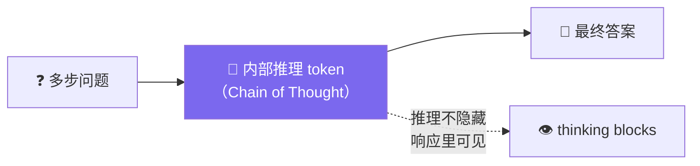

# Claude Platform 101: 《What is thinking?》Extended Thinking 深度推理

> **课程出处**：Anthropic 官方 Claude Academy (`academy.claude.com/courses/claude-platform-101/what-is-thinking`)  
> **课程定位**：有些任务不是"快答"能解决的——多步问题立刻作答，模型可能**自信地答错**；Extended Thinking 让 Claude 在给出最终响应前**逐步推理**，且推理过程可见  
> **核心主题**：Chain of Thought、Opus 5 自适应思考、effort 参数五档、何时用/何时跳过  
> **课程时长**：约 5 分钟（第 6/13 课）

---

## 目录
1. [Extended Thinking 是什么](#1-extended-thinking-是什么)
2. [Opus 5 的自适应思考与 effort 参数](#2-opus-5-的自适应思考与-effort-参数)
3. [何时用、何时跳过](#3-何时用何时跳过)
4. [实战：自驾游规划](#4-实战自驾游规划)
5. [实战 Cheatsheet](#5-实战-cheatsheet)

---

## 1. Extended Thinking 是什么

**要避免的失败模式**：多步问题要求模型立刻作答 → 它可能**自信地错**。

> **Extended thinking** lets Claude reason step by step before producing a final response.



- 启用后 Claude 生成**内部推理 token**（俗称 **chain of thought**），然后交付答案
- **推理不是黑盒**：与最终文本一起出现在响应里，可以看

---

## 2. Opus 5 的自适应思考与 effort 参数

在 **Opus 5** 上，思考是**自适应（adaptive）的且默认开启**：

- **无需选 token 预算**——Claude 动态决定何时思考、思考多深
- 想控制深度 → 用 **`effort` 参数**
- ⚠️ **坑点**：effort 放在 **`output_config` 里**，不是 `thinking` 块旁边

| effort 档位 | 说明 |
| :--- | :--- |
| `low` | 最浅 |
| `medium` | 中 |
| `high` | **默认** |
| `xhigh` | 更深 |
| `max` | 最深 |

---

## 3. 何时用、何时跳过

| ✅ 值得开启 | ❌ 应该跳过 |
| :--- | :--- |
| 数学与多步逻辑 | 简单分类 |
| 代码调试 | 抽取 |
| 监管分析 | 模板化输出 |
| 任何涉及**权衡取舍**、比较选项的任务 | （这些场景只增加延迟和成本，不改善结果） |

---

## 4. 实战：自驾游规划

Agent 循环 + 一个天气工具，任务："从旧金山出发规划自驾游，中途两站，权衡**天气**与**车程**"——真实的取舍题，思考的价值所在。

```python
response = client.messages.create(
    model="claude-opus-5",
    max_tokens=16000,
    thinking={"type": "adaptive", "display": "summarized"},  # 返回推理文本
    output_config={"effort": "high"},  # low | medium | high | xhigh | max
    tools=[weather_tool],
    messages=[
        {
            "role": "user",
            "content": "Plan a road trip out of San Francisco with two stops, "
                       "weighing weather and drive time.",
        }
    ],
)
```

### 输出结构（比平时有意思）


推理全程可见——**这正是意义所在**。

### 生产价值

合规审查应用里，开启自适应思考的区别：

- 关闭：Agent **一次发现一个问题**
- 开启：Agent 能**跨章节关联问题**——比如发现第 3 节的风载荷规格与文档别处的材料规格**相互矛盾**

---

## 5. 实战 Cheatsheet

```markdown
### 🧠 Extended Thinking 速查

#### 1. 是什么
回答前先生成推理 token（chain of thought），再出答案
推理过程可见（响应中带 thinking blocks）

#### 2. Opus 5 自适应
默认开启、无需 token 预算，动态决定思考深度
display: "summarized" → 响应里返回推理文本

#### 3. effort 五档（坑点）
放在 output_config 里，不是 thinking 旁边！
low / medium / high（默认）/ xhigh / max

#### 4. 用/不用
✅ 数学多步逻辑、代码调试、监管分析、权衡取舍
❌ 分类、抽取、模板化（只加延迟和成本）

#### 5. 生产价值
从"一次发现一个问题"到"跨章节关联问题"
（例：风载荷规格 vs 材料规格的矛盾）
```

### 课程衔接

> 🔗 **下一课**：L7《Built-in tools》——Web Search / Code Execution / Web Fetch：声明即用、Anthropic 托管运行。
