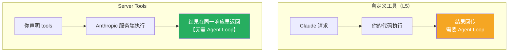

# Claude Platform 101: 《Built-in tools》内置工具：声明即用

> **课程出处**：Anthropic 官方 Claude Academy (`academy.claude.com/courses/claude-platform-101/built-in-tools`)  
> **课程定位**：有些能力通用到 Anthropic 直接预打包——**你不用写代码、不用托管沙箱，声明工具即用，Anthropic 替你运行**  
> **核心主题**：Server Tools 三件套（Web Search / Code Execution / Web Fetch）、无循环响应结构、Client Tools（Memory / Bash）  
> **课程时长**：约 6 分钟（第 7/13 课）

---

## 目录
1. [Server Tools：你声明，Anthropic 执行](#1-server-tools你声明anthropic-执行)
2. [一个文件跑两个 Server Tools](#2-一个文件跑两个-server-tools)
3. [另一类：Client Tools](#3-另一类client-tools)
4. [生产价值与提醒](#4-生产价值与提醒)
5. [实战 Cheatsheet](#5-实战-cheatsheet)

---

## 1. Server Tools：你声明，Anthropic 执行

> You don't write the code. You don't host the sandbox. **You just declare the tool, and Anthropic runs it.**

**Server Tools** 运行在 **Anthropic 的基础设施**上：

| 工具 | 能力 |
| :--- | :--- |
| **Web Search** | 搜索互联网，返回**带引用**的结果 |
| **Code Execution** | 在沙箱里**写并运行 Python** |
| **Web Fetch** | 检索 URL 的完整内容 |

### 与自定义工具的本质区别



**不需要 agent loop**：不 switch `stop_reason`、不回填 tool result——Anthropic 在服务端跑完，**响应里已经带着结果**。

---

## 2. 一个文件跑两个 Server Tools

两次 `messages.create`：一次 Web Search、一次 Code Execution：

```python
import anthropic

client = anthropic.Anthropic()

# 调用 1：Web Search —— Anthropic 服务端执行搜索
search_response = client.messages.create(
    model="claude-opus-5",
    max_tokens=1024,
    tools=[{"type": "web_search_20260209", "name": "web_search"}],
    messages=[
        {"role": "user",
         "content": "What is Anthropic's latest model release? Answer in one sentence."}
    ],
)

for block in search_response.content:
    if block.type == "server_tool_use":
        print(f"Tool call: {block.name} — {block.input}")
    elif block.type == "text":
        print(block.text)

# 调用 2：Code Execution —— Claude 在沙箱里写并运行 Python
code_response = client.messages.create(
    model="claude-opus-5",
    max_tokens=1024,
    tools=[{"type": "code_execution_20260120", "name": "code_execution"}],
    messages=[
        {"role": "user",
         "content": "Calculate the mean and standard deviation of [1,2,3,4,5,6,7,8,9,10]"}
    ],
)

for block in code_response.content:
    if block.type == "server_tool_use":
        print(f"Tool call: {block.name} — {block.input}")
    elif block.type == "bash_code_execution_tool_result":
        print(f"stdout: {block.content.stdout}")
    elif block.type == "text":
        print(block.text)
```

### 两个观察点

1. **没有 agent loop**——不切 `stop_reason`、不回填结果；工具服务端执行，响应自带结果
2. **新的 block 类型**：`server_tool_use`（工具调用）、`bash_code_execution_tool_result`（沙箱输出，含 stdout）、常规 `text` 块

### 运行结果

- **Web Search**：打印 Claude 的工具调用 → 一句话答案，**搜索引用已折入**
- **Code Execution**：能看到 **Claude 实际写的 Python**、沙箱运行 stdout、最终文本答案

> 没搭搜索爬虫、没跑 Python 沙箱——声明两个工具，全都白拿。

---

## 3. 另一类：Client Tools

**Client Tools** 在**你的代码运行处**执行。Anthropic 发布 schema 并训练过 Claude，**无需自己定义 schema**：

| 工具 | 能力 |
| :--- | :--- |
| **Memory** | Claude **跨会话**读写记忆 |
| **Bash** | 持久 bash shell，Claude 可执行命令 |

形态与自定义工具相同，但 SDK 直接给你 schema 和现成 runner。

---

## 4. 生产价值与提醒

- **生产捷径**：本来要花数周的功能，现在一步到位——Web Search 可驱动"事实核查端点"，把草稿里的每条数字和监管声明对实时网络验证
- ⚠️ **提醒**：**互联网上验证过 ≠ 真**——永远复核 Claude 的工作


> 💡 "Anthropic 托管"的思想一路扩展：**Managed Agents 把它应用到整个 Agent，而不只是一个工具**。

---

## 5. 实战 Cheatsheet

```markdown
### 🧰 内置工具速查

#### 1. Server Tools（Anthropic 托管）
- Web Search：搜网，带引用
- Code Execution：沙箱写跑 Python
- Web Fetch：抓 URL 完整内容

#### 2. 核心差异 vs 自定义工具
声明即用，服务端执行，结果在同一响应
→【无 agent loop】不切 stop_reason、不回填

#### 3. 新 block 类型
server_tool_use（调用）
bash_code_execution_tool_result（含 stdout）
text（最终答案）

#### 4. Client Tools（你的环境执行）
Memory（跨会话记忆）/ Bash（持久 shell）
schema 由 SDK 提供 + 现成 runner

#### 5. 提醒
网络验证过 ≠ 真；永远复核 Claude 的输出

#### 6. 托管谱系
声明工具（单个）→ Managed Agents（整个 Agent）
```

### 课程衔接

> 🔗 **下一课**：L8《Skills》——SKILL.md 打包流程：教 Claude"你的做法"。
