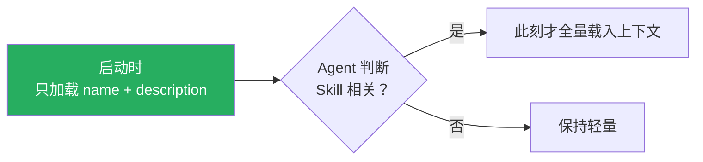
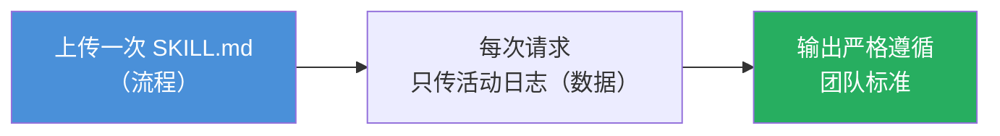

# Claude Platform 101: 《Skills》API 端的 SKILL.md 流程打包

> **课程出处**：Anthropic 官方 Claude Academy (`academy.claude.com/courses/claude-platform-101/skills`)  
> **课程定位**：Skills 是**指令、脚本、资源的文件夹**，Claude 动态加载以提升专项任务表现——上传一次 SKILL.md，就能挂到任何 messages.create 调用上；你在教 Claude"**你的做法**"：状态报告格式、审查清单、发布说明  
> **核心主题**：Tools vs Skills 分野、渐进式加载、skills.create 上传、container.skills 挂载、与 Code Execution 搭配  
> **课程时长**：约 6 分钟（第 8/13 课）

---

## 目录
1. [Skills 是什么](#1-skills-是什么)
2. [Tools vs Skills：what 与 how](#2-tools-vs-skillswhat-与-how)
3. [上传与挂载](#3-上传与挂载)
4. [运行与生产价值](#4-运行与生产价值)
5. [实战 Cheatsheet](#5-实战-cheatsheet)

---

## 1. Skills 是什么

> **Skills** are folders of instructions, scripts, and resources that Claude loads **dynamically** to improve performance on specialized tasks.

- 核心是 **`SKILL.md`**——打包好的一套指令，**上传一次**，之后可挂到任何 `messages.create` 调用
- Claude 读 Skill → 遵循流程 → 按**你的形状**产出

**关键机制——渐进式加载**：



> Skills don't load fully into context on startup. Only the **name and description** load at first.  
> （启动不占满上下文——即使有很多 Skills 也能保持 context 精简。）

> 💡 与 Claude Code L10 / Cowork L7 的 Skill 完全同源——**同一套机制在产品端与 API 端的统一**。

---

## 2. Tools vs Skills：what 与 how

| 维度 | **Tools** | **Skills** |
| :--- | :--- | :--- |
| 解决 | 连接**数据与动作** | 教会一套**流程** |
| 例子 | "查这条规范"、"发这封邮件" | "按这个模板生成日报" |
| 本质 | Claude 调用，别处执行 | Claude 阅读遵循的 playbook（有时内含脚本自己跑） |
| 一句话 | **what** Claude can do | **how** you want it done |

---

## 3. 上传与挂载

### 上传一次（获得 skill.id）

```python
skill = client.skills.create(
    display_name="Status Report Generator",
    files=files_from_dir("status-report-skill"),  # 含 SKILL.md 的文件夹
)
print(skill.id)  # 后续请求引用此 ID
```

### 挂载到请求（container.skills）

```python
response = client.messages.create(
    model="claude-opus-5",
    max_tokens=4096,
    container={
        "skills": [
            {
                "type": "custom",
                "skill_id": skill.id,
                "version": "latest",
            }
        ]
    },
    tools=[
        {
            "type": "code_execution_20250825",
            "name": "code_execution",
        }
    ],
    messages=[
        {
            "role": "user",
            "content": f"Generate the daily status report from this activity log:\n\n{activity_log}",
        }
    ],
)
```

### 四个要点

1. **标准 `messages.create`，无 beta header**——Skills 已 GA，旧的 `skills-2025-10-02` beta header 不再需要（继续发也不报错）
2. **`container.skills` 是列表**——一次调用可叠加多个 Skills
3. **必须开 Code Execution**——API 上 Skills 运行在 code execution 工具的容器里，流程才能干真活（如在终端跑脚本）
4. Skill 定义"什么是好报告"（章节、语气、如何总结、如何处理阻塞项）；活动日志只是请求时传入的**字符串**——**流程与数据分离**

---

## 4. 运行与生产价值

**输出**：完全按 Skill 规定格式生成的状态报告——章节、语气、阻塞项处理全部来自上传的 SKILL.md。**用户 Prompt 只有一行，流程活在 Skill 里。**

**生产场景**——团队输出标准化的整个特性：

> 每位 PM 拿到的日报：**同样的结构、同样的语气、同样的章节、同样的顺序**——没有人需要把模板复制粘贴进 Prompt。



---

## 5. 实战 Cheatsheet

```markdown
### 📦 API Skills 速查

#### 1. 定义
Skills = 指令 + 脚本 + 资源的文件夹，核心是 SKILL.md
上传一次 → 挂到任意 messages.create

#### 2. Tools vs Skills
Tools = what（连数据与动作）
Skills = how（你的流程与模板）

#### 3. 渐进式加载
启动只载 name + description
Agent 判定相关才全量进上下文（保持精简）

#### 4. 上传与挂载
上传：client.skills.create(display_name, files=含SKILL.md的文件夹) → skill.id
挂载：container.skills = [{type:"custom", skill_id, version}]（列表可叠加）

#### 5. 必配 Code Execution
Skills 跑在 code execution 容器里
流程要干真活（跑脚本）就必须开

#### 6. 状态
已 GA，无需 beta header
（skills-2025-10-02 旧 header 继续兼容）

#### 7. 何时用
how 与 what 同样重要时 → Skill
```

### 课程衔接

> 🔗 **下一课**：L9《MCP》——为什么有了 Tools 和 Skills 还要 MCP？答案在维护责任归属。
